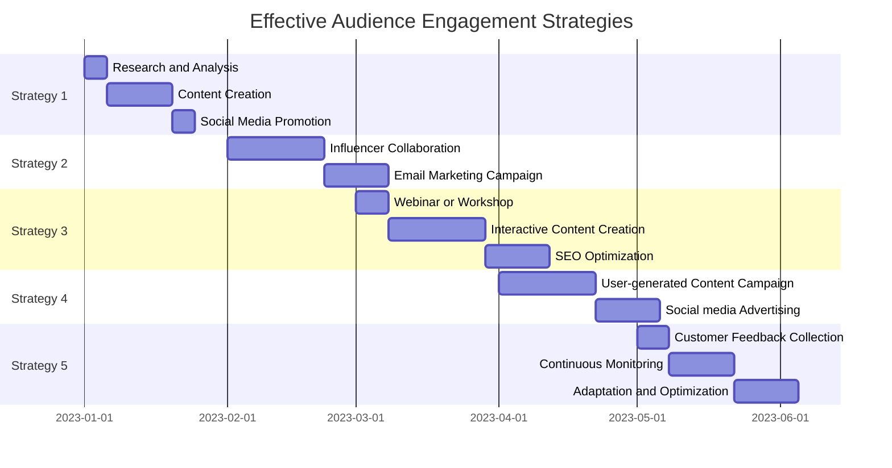
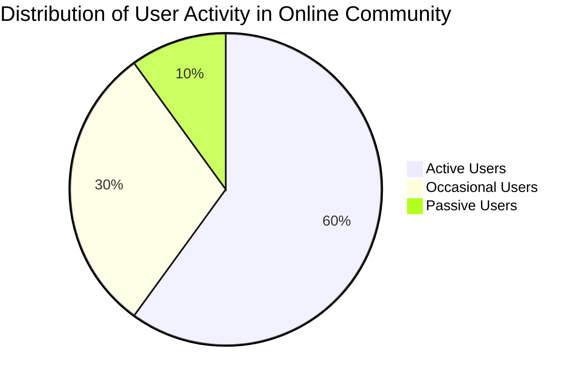

---
authors:
    - clair
categories:
    - audience engagement
date: 2023-10-24
---

# Boosting Audience Engagement: Effective Strategies for Community Managers

Discover how Chainfuse AI revolutionizes the world of influencer marketing and community management with powerful audience engagement strategies. Personalized content, automated responses, and data analysis empower influencers to create immersive experiences that resonate with their audience.

<!-- more -->

## Introduction

In today's digital landscape, building and nurturing online communities is essential for influencers, creators, and brands alike. The key to success lies in audience engagement - creating a sense of belonging and actively involving community members in discussions and interactions. This is where Chainfuse AI comes into play. With its powerful suite of tools and advanced analytics, Chainfuse AI enables influencers and creators to personalize content, streamline community management, and optimize monetization strategies. By harnessing the power of AI-driven communication, influencers can strengthen connections with their fans, gather valuable insights, and create a vibrant online community that thrives on engagement. In this article, we will explore the various ways in which Chainfuse AI can revolutionize the world of influencer marketing and community management. From personalized content recommendations to automated responses and data analysis, Chainfuse AI empowers influencers to create an immersive experience that resonates with their audience. Let's dive in!

## 1. Understanding the Importance of Audience Engagement

Online communities thrive on the active engagement of their members, far beyond mere follower or subscriber numbers. Audience engagement is the heartbeat that fuels the vibrancy and growth of these communities.

Through strategies that promote active involvement and foster a strong sense of community, members become more than passive observers; they contribute, participate, and shape the community's culture, creating a loyal and dedicated following.

Building a thriving online community centers on creating an environment where members feel a sense of belonging, where they are encouraged to actively take part in discussions and build connections with each other. This sense of community can be fostered by implementing engagement strategies that make the community more interactive, such as gamification techniques. By introducing elements like badges, points, or leaderboards, members are incentivized to participate more actively. Regularly sharing valuable content, organizing virtual events, and actively responding to members' queries and feedback also serve to enhance audience engagement.

Creating a welcoming and inclusive environment is another critical ingredient for fostering a sense of belonging in online communities. All members should feel valued, respected, and free to express their opinions. This can be achieved by setting clear guidelines that promote respectful interactions and by consistently enforcing them. Moreover, acknowledging and celebrating members' contributions is a powerful way of showing appreciation and making them feel valued.

Promoting active participation goes beyond just having a discussion board. It involves fostering an environment that encourages respect and support among members, stimulating meaningful discussions, and recognizing members who actively contribute. Introducing gamification elements can also motivate members to engage more actively. Host interactive events like live Q&A sessions, webinars, or virtual meetups that provide opportunities for members to interact with each other and the community administrators. Remember, building an active online community is a journey that requires continuous monitoring and adaptation.

Building a loyal and dedicated community is an outcome of regular engagement, valuable content, and genuine commitment. By consistently delivering high-quality and relevant content and by being active on social media platforms, a strong bond can be formed between the community and its members. Actively listening and addressing community members' concerns and feedback fosters a sense of loyalty and dedication among members.

Effective audience engagement strategies can vary widely depending on the specific audience and the goals of the organization.

Some successful strategies include creating interactive content such as quizzes, polls, or surveys, running social media campaigns, and personalizing content for individual audience segments. These strategies can make the audience feel more valued and connected to the organization. Encouraging user-generated content can not only increase engagement but also foster a sense of community.

Monitoring user activity and participation within the community can help gauge the effectiveness of audience engagement strategies.

Additionally, monitoring user sentiment and feedback can provide insights into overall satisfaction and engagement. Other notable metrics include community growth over time, frequency of user visits, and average time spent on the platform.

In summary, fostering audience engagement in online communities requires a blend of strategies that promote active participation, create a sense of belonging, and build a loyal and dedicated community. With consistent effort, valuable content, and active engagement, online communities can become vibrant and thriving digital spaces that foster connection and collaboration.

### 1.1. Role of Positive Communication in Building Online Communities

The bedrock of thriving online communities is rooted in the power of positive communication. It's about creating an environment that resonates with value, making every member feel heard, respected, and crucial to the community. Fostering a positive atmosphere is integral to stimulating active engagement, and it all begins with open dialogue, constructive feedback, and the recognition of each member's input.

Let's delve into the strategies that facilitate this positive communication. One essential approach is to establish clear community guidelines that advocate for respectful exchanges. These guidelines should cover language, behavior, and conflict resolution, setting the foundation for a friendly and constructive discourse. They are the compass that directs the community's interaction, ensuring everyone understands what is expected of them.

Inclusivity is another cornerstone of a positive communication environment. By valuing diverse opinions and encouraging active participation, we can build a welcoming space where members are at ease expressing themselves. This sense of belonging significantly boosts open dialogue, leading to more meaningful conversations.

Moderation holds the key to maintaining this positive atmosphere. Dedicated moderators who enforce community guidelines play a pivotal role in addressing inappropriate behavior or conflicts when they arise. A swift and constructive response to any issue helps to redirect the discussion positively.

Emphasizing a supportive community culture promotes positive communication. Recognizing and appreciating members' contributions not only fosters a sense of belonging and motivation but also builds a supportive and engaging atmosphere. Public shout-outs, badges, or even personalized messages expressing gratitude can be used to acknowledge these contributions.

When these strategies are effectively implemented, they create a space where positive communication is the norm. This leads to an environment where members feel more than just valued - they feel engaged. They are more likely to participate actively, leading to a vibrant and thriving community.

Engagement can also be stimulated through various techniques. Providing opportunities for discussion and sharing ideas, such as forums or chat rooms, allows for regular and meaningful interactions. Incentivizing participation by offering rewards or recognition to active members is another effective tactic. Listening to and responding to community feedback demonstrates that their input is of value, further enhancing their interest and involvement.

Successful online communities like Reddit, Stack Exchange, and Quora serve as exemplary models. They've built robust reputations for fostering constructive discussions and providing valuable information to their users. Effective moderation, user-driven content, and an emphasis on respectful and beneficial interactions have been the keys to their success.

To sum it up, as a community manager, promoting positive communication involves a proactive and inclusive approach. Leading by example, setting clear guidelines and expectations, and actively managing the community are all part and parcel of this role. By implementing these strategies, we can build a strong, vibrant community where positive communication is the heart of every interaction.

### 1.2. Addressing Challenges Faced by Community Managers

Community managers are the lifeblood of online communities, wading through a sea of challenges to keep the digital ecosystem thriving. They grapple with numerous issues like managing negative comments and feedback, as well as handling spam and inappropriate content.

The effective management of negative comments is a balancing act. The response should be prompt, professional, and address the concerns raised by community members. Active listening, empathizing with their concerns, and constructive responses can turn the tide of dissatisfaction. Furthermore, setting clear community guidelines and moderating discussions aids in maintaining a positive and respectful environment. Encouraging open dialogue and promoting constructive criticism can transform negatives into opportunities for growth and improvement.

Tackling the spam issue requires robust content moderation measures, a blend of automated spam filters, and manual moderation to identify and remove spammy content. Community guidelines and rules that expressly prohibit spamming, coupled with consistent enforcement, create an environment that discourages spam. Moreover, fostering an active and engaged community aids in self-regulation, with members themselves willing to report any spam they encounter.

Handling inappropriate content requires a strategic and proactive approach. Best practices include establishing community guidelines that outline what is considered inappropriate, and making them accessible to all community members. It's essential to have a system for reporting inappropriate content, through a reporting feature or by urging community members to contact the community manager directly. It's crucial to respond swiftly to reported content to maintain the community's trust.

Fostering a positive online community requires a clear framework for behavior that promotes respect and inclusivity, discourages harassment or discrimination, and implements moderation tools to promptly deal with inappropriate behavior. Organizing regular community events or discussions can foster a sense of belonging and engagement, enhancing the community's overall harmony.

Feedback management is key in keeping a positive and engaged community. Active listening, timely and empathetic responses, and clear communication can ensure that concerns are addressed effectively. A regular feedback loop involving community members fosters a sense of ownership and collaboration, while transparent updates on actions taken as a result of feedback, underscore the value the community places on its members' input.

Successful community engagement strategies may include hosting regular community events, establishing online community platforms, encouraging volunteerism, collaborating with local organizations, promoting transparent communication, and empowering community leaders. These strategies should be tailored to the specific needs, values, and demographics of the community.

Effective community management necessitates clear communication channels, active engagement with community members, and a positive and inclusive environment. A well-defined set of community guidelines and policies can help maintain a respectful and productive community. Regular monitoring and addressing of any issues or conflicts, plus transparency and responsiveness to community feedback, are also cornerstones of robust community management.

#### 1.2.1 Managing Negative Comments and Feedback

Navigating the choppy waters of negative feedback skilfully can transform these potential obstacles into stepping stones for community growth and improvement. An effective strategy is to handle negative feedback with a proactive and empathetic approach, underscored by the tenets of professionalism and promptness.

One of the initial steps in tackling negative feedback is to provide immediate and professional responses. A rapid response signals to the community that their feedback is valued, and the management is keen on resolving issues. Importantly, these responses should maintain professionalism at all times, acknowledging the concerns raised and demonstrating empathy towards the experiences of the community members. A defensive or dismissive attitude could further escalate the situation, highlighting the necessity to comprehend their perspective sincerely.

Transparency is another cornerstone of dealing with negative feedback. Publicly addressing feedback indicates active engagement in troubleshooting issues. However, in situations where feedback veers towards personal attacks or escalates beyond control, addressing it privately might be a more suitable approach. This delicate balance between public and private addresses is key to maintaining transparency without compromising the individual's comfort.

A key strategy to turn negative feedback into a growth opportunity is leveraging it as a learning experience. Negative comments often underline genuine issues that require attention. Recognizing these concerns, taking actionable steps towards resolution, and communicating these actions back to the community can showcase the value placed on their feedback. This practice not only improves the community's perception of the brand but also provides the brand with valuable insights for continuous development.

Moreover, clear guidelines and policies can ensure a consistent and framework-guided approach towards negative feedback. These policies can serve as a compass for community managers, helping them navigate the complexities of negative feedback handling, thereby promoting a positive community environment.

Essential to this process is the use of appropriate tools and resources. Various platforms and software, such as customer relationship management (CRM) software, social media listening tools, and customer feedback management systems, can assist in effectively tracking, monitoring, and responding to the feedback. These tools not only make feedback management more efficient but also aid in taking the necessary actions based on the feedback, thereby enhancing customer satisfaction.

In conclusion, it is through the lens of empathy and the commitment to improvement that we should view negative feedback. By promptly and professionally addressing concerns, maintaining transparency, and using feedback as a springboard for growth, we can create a positive and supportive community environment, despite the inevitable presence of occasional dissent.

#### 1.2.2 Dealing with Spam and Inappropriate Content

Maintaining a vibrant online community can become a challenge when faced with spam and inappropriate content. This unwanted material can disrupt the community vibe and discourage active engagement. To combat these issues, community managers need to deploy effective strategies to detect and eliminate such content, thereby ensuring a safe and engaging environment for all members.

Implementing a combination of filtering techniques can prove instrumental in managing spam content. Creating a list of keywords usually associated with spam can help flag or automatically eliminate posts or comments containing these trigger words.

The use of advanced technologies like machine learning algorithms or natural language processing techniques can further fortify this barrier against spam. These solutions can analyze the content of posts and comments for patterns typically associated with spam, like excessive use of capital letters, repetitive phrases, or excessive links.

Community members can play a vital role in this filtering process too. User moderation allows community members to report suspicious or spammy content. Assigned moderators can then review this reported content and take appropriate action, like deleting or hiding the spam content. Regular reviews and updates of these spam filtering techniques are crucial to stay one step ahead of spammers who continuously adapt their tactics.

Setting clear guidelines and policies in place is another effective strategy when dealing with inappropriate content. This helps establish expectations for behavior among community members, ensuring all are aware of what is considered inappropriate.

A robust reporting system allows community members to easily flag any inappropriate content. Addressing these reports promptly and taking appropriate action, like removing the content or issuing warnings to the individuals involved, helps maintain a positive community environment. Regular moderation and proactive monitoring of the community for inappropriate content can also help preserve this positive atmosphere.

Automated spam detection systems prove extremely useful in managing online communities, as they can analyze user-generated content and identify patterns commonly associated with spam. These systems, backed by machine learning algorithms, continuously learn and adapt to new spamming techniques.

Another effective method is content filtering, which involves setting up filters to flag or block content based on predefined criteria like specific keywords, URLs, or IP addresses commonly used by spammers. However, community moderation remains an essential tool for spam detection and removal. Trained moderators can manually review user-generated content and identify spam.

Additional techniques like whitelisting and blacklisting can be used to detect and remove spam. Whitelisting involves creating a list of trusted sources or users whose content is exempt from spam filters. On the other hand, blacklisting involves blocking or flagging content from known spammers or suspicious sources.

For a community to thrive, it's essential to create an environment that fosters active participation, inclusivity, and respect. Key strategies include establishing clear guidelines, encouraging active participation, moderation and enforcement, providing resources and support, fostering positive interactions, regular communication, promoting diversity and inclusivity, and continuously improving and adapting based on community feedback.

Effective content moderation, regular monitoring and analysis of user activity, clear community guidelines, and transparency in the moderation process contribute to the success of an online community. Through a combination of automated spam detection systems, content filtering, community moderation, whitelisting, blacklisting, and monitoring user activity, we can create a safer and more positive online environment.

## 2. Balancing Multiple Communication Channels with Chainfuse AI

In this digital era, the role of community managers is ever-evolving. One significant challenge is establishing an effective connection with their audience across multiple platforms. Chainfuse AI is a powerful tool designed to help with this task, providing universal connectivity and enabling seamless interaction with communities across various popular communication channels like Discord, Telegram, WhatsApp, and SMS.

To harness the powers of Chainfuse AI, community managers can integrate this technology with their different communication platforms. For instance, if Discord is one of the platforms, they can easily integrate Chainfuse AI by creating a webhook and linking it with their Chainfuse AI account. Through this process, they can receive real-time updates and alerts from the AI directly on Discord.

Likewise, they can use the tools and features offered by Chainfuse AI to extend their community engagement on WhatsApp. The AI capabilities of Chainfuse, such as process automation, data analysis, and insight generation, can take their community engagement strategies on WhatsApp to a new level.

However, the integration of Chainfuse AI with communication platforms is just the first step. There are certain best practices that can further enhance the effectiveness of Chainfuse AI in community management.

Regular and transparent communication is key. By providing frequent updates and sharing information about Chainfuse AI's latest developments, community managers can keep their audience informed and involved.

Feedback plays an integral role in community management. Encouraging members to share their thoughts and actively addressing their queries and concerns can help build trust and enhance engagement.

Community managers can also offer comprehensive support to their community members, providing resources, tutorials, and documentation that help them understand and utilize Chainfuse AI effectively. Hosting webinars, creating FAQs, and maintaining a dedicated support team are some ways to do this.

Fostering collaboration is another best practice. By encouraging community members to work together or with the Chainfuse AI team, a collaborative environment that fosters innovation and growth can be created.

Last but not least, recognizing and rewarding active community members can improve their community engagement. Featuring their work, offering incentives, or even providing opportunities for them to contribute directly to the project can show appreciation for their engagement.

In essence, adapting Chainfuse AI to different communication channels involves identifying the channels you want to customize, understanding their specific requirements, modifying the AI to accommodate these needs, and continuously monitoring and evaluating its performance.

To help with this, ChainFuse AI provides detailed documentation on how to integrate with popular communication channels. Following these guidelines will allow community managers to leverage the power of ChainFuse AI, enhancing their communication workflows and ultimately strengthening their connection with their audience.

### 2.1 Utilizing Universal Connectivity for Seamless Engagement

Chainfuse AI's universal connectivity is an unparalleled feature that empowers community managers to directly communicate with their audience across various channels. It's an ideal solution that enhances their brand visibility and nurtures a stronger bond with their community members.

By connecting to multiple channels, you're extending your brand's reach. This accessibility is made possible with Chainfuse AI's seamless integration into various communication platforms, be it websites, social media, or mobile apps. Their user-friendly APIs and coding solutions allow for a smooth integration process. By setting up specific triggers and behaviors for each channel, you can optimize the AI's performance to suit your needs. Testing and continuous performance monitoring are crucial in ensuring that the AI is functioning as intended. Crucial insights gained from analyzing data can be utilized for optimization, leading to improved effectiveness.

Chainfuse AI is more than just a connection enabler. It's a platform that provides intelligent decision-making and automation capabilities. With the AI technology, data is managed and analyzed in an improved manner, leading to higher productivity and cost savings for businesses. It's universally compatible with various devices and platforms, offering seamless data exchange and collaboration across different networks and environments.

To make the most of Chainfuse AI's universal connectivity, a few best practices should be followed. Primarily, set the base URL to "https://chainfuse.com/", which will serve as the foundation for all the platform interactions. Appropriately using the chunk ID and domain information when making requests or performing actions on the platform ensures precision and context relevance.

Through various case studies, Chainfuse AI's potential in effectively reaching audiences across different channels is illustrated. By employing the capabilities of Chainfuse AI, businesses can bolster their marketing strategies, targeting customers across various channels. Such an approach broadens the audience reach and has a positive impact on the overall marketing performance.

The universal connectivity of Chainfuse AI enhances brand presence significantly. By connecting with a wide range of platforms and channels, brands can reach a larger audience and heighten their visibility across multiple online platforms. The central idea is to ensure consistency in message and branding across various platforms, creating a strong brand presence.

Chainfuse AI can revolutionize community engagement across multiple channels. The artificial intelligence capabilities can analyze data from diverse sources, identify community behavior patterns, and highlight trends. These insights enable organizations to tailor their communication strategies and engagement efforts to align with the community members' needs and preferences. The automation and optimization capabilities of Chainfuse AI can expedite community engagement processes, allowing organizations to manage and respond to inquiries, feedback, and other forms of communication efficiently. This strengthens the bond between the organization and its community, leading to improved communication, increased community satisfaction, and robust relationships.

Indeed, Chainfuse AI is a game-changer for community managers. It allows them to connect and engage with their communities more effectively. Chainfuse's technology enhances their operations, productivity, and communication with community members. The AI capabilities automate certain tasks, analyze data, and provide insights that help in optimizing community management strategies. Chainfuse's universal connectivity solution with AI empowers community managers to manage their communities efficiently and successfully.

### 2.2 Streamlining Operations through AI-driven Communication

The power of AI-driven communication in enhancing operational efficiency can't be underestimated, particularly in the realm of community management. This technology allows for the automation of repetitive tasks, such as responding to common queries, thereby permitting community managers to focus their energies on strategic initiatives. Chainfuse AI, an emerging leader in this space, is a prime example of this paradigm shift.

Chainfuse AI leverages advanced algorithms and machine learning capabilities to ensure community managers are not bogged down with mundane tasks. By automating responses, community managers can devote their time and energy towards larger goals and objectives. This is achieved through Chainfuse AI's ability to integrate itself into existing workflows through API calls, freeing community managers from the task of manually responding to each question or comment.

Beyond automating responses, Chainfuse AI also excels at gathering and analyzing large volumes of data. This is a game-changer for community managers as it offers valuable insights that can help shape and optimize audience engagement strategies. From understanding audience behaviour to tailoring engagement strategies, the insights provided by Chainfuse AI prove instrumental in driving engagement.

Yet, one of the standout features of Chainfuse AI is its ability to streamline operations by leveraging AI in community management tasks. Sentiment analysis, content moderation, personalised interactions, and identification of trends, patterns, and anomalies in community behaviour, are some of the tasks where Chainfuse AI shines. By automating these tasks, Chainfuse AI not only enhances efficiency and productivity but also significantly improves the effectiveness of community management.

Of course, the ability to personalise communication and deliver targeted content using AI-driven communication is key to maximising audience engagement. Chainfuse AI's algorithms and machine learning capabilities allow for an analysis of user data and behaviour, leading to a personalised and engaging communication strategy. This includes personalised recommendations, chatbots for real-time interaction, and automated responses to customer inquiries. The result is a significantly enhanced customer experience and an upward trajectory in audience engagement.

Finally, Chainfuse AI also provides innovative solutions to improve response time and efficiency, such as chunking and domain optimisation. These features result in faster loading times and optimized resource loading, thereby enhancing overall efficiency.

In summary, Chainfuse AI serves as a transformative tool for community managers, automating a variety of tasks and providing valuable insights that allow for the optimisation of audience engagement strategies. By freeing up community managers to focus on strategic tasks, Chainfuse AI is truly revolutionising community management.

## 3. Customizing Chainfuse AI to Suit Your Brand and Audience

With Chainfuse AI, community managers are empowered to create an experience that truly resonates with their audience. This personal touch is achieved through a suite of customization options that align with both the brand's identity and the unique preferences of its community members.

The Chainfuse platform offers a level of versatility that allows community managers to tailor the AI to their specific needs. By modifying the platform's CSS styles and integrating custom JavaScript functions, managers can create a brand-consistent user experience that bolsters engagement across the board.

Moreover, Chainfuse AI can be customized to support a variety of community engagement strategies. By integrating features such as community forums, live chat support, and social media, community managers can foster a dynamic and collaborative environment. Tailoring the AI to include these functionalities not only ensures a vibrant community but also keeps the audience actively engaged.

One of Chainfuse AI's most compelling features is its capacity for learning and adaptation. By leveraging AI algorithms, the platform can analyze user data and provide personalized recommendations, notifications, and updates to community members. This analytical approach to community engagement nurtures a sense of belonging and encourages active participation from its users.

The Chainfuse AI platform provides a user-friendly interface for customization. By accessing the base URL (https://chainfuse.com/), community managers can explore the available options and features that Chainfuse AI offers. Navigating to specific chunk IDs allows managers to reach relevant sections or pages on the Chainfuse website, providing a streamlined route to customization.

Further, the platform's refined tailoring options offer numerous advantages. By optimizing their AI models to suit specific requirements, users can achieve more accurate results. This focus on specificity improves the efficiency of AI applications, resulting in enhanced accuracy, improved customization, and increased efficiency in AI model training and deployment.

Community managers looking to boost engagement can also focus on the blog section of their websites. By customizing the content, design, and user experience of the blog, they can write engaging articles that attract and retain community members. With AI's help, they can even offer personalized recommendations based on user behavior and preferences.

Finally, the customization process can be improved by following best practices. Understanding the website's structure, identifying target URLs, and using appropriate event listeners and handlers can ensure that customizations are applied at the right time and in the right context. Additionally, it's important to consider the existing layout and functionality of the website while customizing and to test the changes thoroughly before deploying them live.

In conclusion, Chainfuse AI's personalization capabilities present an opportunity for community managers to create a unique and engaging experience for their members. Whether it's tailoring the AI to reflect the brand's identity, implementing features to encourage community engagement, or simply making the platform more user-friendly, Chainfuse AI makes the process of building a vibrant online community a breeze.

### 3.1 Identifying and Filtering Out Spam and Inappropriate Content

Harnessing the power of Chainfuse AI, community managers can take control of spam and unsuitable content in their communities. By effectively employing Chainfuse AI, you can create a dynamic, safe, and engaging atmosphere for your community members.

Chainfuse AI is adaptable and can be fine-tuned to identify and filter out undesired content, ensuring a superior experience for your community members. This can be achieved by leveraging the base URL https://chainfuse.com/ to navigate and explore the platform's features and functionalities. Understanding these tools will enable you to tailor the AI system, aligning it more closely with your platform's content moderation needs.

Chainfuse AI, when integrated with your community platform, greatly assists in identifying and blocking spam activities. However, realize that this is not just an automated system but a solution that evolves with your needs. You can train the Chainfuse AI model to recognize different types of inappropriate content inherent to your platform. This is done by supplying the AI with labeled examples of unsuitable content during the training phase.

Real-time monitoring is another noteworthy feature. Chainfuse AI can flag inappropriate content in real-time, preventing its display on your platform. Moreover, the AI's real-time monitoring capabilities will alert you when spam or inappropriate content is detected, enabling you to take immediate action.

Understanding that content trends and patterns can change over time, the AI model should be updated periodically. Regularly updating the Chainfuse AI model ensures that it continues to be effective in detecting new forms of inappropriate content. Moreover, it can analyze user behavior and detect any potential security threats or suspicious activities.

This system is not solely reliant on AI. By combining AI with human moderation, you can create a robust content moderation system. While AI can be highly effective in detecting inappropriate content, it is still beneficial to have human moderators review flagged content. Human moderators can provide context and make subjective decisions that AI may struggle with.

Embrace the power of your community members. Encourage them to report any inappropriate content they come across. Chainfuse AI can automatically flag reported content for review by moderators. By doing this, you ensure that the community guidelines are followed and you maintain a positive and safe environment for all members.

In essence, Chainfuse AI offers an effective solution to ensure a safer and more secure browsing experience. It can analyze the content of web pages and detect any elements that may be inappropriate or violate specific guidelines. Plus, it helps to automate tasks such as moderation and content filtering. Chainfuse AI not only creates a safe and engaging environment but also enhances the user experience and engagement by providing personalized recommendations and content.

Remember, Chainfuse AI is a powerful tool in combating spam and inappropriate content, but it is important to regularly monitor and evaluate its results to ensure it is meeting the unique challenges of your community.

### 3.2 Creating a Safe and Engaging Environment for Community Members

Chainfuse AI serves as a robust tool committed to creating a safe, engaging, and spam-free environment for community members. It harnesses the power of advanced algorithms and machine learning techniques to meticulously analyze messages, identify common traits associated with spam and inappropriate content, effectively segregating such content from the genuine interactions. This ensures the overall user experience remains untainted and fosters a sense of trust and belonging within the community.

To create a community environment that promotes safety and positive interactions, it's crucial to adhere to a set of best practices. These include continuously monitoring the AI-generated content to pinpoint and rectify any potential issues swiftly. It's essential to ensure that the AI's coding aligns perfectly with the safety guidelines and community norms your platform upholds. Educating users about engaging responsibly with the AI system can also play a pivotal role in maintaining a respectful community atmosphere. Regularly updating and refining the AI algorithms based on user feedback and changing community needs is another key practice that enhances community safety and well-being.

Trust plays an instrumental role in fostering a sense of belonging among community users. Chainfuse AI accentuates this trust by implementing measures such as error handling and displaying detailed error messages, thereby providing clarity and guidance to users about addressing any issues that might crop up. The addition of security measures such as email protection, further bolsters the reliability of the platform, giving the users the confidence to engage and connect within the community.

To leverage Chainfuse AI optimally in filtering out spam and inappropriate content, a few actions can prove beneficial. These include ensuring the AI features are activated and correctly configured, providing the AI system with ample labeled data for training, regularly updating the model as new spam and content patterns come up, fine-tuning the filters to balance accurate detection and false positives, prompt monitoring of the system’s performance, and actively encouraging user participation for reporting any spam or inappropriate content.

Chainfuse AI's configuration plays a significant role in how effectively it can segregate spam and inappropriate content. Access the configuration settings through the Chainfuse AI platform, adjust according to your requirements, and make sure to save the changes for the settings to take effect. By tweaking these settings, the AI's ability to filter undesired content can be significantly enhanced.

In summation, Chainfuse AI stands as a reliable ally, fostering a safe, engaging, and trustworthy environment for communities. By utilizing advanced AI capabilities, it ensures that interactions remain genuine and meaningful, thereby promoting a sense of belonging among members and facilitating a positive community experience.

## 4. Adapting to Unique Needs of Different Industries with Chainfuse AI

The unique offerings of Chainfuse AI transcend industry boundaries, providing a universal solution with the potential to boost the effectiveness of audience engagement strategies across multiple sectors.

In the realm of crypto startups, Chainfuse AI has the ability to enhance strategic decision-making by offering in-depth analytics and pertinent insights. Through the analysis of various metrics, Chainfuse AI empowers startups to discern market trends, comprehend customer behavior, and identify potential investment opportunities. Furthermore, it offers tools for risk assessment and mitigation, aiding in navigating the complex and unpredictable nature of the crypto market.

E-commerce brands also stand to benefit greatly from the integration of Chainfuse AI. By intelligently analyzing customer interactions and data, it delivers personalized and efficient support. This swift and effective resolution of issues leads to heightened customer satisfaction and loyalty, while simultaneously boosting operational efficiency.

When it comes to educational institutions, Chainfuse AI is a game-changer. Features such as personalized learning, adaptive assessments, and intelligent tutoring systems, all powered by Chainfuse AI, can dramatically improve learner engagement. By providing real-time feedback and recommendations to learners and instructors, it fosters a more interactive and dynamic learning experience. Moreover, the generated data can be leveraged to discern patterns and trends, enabling data-driven decision making and continuous enhancement of instructional strategies.

In the travel industry, Chainfuse AI can significantly improve the customer experience by providing personalized recommendations, seamless booking experiences, and real-time assistance. By analyzing customer preferences, travel habits, and historical data, it can offer tailor-made travel suggestions and itineraries, enhancing the overall customer journey. Timely and accurate support and assistance can also be provided via chatbots or virtual assistants powered by Chainfuse AI.

For non-profit organizations, Chainfuse AI can be instrumental in fine-tuning engagement strategies. By analyzing data from various sources, it can identify trends, preferences, and patterns, informing decision-making processes, and enabling the creation of more targeted and personalized campaigns. This can lead to improved communication with donors and volunteers, and ultimately, increased support for their cause.

In the world of influencers, Chainfuse AI can be leveraged for maximizing fan engagement and monetization. It can analyze fan behavior, preferences, and trends to help influencers optimize their content and interactions leading to increased fan loyalty and more effective monetization opportunities.

Chainfuse AI can also greatly benefit local businesses by enhancing their community engagement. It enables businesses to better understand their target audience and tailor their marketing strategies accordingly. Identifying potential customers, personalizing marketing messages, and engaging with the community more effectively are all possible through the use of Chainfuse AI.

Given the varied advantages that Chainfuse AI offers to different industries, it's important to tailor the implementation process to the specific requirements and challenges of each sector, involving key stakeholders, and ensuring regular communication and collaboration. Thorough testing, quality assurance, and ongoing monitoring and evaluation are also integral to ensure the successful integration and optimization of Chainfuse AI. Ultimately, by following these best practices, businesses across various industries can maximize the benefits of Chainfuse AI.

### 4.1 Leveraging AI for Political Campaigns, Crypto Startups, E-commerce Brands

### 4.2 Enhancing Engagement in Educational Institutions, Travel Agencies, Non-profit Organizations

Educational institutions stand to gain substantially by leveraging Chainfuse AI. It offers them a dynamic platform to reach out to their learners, engage with them, and also collect vital feedback across multiple channels. However, let's note that Chainfuse’s AI does not directly address learners' doubts. This interaction is facilitated through a simple set of steps to access the learner engagement feature, which includes navigating to the base URL, identifying the associated domain and chunk ID, and exploring the AI functionalities on their webpage. The feedback collection feature is particularly noteworthy; it uses AI to facilitate efficient and automated collection of feedback from various stakeholders.

Shifting gears to the travel industry, Chainfuse AI provides travel agencies with the tools they need to craft immersive journeys for their customers. They can engage potential customers and collect feedback for future trip planning. This essentially involves providing personalized itineraries and recommendations, thanks to the AI which takes into account individual preferences and needs of each traveler. This procedure results in an entirely unique and memorable experience for each traveler. The engagement with potential customers is facilitated through the base URL of the website and its associated services. Additionally, there's a blog section that can be used to attract and inform potential customers. As for collecting feedback about their trips, the agencies can use the features and tools on the Chainfuse website to gather user feedback, which can then be incorporated into their AI system to plan future trips.

Non-profit organizations also have an array of benefits to reap from using Chainfuse AI. They can enhance their mission by using the AI to engage supporters, spread awareness about their cause, and potentially collect donations. The AI analyzes data and provides insights to effectively communicate with supporters, tailoring engagement strategies to meet their specific interests and preferences. However, while the context information acknowledges the potential use of Chainfuse AI in engaging supporters and spreading awareness, it does not directly mention the use of AI in collecting donations. By using Chainfuse AI, organizations can track the impact of their awareness campaigns and make data-driven decisions for future initiatives.

#### 4.2.1 Gathering Feedback and Addressing Queries Across Multiple Channels

Harnessing the power of Chainfuse AI's universal connectivity, businesses can now effortlessly collect feedback and address inquiries across a plethora of communication channels. This innovative approach not only enriches the overall customer experience but also yields invaluable insights for refining products and services.

Consider a scenario where you wish to integrate Chainfuse AI with popular communication platform Discord; the process is refreshingly uncomplicated. Simply create a webhook in your Discord server settings, name it, and choose the specific channel for AI notifications. By copying the generated webhook URL and pasting it into the appropriate field on the Chainfuse AI platform, you enable smooth, real-time updates and alerts from the AI system directly in your Discord channel.

Chainfuse AI revolutionizes the feedback collection process by making it seamless and purpose-driven. An ideal feedback experience for AI systems is one that integrates collection mechanisms directly into the interface. This way, a mix of both quantitative data such as ratings and rankings, and qualitative data like comments and suggestions can be gathered. Regularly scrutinizing and acting on this feedback is imperative, as it allows businesses to swiftly address any potential issues or areas for improvement. Upholding privacy and data protection regulations ensures that user feedback is collected in a secure and respectful manner.

Chainfuse AI is also a powerful tool for harnessing user insights. By monitoring user interactions and analyzing metrics like page views, click-through rates, and session duration, valuable insights into user engagement can be obtained. Unearthing these areas of improvement can help businesses optimize their customer experience based on data-driven decisions.

When it comes to addressing user queries, Chainfuse AI exhibits several impressive benefits. Its advanced natural language processing capabilities allow for the interpretation and response to user queries in an accurate, timely manner, enhancing customer satisfaction. This automation of query responses saves resources in terms of time, freeing up businesses to focus on other crucial tasks. Chainfuse AI also offers optimization in website performance and security by integrating with a content delivery network for fast, reliable content access. The email protection feature is an added bonus, helping to ward off spam and protect user data.

In conclusion, leveraging Chainfuse AI's universal connectivity to gather feedback and pinpoint areas for improvement can lead to a significantly improved product or service offering. Addressing user queries using Chainfuse AI not only improves customer satisfaction but also boosts operational efficiency, making it a worthy addition to any business seeking to optimize their digital presence and engagement.

#### 4.2.2 Promoting Events and Improving Services through User Insights

Leveraging user feedback and insights can significantly enhance the services you offer as an organization, and Chainfuse AI can play a crucial role in this process. It offers robust functionalities that help organizations better understand their users' experiences, thereby facilitating informed decision-making and service improvement.

To harness the power of Chainfuse AI in analyzing user feedback, the first step is accessing the platform via the base URL: https://chainfuse.com/. Here, one can identify various avenues where users may leave their feedback, such as contact forms or feedback pages. Encourage users to utilize these platforms to provide their insights. Once this feedback is gathered, Chainfuse AI steps in to offer its advanced analytic capabilities. It might employ natural language processing techniques to extract meaningful insights, sentiment analysis to understand user sentiment, or other AI algorithms tailored for feedback analysis. With this comprehensive feedback analysis, organizations get a clearer picture of user preferences, pain points, and suggestions, thereby enabling them to enhance user experience and make strategic decisions for future advancements.

Moreover, Chainfuse AI aids in service optimization by providing a secure connection and access to relevant resources. Organizations can implement event listeners and utilize the document's ready state to better load and render content, thereby improving the user experience. Additionally, error messages or other provided details can offer insights into potential issues or rooms for improvement. Chainfuse AI allows you to seamlessly integrate its AI-powered features by utilizing appropriate scripts and functions, which might include specific API calls or data processing methods. By adhering to these best practices, you can effectively utilize Chainfuse AI to enhance your services and offer an improved user experience.

Furthermore, Chainfuse AI's advanced analytics capabilities can help gather user insights. It provides valuable insights into user engagement by tracking and analyzing user behavior, preferences, and interaction on your website. By capturing and analyzing data such as page views, click-through rates, and conversion rates, you can make data-driven decisions to improve your website and drive better results. It also offers features like user segmentation and A/B testing, which allow you to target specific user groups and measure the effectiveness of different website variations.

When it comes to utilizing user feedback with Chainfuse AI, it's crucial to actively listen, analyze, and understand the feedback. Prioritizing user feedback based on its potential impact and value can help you make informed decisions about implementing changes or updates. Moreover, communicating with users about their provided feedback, acknowledging their input, and providing updates on any changes made as a result of their feedback is crucial.

To optimize services using Chainfuse AI and user feedback, you can analyze, collect, and identify key areas for optimization based on user feedback. Leverage the capabilities of Chainfuse AI to gain insights and recommendations for improving the identified areas. Implement the necessary optimizations based on the insights provided by Chainfuse AI, continuously monitor the impact of the optimizations on user experience and overall service performance, and iterate and make further improvements to enhance the services. Following these steps will allow you to effectively optimize your services using Chainfuse AI and user feedback, resulting in an improved user experience and better overall performance.

In summary, Chainfuse AI can be a powerful tool to bolster your services through the insightful analysis of user feedback. Its advanced analytics capabilities, coupled with an organization's active engagement with user feedback, can greatly enhance the services and improve overall user experience.

## 5. Using Chainfuse AI to Strengthen Fan Connections for Influencers and Creators

Chainfuse AI opens up an array of possibilities for influencers and creators to connect more deeply with their fan base and streamline community management. This AI-powered platform offers a comprehensive suite of tools to foster engagement and interaction, with the added advantage of real-time analytics. These features are designed to personalize the fan experience and create a more captivating environment for followers.

One of the key strengths of Chainfuse AI lies in its ability to analyze user behavior to offer personalized recommendations. When integrated into a fan engagement strategy, it can tailor content based on the audience's preferences and interests. Whether it's suggesting articles or videos, Chainfuse AI can enhance fan experiences and drive deeper engagement with your platform.

Beyond personalized content, this AI solution can be leveraged to gain insights from user feedback and sentiment analysis. This capability allows influencers and creators to understand their followers' preferences better and make data-driven decisions to enhance their offerings.

When it comes to community management, Chainfuse AI stands out with its features designed to make influencer's life easier. The platform provides an efficient way to connect, engage, and collaborate with fans, offering valuable insights into audience demographics, engagement metrics, and content strategy optimization. This makes it a powerful ally in managing influencer communities, ensuring they can have the maximum impact on their influencer marketing campaigns.

For influencers and creators, the benefits of Chainfuse AI extend beyond community management. By analyzing their social media data, influencers can gain deep insights into audience demographics, interests, and engagement patterns. This knowledge can be instrumental in tailoring content to resonate better with followers and increase reach and impact.

Chainfuse AI can also identify potential collaborations with brands that align with an influencer's niche and target audience. This can lead to opportunities for sponsorships and brand partnerships, paving the way for monetization.

While using Chainfuse AI, it is important for influencers and creators to maintain authenticity and transparency. They should focus on creating high-quality, engaging content and pursue partnerships and collaborations with brands that align with their niche and audience. With continuous testing and optimization, influencers can leverage the AI-powered analytics of Chainfuse to deliver the best possible results for their audience and themselves.

In summary, Chainfuse AI is a versatile platform that can enhance the online presence of influencers and creators, providing valuable intelligence and guidance to maximize their impact. Whether for strengthening fan connections, optimizing content strategies, or streamlining community management, Chainfuse AI can be a game-changer.

### 5.1 Enabling Monetization and Gathering Content Preferences

With the advent of Chainfuse AI, a new era of content personalization and audience engagement has unfolded for influencers and creators. This innovative technology not only paves the way for a superior understanding of fan preferences but also lights the path towards effective monetization strategies.

Bringing to light the potential sponsors and advertisers is a crucial component of the monetization journey for influencers. With Chainfuse AI, this process can be considerably streamlined. The AI scrutinizes URLs and domains, identifying any existing sponsorship or advertising relationships. This analysis projects a clear picture of potential collaborations that might be beneficial for the influencers.

Moreover, Chainfuse AI holds the promise of enabling influencers to align their content more closely with audience preferences. By leveraging the AI technology and integrating it into their platforms, influencers can tap into pivotal insights about their audience. This in-depth understanding of fan preferences can be a game-changer, enabling influencers to fine-tune their content, thereby fostering increased levels of engagement and satisfaction.

However, Chainfuse AI goes beyond mere audience understanding. It also offers actionable insights into content personalization. By studying audience interactions and engagement with diverse content forms, Chainfuse AI gathers invaluable data on the topics, formats, and styles that audiences prefer. This granular understanding of audience preferences can then be harnessed to optimize content strategy, ensuring the right content reaches the right audience at the right time.

While the concept of influencer monetization isn't new, the application of AI technology like Chainfuse to this domain is certainly innovative. Monetization through collaborations with brands or advertisers is a key revenue stream for influencers. However, without specific information regarding best practices for influencer monetization using Chainfuse AI, it would be beneficial to delve deeper into this area with further research.

Although the current context lacks concrete examples of successful influencer monetization using Chainfuse AI, the potential of this technology in the blockchain space cannot be overlooked. It stands to reason that Chainfuse AI could potentially revolutionize the approach to influencer marketing campaigns in this industry, thereby enhancing monetization prospects.

In essence, Chainfuse AI doesn't just offer a new approach to monetization and audience understanding. It presents an opportunity to revolutionize content creation and audience engagement. The insights garnered through this technology equip influencers to tailor their content more precisely, thereby enhancing their fan connections. In turn, this paves the way for successful monetization, making Chainfuse AI an invaluable tool in the arsenal of influencers and content creators.

### 5.2 Managing Community with Ease Through Automated Responses

Through the use of Chainfuse AI, influencers and creators can transform the way they manage their communities. This cutting-edge tool utilizes AI to automate responses to everyday inquiries, thereby freeing up more time for influencers to focus on crafting engaging content.

Chainfuse AI can provide valuable insights and analytics to help influencers and creators optimize their content, grow their audience, and increase their engagement. By analyzing data and trends, this AI-powered platform can identify target audience demographics and suggest content ideas that are likely to resonate with the audience. It can also streamline influencers' workflow by automating tasks such as content scheduling and data analysis.

An important aspect of community management with ChainFuse AI involves establishing clear community guidelines. This helps create a positive, respectful environment where everyone feels safe and valued. Regular engagement with community members by responding to their queries, comments, and concerns is also crucial. Encouraging community members to contribute and share their insights through forums, social media groups, or community events can stimulate engagement. Opportunities for community members to connect and network with each other can be achieved through virtual meetups, webinars, or in-person events.

Automated responses with ChainFuse AI can be set up by following a series of steps. Start by visiting the ChainFuse website and locating the 'Onboard' section. Here, instructions and options will be provided to set up automated responses according to specific requirements.

To engage and grow a community with Chainfuse AI, it's important to communicate regularly with the community through channels such as social media, newsletters, and forums. Encouraging active participation by organizing contests, giveaways, or interactive sessions also increases engagement. Providing valuable and relevant content to the community in the form of blog posts, tutorials, or educational videos helps establish authority in the domain, thus attracting and retaining more community members.

Chainfuse AI also allows you to gather content preferences from your community. By leveraging the Chainfuse platform, you can extract valuable insights from the community's interactions on the website. Analyzing user behavior, browsing patterns, and engagement metrics help identify content preferences. You can also track the performance of different types of content to understand what resonates most with the community.

In conclusion, Chainfuse AI offers a multitude of benefits for influencers and creators. It allows them to manage their communities more effectively, provides valuable insights to optimize content and engagement, and enables them to set up automated responses, all while fostering a thriving and engaged community.

## Conclusion

In today's digital landscape, building and nurturing online communities is essential for influencers, creators, and brands alike. The key to success lies in audience engagement - creating a sense of belonging and actively involving community members in discussions and interactions. This is where Chainfuse AI comes into play.

Chainfuse AI offers a powerful suite of tools and advanced analytics that enable influencers and creators to personalize content, streamline community management, and optimize monetization strategies. By harnessing the power of AI-driven communication, influencers can strengthen connections with their fans, gather valuable insights, and create a vibrant online community that thrives on engagement.

Through personalized content recommendations, automated responses, and data analysis, Chainfuse AI empowers influencers to create an immersive experience that resonates with their audience. The platform's versatility allows it to be customized to suit the unique needs of different industries, from political campaigns to crypto startups, e-commerce brands to educational institutions.

By integrating Chainfuse AI into their platforms and workflows, influencers can enhance fan connections by offering personalized recommendations based on user behavior. They can also streamline community management by automating responses to common inquiries and analyzing user feedback to make data-driven decisions.

Furthermore, Chainfuse AI opens up opportunities for influencer monetization by identifying potential sponsorships and collaborations with brands that align with an influencer's niche and target audience. This enables influencers to maximize their revenue streams while maintaining authenticity and transparency.

In conclusion, Chainfuse AI revolutionizes the world of influencer marketing and community management by providing a powerful toolset that enhances audience engagement, streamlines operations, and strengthens fan connections. It has never been easier to create an AI for your brand - start free now https://chainfuse.com/
