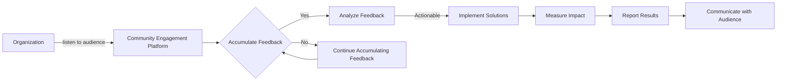
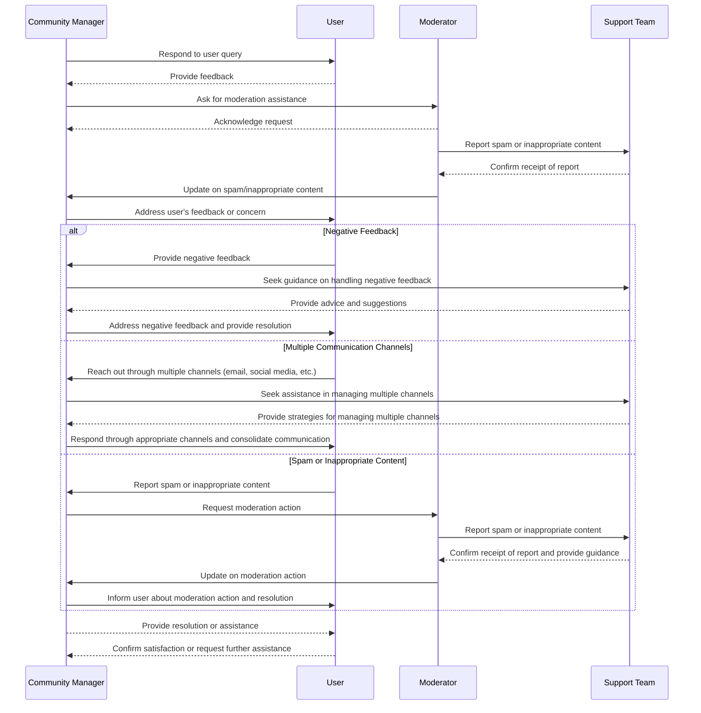
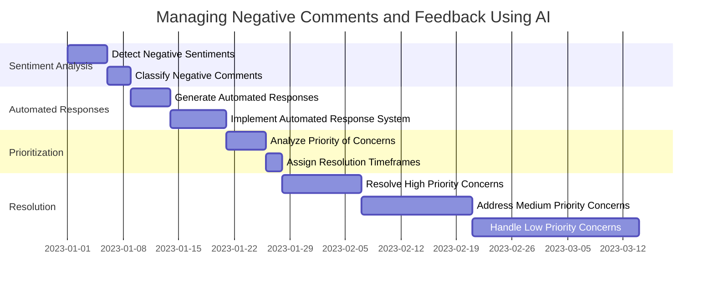
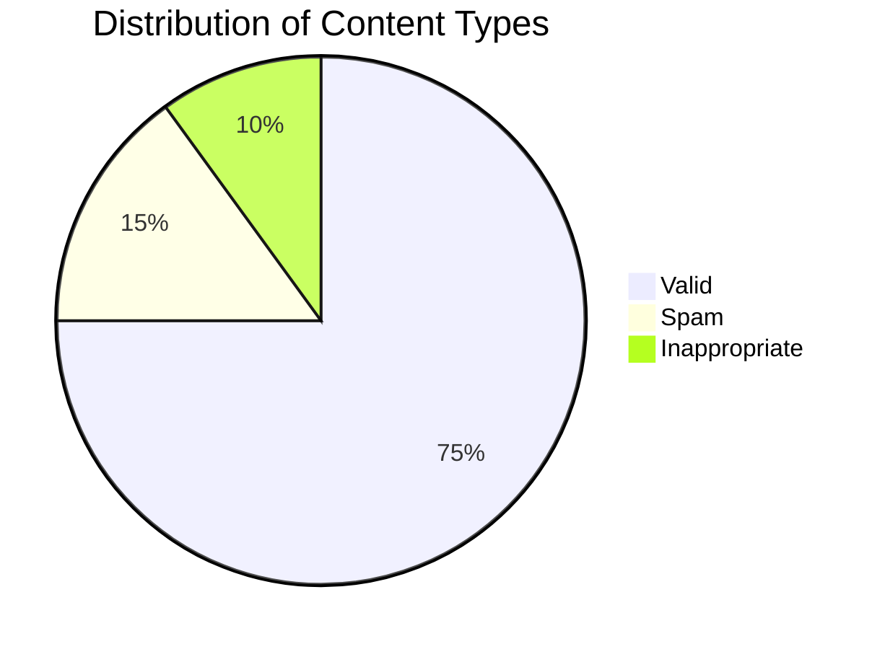

---
authors:
    - clair
categories:
    - audience engagement
date:
    created: 2023-10-24
---

# Choosing the Right Community Engagement Platform: A Comprehensive Guide

Discover the power of community engagement platforms and how they can transform your online community. Explore the benefits of Chainfuse AI and its AI-driven communication and customization options to foster stronger connections and create an inclusive digital community. Join us now!

<!-- more -->

## Introduction

In today's digital landscape, building and nurturing an engaged community is crucial for businesses and organizations. Community engagement platforms play a pivotal role in fostering collaboration, communication, and participation within these communities. One such platform is Chainfuse AI.

In this article, we will explore the benefits of using a community engagement platform like Chainfuse AI. We will delve into how these platforms facilitate effective communication, enable personalized experiences, streamline operations, and ensure safety within online communities. Additionally, we will discuss how Chainfuse AI can be tailored to meet the unique needs of different industries and audiences.

By leveraging the power of AI-driven communication and customization options offered by Chainfuse AI, businesses can enhance their community engagement efforts, foster stronger connections with their audience, and create a vibrant and inclusive online community. Let's dive in!

## 1. Understanding the Role of a Community Engagement Platform

Community engagement platforms form the heart of any flourishing digital community.

They act as the critical link binding establishments and their audience, paving the way for two-way communication that is essential for expansion and achievement. By making it feasible for organizations to listen to their audience, accumulate valuable feedback, and meet their needs in real-time, these platforms enable the creation and nurturing of a positive and cohesive digital community.

Community engagement platforms are instrumental in fostering collaboration and participation within a community. They provide a space for members to connect, share ideas, and contribute to the overall growth and development of the community. The synergy of communication and interaction among community members facilitated by these platforms helps create a sense of belonging and ownership. They also enable the community to gather feedback, address concerns, and make informed decisions collectively. Ultimately, these platforms encourage active involvement, strengthen relationships, and empower individuals to contribute to the betterment of their community.

A community engagement platform can drive numerous advantages. It can expedite communication and collaboration amongst community members, enabling them to share ideas, have discussions, and work collectively towards common objectives. This can help foster a sense of belonging and strengthen relationships within the community. Moreover, a community engagement platform can provide a centralized hub for accessing information, resources, and events, making it easier for community members to stay informed and involved. Equally critical is the platform's ability to help community leaders gather feedback and insights, which can be valuable for decision-making and planning. In essence, a community engagement platform can enhance community participation, empowerment, and overall well-being.

There are several best practices that can ensure successful implementation and utilization of community engagement platforms. These include defining clear goals and objectives before choosing a platform, selecting the right platform based on its features and capabilities, and establishing clear guidelines and expectations for users. Active participation and ownership within the community should be encouraged, and a system should be in place for monitoring and moderating content. It's also essential to promptly respond to community members' inquiries, feedback, and suggestions, demonstrating commitment to engagement and fostering trust and value within the community. Lastly, the success of community engagement efforts should be continuously monitored and evaluated using analytics and feedback to identify areas for improvement and make adjustments as needed.

Choosing the right community engagement platform involves several factors. First, goals and objectives for community engagement need to be defined, and the specific features and functionality needed to achieve those goals have to be determined. Factors such as ease of use, customization options, and integration capabilities with existing systems should be considered. Evaluating the platform's security and privacy measures, as well as the level of support and training provided is also important. Additionally, the scalability and pricing structure of the platform should be considered to ensure it aligns with the organization's needs and budget. Feedback from other organizations or communities that have used the platform can provide valuable insights and recommendations.

In the context of measuring the impact of community engagement platforms, it's important to analyze metrics such as user engagement, user growth, and user feedback. By tracking these metrics, organizations can accurately assess the effectiveness of their community engagement platforms and make data-driven decisions to improve their performance. Surveys or interviews with community members can provide valuable insights into the impact of these platforms on community involvement and satisfaction. By combining quantitative and qualitative data, organizations can gain a comprehensive understanding of the impact of their community engagement platforms.

In conclusion, community engagement platforms are critical tools in building and maintaining thriving digital communities. They facilitate two-way communication, foster a sense of community, and drive engagement and participation. By following best practices and carefully considering platform selection, organizations can create a robust and engaged community that contributes to their overall success.

### 1.1. The Importance of Effective Communication within Online Communities

Good communication is not just vital, but the core essence of any flourishing community, especially in a digital landscape. When communication is effective, it builds trust, nurtures relationships, and instills a deep sense of belonging among community members. This is where the functionality of a community engagement platform like Chainfuse proves invaluable. It becomes the conduit for creating an environment where everyone feels valued, engaged, and part of a unified community.

Chainfuse is a unique platform designed to enhance user engagement within a community. It's not just a tool, but a portal that enables users to communicate, interact, and collaborate efficiently. It simplifies communication, making it more accessible and comprehensive for all users. Through this platform, organizations can amplify their community engagement efforts resulting in a more vibrant, participative, and inclusive community.

Effective communication is the cornerstone of any online community. It's not just about transferring information, but facilitating an environment where knowledge exchange, mutual understanding, and collaboration thrive. This open exchange of ideas and feedback leads to effective problem-solving and decision-making within the community. When community members feel their voices are heard, and opinions valued, it fosters a sense of trust and belonging. Chainfuse ensures that not only is this communication effective, but it also thwarts misunderstandings, avoids conflicts, and stops the spread of incorrect information.

Maintaining a culture of trust and fostering relationships in a community requires an open and transparent communication process. Chainfuse allows active listening, clear messaging, and empathy, creating an environment in which community members trust each other. This is the bedrock upon which strong relationships are built.

Creating a sense of belonging within an online community is no small feat. It requires active engagement, collaboration, and consistent interaction. Chainfuse has been designed to make this an integral part of the community experience. With features like regular discussion forums, Q&A sessions, virtual events, and personalized user profiles, community members are encouraged to share their thoughts, experiences, and ideas. This sense of participation, coupled with rewards and recognition, makes members feel valued and integral to the community.

To facilitate this kind of effective communication, Chainfuse focuses on setting clear guidelines, encouraging active participation, and fostering an inclusive environment. With assigned moderators and community managers at the helm, communication remains respectful and productive, while also offering guidance and support to community members. The platform is equipped with user-friendly communication tools that are accessible to all community members, fostering a positive and engaging environment.

The benefits of a community engagement platform are manifold. It's a centralized hub for community members to connect, collaborate, and share ideas. This not only strengthens relationships but can also lead to increased problem-solving and knowledge sharing. Chainfuse serves as a hub for organizing events, polls, and surveys, thereby enabling active participation and giving community members a stake in decision-making. Through fostering a sense of belonging and promoting inclusivity, Chainfuse empowers community members to actively participate in community initiatives.

The communication tools that Chainfuse offers cater to the various needs of a community. From discussion boards and private messaging to real-time chat and video conferencing, these features enhance communication and make it more interactive. It's not just about communication; moderation tools are also in place to manage any conflicts, ensuring a smooth and harmonious community experience.

In an online community, effective communication best practices include respect, clarity, inclusivity, active listening, proper etiquette, constructive conflict resolution, positive discussions, privacy, reporting issues, and patiece. These practices, when adhered to, create a positive, inclusive, and welcoming online community, promoting healthy communication and collaboration.

Improving community engagement through effective communication isn't just about one-way communication, it's about creating a feedback loop. Regular updates, interactive platforms, responsive customer support, and feedback mechanisms lead to more robust engagement. Chainfuse provides clear channels of communication and actively involves community members in decision-making, creating a sense of ownership and enhanced engagement.

Measuring the impact of communication on an online community requires a multi-faceted approach. It's about observing engagement levels, user satisfaction, and behavioral patterns. By monitoring metrics like active participation, response rates, and sentiment analysis, Chainfuse helps analyze the effectiveness of community communication. Through surveys and feedback, valuable insights are gleaned, providing a clear picture of the impact of communication efforts. Organizations can use these data points to understand the success of their communication strategies and make data-driven decisions to improve their online communities effectively.

### 1.2. Addressing Challenges Faced by Community Managers

A community manager's journey in nurturing a thriving online community is fraught with various challenges.

These hurdles can vary from addressing negative feedback and comments in a timely and respectful way to juggling multiple communication channels and mitigating unwanted spam and inappropriate content.

To ensure a positive and healthy community environment, addressing negativity in a proactive way is paramount. This could mean establishing clear behavioral guidelines, setting expectations for respectful communication, and outlining conducts that are deemed appropriate. Prompt and professional responses to negative comments and feedback, which might involve acknowledging the feedback, addressing concerns, and offering solutions, are crucial. Moreover, encouraging positive contributions within the community and highlighting them can facilitate constructive discussions and prevent further negativity. Regular feedback monitoring and analysis can also provide valuable insights, helping identify recurring issues and enabling proactive measures to be taken.

Balancing multiple communication channels can be another challenge, and it can be managed by having a clearly defined strategy. Understanding the platforms where community members are most active and focusing efforts there can optimize engagement. Regular monitoring and analysis of each communication channel can help identify areas that need improvement and enable informed decisions regarding resource allocation.

Addressing spam and inappropriate content also requires careful navigation. Implementing a robust moderation system including dedicated moderators and automated spam filters can help manage this issue effectively. Clear community guidelines outlining acceptable behavior and content standards, combined with regular monitoring and a mechanism for community members to report violations, can ensure a healthy online environment.

Building and maintaining a vibrant online community requires clear communication, fostering meaningful interactions, providing valuable content, active involvement, and rewarding active members. Encouraging diversity and inclusivity, and continuous evaluation and improvement based on feedback also play key roles in cultivating an engaged community.

Community engagement platforms are the backbone of these efforts, providing a space for open dialogue, collaboration, and participation, empowering community members to voice their ideas, and contribute to decision-making processes.

When it comes to measuring the success of community engagement efforts, tools such as surveys, data analysis techniques, qualitative methods such as interviews and focus groups, and key performance indicators (KPIs) can provide valuable insights.

In summary, community managers need to address negative comments and feedback proactively, balance multiple communication channels effectively, deal with spam and inappropriate content efficiently, and build a vibrant and inclusive community while continuously assessing progress with suitable tools and techniques. In doing so, they can foster a thriving and engaging community.

## 2. Leveraging AI for Community Engagement

Harnessing the power of Artificial Intelligence (AI) has been a game-changer in the way businesses form meaningful connections with their audience.

AI has brought a transformative approach to community engagement, allowing businesses to streamline their operations, maintain consistent interactions, and deliver a bespoke experience that resonates with their community members. Among the pioneers spearheading this technological revolution is the AI-driven community engagement platform, Chainfuse AI.

In the digital sphere, platforms like Chainfuse AI offer a comprehensive solution that harnesses AI technology to foster interaction, collaboration, and personalized connections within online communities. By leveraging AI algorithms, these platforms are capable of analyzing user behavior, preferences, and interests, and thus, enabling community managers to craft content and engagement strategies tailored to their audience's needs. This is achieved by providing personalized recommendations, automating routine tasks, and identifying trending insights that can enhance community engagement.

To grasp the transformative power of AI, businesses need to ensure that their AI systems are well-versed in understanding and responding to their community's needs and concerns. This can be accomplished through extensive data collection and analysis, along with constant monitoring and refinement of AI algorithms. Maintaining transparency and accountability in the use of AI is paramount in this process. Community members should be fully aware of how their data is being used, ensuring their privacy rights are upheld to the highest standards.

Chainfuse AI can be used as an intersection point between businesses and popular platforms like Discord. The integration process is simple and straightforward. Starting from server settings in Discord, a webhook can be created and customized with a name and chosen channel. Once the webhook URL is generated, this can be pasted into the Chainfuse AI platform's integration or webhook settings. The result? Real-time updates and alerts straight from Chainfuse AI are seamlessly delivered to the specified Discord channel.

Moreover, Chainfuse AI can be uniquely tailored to deliver a personalized community experience. This is achieved by identifying specific settings on the Chainfuse platform, modifying the AI parameters to align with business needs, and testing the effectiveness of these changes.

When it comes to improving user satisfaction, Chainfuse AI can also be harnessed to set up a feedback collection system. This system can include a feedback form or chatbot that allows users to submit queries or share their feedback. Chainfuse AI then takes the reins, analyzing and categorizing the feedback and queries, and generating appropriate responses or actions based on the user's input.

In conclusion, AI-powered platforms like Chainfuse AI are not just a novel concept, but a transformative approach that can revolutionize the landscape of community engagement. By leveraging the power of AI, businesses can deliver a unique and customized community experience that resonates with their audience, fostering stronger connections and building a cohesive online community.

### 2.1. Managing Negative Comments and Feedback Using AI

Negative feedback and unkind remarks can pose significant challenges for community managers.

However, advancements in artificial intelligence have paved the way for a solution that can mitigate these challenges.

AI, with its ability to decode and comprehend language, can revolutionize the way community managers handle negative comments. By employing Natural Language Processing (NLP) techniques, AI algorithms can scan and classify the sentiment inherent in text data. This sentiment analysis allows them to automatically detect negative comments or feedback, thereby streamlining the process of monitoring and managing community feedback.

The real magic unfolds when you train these AI algorithms with a dataset of comments and feedback. The more data the AI model digests, the better it gets at accurately classifying sentiments. Deploying it on a real-time basis, you can keep a pulse on the community's mood and act promptly.

However, it's essential to strike a balance between AI and human intervention. While AI can sift through data and identify negative comments, interpreting the context and providing a suitable response relies on human judgment and empathy. AI can significantly reduce the grunt work, but for effective community management, the human touch is irreplaceable.

Effective community management is not just about identifying negative sentiments but also about addressing them strategically. By using AI tools, you can proactively monitor the community's sentiment and promptly address any negativities. Responsiveness coupled with empathy goes a long way in acknowledging and assuaging the concerns of the community members.

AI's advantage extends to automating responses. However, the key is to ensure that these automated responses are personalized and pertinent to the specific situation at hand. A generic, one-size-fits-all response will not cut it. In situations of negative sentiment, providing solutions or helpful resources can help address the community member's concerns. This could be anything from directing them to a support team, sharing relevant articles, or providing access to a FAQ section.

Managing negative feedback and maintaining a positive community environment is a proactive task. It involves continuous learning and adapting from the feedback received. By leveraging AI, you can gain insights and tweak your strategies to enhance community management. However, remember that AI should not replace but assist in managing the community. Human intervention and empathy are pivotal in effectively addressing negative sentiments.

There's a slew of AI-powered tools available to manage negative feedback, ranging from sentiment analysis platforms to social media monitoring tools, and community management platforms with AI-driven moderation features. These tools use sophisticated algorithms and machine learning techniques to detect sentiment, thereby allowing businesses and community managers to proactively address negative feedback and maintain a positive online reputation.

In conclusion, leveraging AI can accelerate the process of detecting and handling negative sentiments in community management. By implementing an automated system that analyzes user feedback and takes actions based on predefined rules and patterns, organizations can efficiently manage negative feedback, address concerns promptly, and foster a positive community environment. This approach not only nurtures trust and engagement but also enhances the overall user experience.

### 2.2. Balancing Multiple Communication Channels with AI

Modern businesses need to be omnipresent, maintaining active communication with their audience across a myriad of channels. The challenge, however, often lies in effectively managing these diverse platforms. Artificial Intelligence (AI) has emerged as a powerful tool to ensure consistent community engagement, regardless of the platform – be it Discord, Telegram, WhatsApp, or even SMS.

For instance, consider Chainfuse AI. This advanced AI solution can help businesses leverage the power of automation to streamline communication across various platforms. Let's delve into how Chainfuse AI can be integrated with some popular platforms:

-   **Discord**: To foster seamless engagement on Discord through Chainfuse AI, one needs to create a new application through the Discord Developer Portal, generate a bot token for that application, and then add the bot to the Discord server using the OAuth2 URL with the correct permissions. Subsequently, on the Chainfuse AI dashboard, navigate to the settings section, click on the Discord integration option, enter the bot token, and save changes. Post these steps, Chainfuse AI can facilitate smooth interaction with the Discord community.
-   **Telegram**: Chainfuse AI serves as a valuable tool for enhancing efficiency and productivity on Telegram. By automating routine tasks, enabling seamless communication among team members, and ensuring easy access to critical information, Chainfuse AI can help businesses streamline their operations on Telegram.
-   **SMS**: Chainfuse AI can significantly enhance customer engagement and streamline communication processes when integrated with SMS communication. The AI system can automate responses to customer inquiries, offer personalized messaging, and handle routine chores such as scheduling appointments or tracking orders.

While there is no context information about Chainfuse AI's integration with WhatsApp, the benefits that AI brings to the table for the other platforms indicate potential advantages for WhatsApp as well.

To effectively manage multiple communication channels with Chainfuse AI, it is important to follow certain best practices. These include centralizing communication using a single platform, ensuring all communication channels are integrated with relevant systems, prioritizing channels based on their importance to the business, maintaining consistency across all channels, leveraging automation to streamline repetitive tasks, and regularly monitoring and analyzing the performance of each channel.

Chainfuse AI leverages advanced algorithms and machine learning techniques to ensure consistent engagement across various platforms. It analyzes user behavior and preferences to deliver personalized content and recommendations, offering a seamless and consistent experience that maximizes user engagement and satisfaction.

Remember, while integrating Chainfuse AI with platforms like Discord, Telegram, WhatsApp, and SMS requires following certain instructions, the reward is a more efficient, streamlined, and engaging communication system.

## 3. Chainfuse AI as a Comprehensive Solution

Chainfuse AI is far more than a mere tool for community engagement. It's an all-encompassing solution that allows businesses to fine-tune and enhance their community engagement strategies. Through universal connectivity and AI-powered communication, Chainfuse AI is the resource businesses need to take their community engagement to the next level.

Utilizing the capabilities of Chainfuse AI is central to maximizing community engagement. With its ability to analyze user behavior and preferences, recognize patterns, and generate personalized content or recommendations, it's a game-changer in boosting user engagement. Not only does Chainfuse AI align communication and outreach strategies with user interests and preferences, but it also offers a more streamlined management process. By automating repetitive tasks and offering real-time insights, it aids in creating a vibrant and dynamic community around Chainfuse.

AI-driven communication is the key to community engagement. Integrating AI technology into your community engagement system's communication platform can automate a wide range of processes. These can include chatbots, personalized messaging, and sentiment analysis. With timely responses and an analytical approach to user feedback, AI-driven communication can significantly bolster engagement levels and enhance community interactions.

Creating a more interactive and collaborative environment for users is another powerful way to leverage Chainfuse AI. Implementation of features such as community forums, live chat support, and social media integration can help achieve this. AI algorithms analyze user data and provide personalized recommendations, notifications, and updates to community members. By actively engaging the community and constantly improving the platform based on user feedback, Chainfuse AI can foster a sense of belonging and encourage active participation from its users.

To ensure the most effective community engagement with Chainfuse AI, adhering to certain best practices is recommended. These include maintaining regular and transparent communication, actively listening to feedback, providing comprehensive support, fostering collaboration, and recognizing and rewarding contributions. By implementing these practices, Chainfuse AI can create an engaged, supportive community that encourages collaboration, innovation, and growth.

Harnessing the power of Chainfuse AI can dramatically enhance community engagement efforts. By utilizing the AI-powered features and functionalities of Chainfuse, organizations can provide personalized recommendations, targeted messaging, and dynamic content delivery based on user preferences and behaviors. Additionally, the AI algorithms can analyze community data to identify trends, preferences, and sentiment, allowing organizations to customize their engagement strategies. The result? Community engagement that not only meets but exceeds expectations.

Chainfuse AI has a proven track record in effective community engagement.
Join the growing community of businesses using Chainfuse AI and elevate your community engagement today.
Case studies highlight its successful engagement with various communities, showcasing the platform's ability to facilitate communication, collaboration, and problem-solving. With its innovative features and user-friendly interface, Chainfuse AI has enabled communities to unite, exchange ideas, and work towards shared goals. These case studies serve as tangible proof of Chainfuse AI's ability to foster meaningful and productive community engagement.

Measuring the effectiveness of community engagement with Chainfuse AI can be achieved by analyzing various factors. For instance, website traffic, user engagement metrics, and conversion rates can offer valuable insights. By regularly monitoring and analyzing these metrics, you can assess the impact of Chainfuse AI on community engagement and make informed decisions to further optimize its effectiveness.

### 3.1. Universal Connectivity Across Popular Platforms

Chainfuse AI stands out due to its universal connectivity capabilities. This multi-channel communications feature offers businesses a platform to connect with their audience across a variety of mediums. For instance, enthusiasts in gaming or cryptocurrency communities can be reached directly, creating more opportunities for interaction.

Chainfuse AI provides the functionality to extend the reach to followers on Telegram, leveraging this platform's unique features. Automation is key here, with tasks such as message sending, group management, and engagement analysis driven by artificial intelligence. This optimizes the communication strategy, enabling meaningful interactions with followers.

In regards to engaging with gaming communities, Chainfuse's range of services is designed to foster interaction and engagement with gamers. By utilizing the tools and resources offered within the Chainfuse platform, businesses can create an engaging experience, fostering stronger relationships.

For those in the crypto world, Chainfuse AI can be a game-changer. The platform's AI capabilities provide deep insights, analytics, and automation tools that can help crypto communities understand their audience better, tailoring their messaging to drive meaningful interactions. With its ability to analyze user behavior, sentiment, and preferences, Chainfuse AI enables targeted outreach and personalized experiences, enhancing community engagement and creating a more robust sense of togetherness within the crypto space.

Moreover, Chainfuse AI might be instrumental when it comes to global conversations on platforms like WhatsApp. It is advisable to explore the official documentation or reach out to Chainfuse AI to gain insights into their specific capabilities on WhatsApp.

Chainfuse AI is designed to offer businesses seamless integration with their existing communication channels like email, messaging apps, and social media. By employing AI, businesses can automate and enhance their communication processes, offering personalized and efficient interactions across multiple platforms. This optimization of communication strategy leads to an exceptional customer experience.

Finally, Chainfuse AI is not only about connectivity; it's also about reach. By leveraging the AI capabilities of the platform, businesses can improve their website performance and user experience. The AI-powered analytics provided by Chainfuse offer businesses insights into their audience, allowing them to tailor their content to their preferences, expanding their reach and increasing brand engagement.

In conclusion, Chainfuse AI promises universal connectivity, offering businesses a means to extend their reach, engage with their audience across multiple channels, and create a more personalized, efficient, and engaging communication strategy.

### 3.2 Streamlining Operations with AI-driven Communication

Harness the power of Chainfuse AI to simplify and optimize your operational tasks. With the implementation of this AI-driven platform, tedious manual tasks such as collating feature requests, addressing user inquiries, and prioritizing user concerns can be automated, granting you more time to focus on enhancing the user experience and analyzing key insights.

Chainfuse AI brings to the table a user-friendly interface, packed with a variety of tools and features. Employ these tools to gather and manage feature requests from your users. For instance, customizable forms and surveys aid you in collecting detailed information about each requested feature. Additionally, the platform's analytics and reporting capabilities enable you to monitor and analyze the gathered requests, assisting you further in planning future enhancements and updates.

As for user queries, Chainfuse AI comes in handy with its smart response generation feature. By evaluating various context information including base URL, chunk ID, domain, type, and URL, Chainfuse AI comprehends specific user inquiries and delivers apt and reliable answers. Be it questions related to the website, specific URLs, or any topic related to Chainfuse, rest assured that the AI system will provide dependable guidance based on the given context.

The ability to prioritize user concerns is yet another striking benefit of Chainfuse AI. The platform employs an analytical algorithm that scrutinizes user feedback and sentiment. This approach identifies the most recurring and impactful concerns raised by users, which can then be prioritized for resolution, enhancing user satisfaction. Machine learning techniques are also used to predict potential issues based on user behavior and patterns, enabling proactive measures to be taken before they evolve into major concerns.

Chainfuse AI's ability to automate responses to incoming requests is a further testament to its efficiency. By integrating your system with Chainfuse, you can make the most of their AI capabilities to automate your customer service or support responses. This feature not only improves efficiency but also streamlines the entire customer service process.

In addition to these operational benefits, Chainfuse AI promotes a superior customer experience. Its advanced capabilities provide customers with personalized recommendations, efficient communication channels, and streamlined processes. The AI technology has the ability to analyze customer data and offer predictive insights, ensuring a smooth and delightful experience for users.

Chainfuse AI's proficiency extends to data analysis as well. By processing large volumes of data, it can identify patterns, trends, and correlations that may be overlooked by human analysts. This power of AI aids businesses in making data-driven decisions, enhancing operational efficiency, and gaining a competitive edge in their industries.

To summarize, whether you're looking to analyze customer behavior, optimize marketing campaigns, or predict market trends, Chainfuse AI can provide valuable insights that can drive business growth and success. Opt for Chainfuse AI to streamline your operations, automate tasks, and make data-driven decisions. By doing so, you will not only improve productivity but also reduce operational costs.

## 4. Ensuring Safety within Online Communities

In the bustling world of online communities, ensuring a secure environment for open communication is nothing short of essential. Tackling issues like spam and inappropriate content can be a herculean task, but not when you have a tool like Chainfuse AI in your arsenal.

With Chainfuse AI, businesses can leverage cutting-edge algorithms that scrutinize user behavior, content patterns, and network activity for any signs of spam. These cunningly designed safeguards can automatically detect and block spam messages or accounts, fostering a safer community space for users to engage in.

But the power of Chainfuse AI doesn't stop there. It also plays a pivotal role in curbing inappropriate content. This AI-driven solution can proactively moderate and filter out any user-generated content that is potentially detrimental to the community, making way for wholesome and respectful conversations.

Moreover, Chainfuse AI isn't a set-and-forget tool. It thrives on continuous learning and evolution. With regular updates and enhancements, the AI algorithms under the hood ensure the platform adapts to emerging trends and continues to minimize risks effectively.

Of course, the responsibility of fostering a safe community doesn't rest solely on technological measures. As a community manager, you can supplement the AI's efforts by clearly communicating the community guidelines to all users. After all, setting a clear expectation of behavior goes a long way in cultivating a respectful environment.

But what about user feedback and concerns? Chainfuse AI has you covered there too. By keeping a keen eye on user feedback and promptly addressing any issues tied to the AI, you can demonstrate your dedication to maintaining the safety and inclusivity of your online community.

Utilizing Chainfuse AI for moderation doesn't just end at ensuring safety. It also helps streamline the entire moderation process. By analyzing user-created content and pinpointing potential violations, you can reduce the manual effort required to review and moderate content, letting you focus on fostering a vibrant community.

Here's a step-by-step guide to utilizing Chainfuse AI for enhancing community safety:

1. Establish community guidelines: Define rules and standards for behavior.
2. Monitor user-generated content: Use Chainfuse AI to automatically flag and filter potentially inappropriate content.
3. Encourage reporting: Make it simple and anonymous for users to report inappropriate content.
4. Take swift action: Quickly remove inappropriate content and take necessary action against the offenders.
5. Educate your community: Highlight the importance of respecting community guidelines and the consequences of not doing so.
6. Regularly update AI algorithms: Keep up with technological advancements for effective moderation.
7. Foster open communication: Encourage respectful and open conversations among community members.

By integrating Chainfuse AI and following these best practices, you can create a safe, inclusive, and positive environment that nurtures constructive interactions and shields your community from harmful content or behavior.

### 4.1 Dealing with Spam and Inappropriate Content using Chainfuse AI

Creating a safe and engaging online community environment is a significant task for any business. Chainfuse AI, with its state-of-the-art content moderation capabilities, steps in to provide a solution. Its primary function is to analyze and classify content using advanced algorithms and machine learning techniques. It scrutinizes various types of content – text, images, and videos – with great precision.

Chainfuse AI can detect and flag inappropriate or harmful content almost instantly. This feature permits the community managers to take immediate action, whether it's removing or blocking such content from the platform.

While Chainfuse AI seamlessly automates the monitoring process, it is essential to establish clear community guidelines and rules that outline acceptable behavior on the platform. This approach encourages positive engagement and provides users with a clear understanding of what is expected of them.

Further enhancing the capabilities of Chainfuse AI is the implementation of a robust moderation system. This system leverages both AI algorithms and human moderators for a two-pronged approach. This makes it possible to effectively identify and address any inappropriate or harmful content, ensuring the community remains a safe haven for its users.

For a comprehensive safety protocol, Chainfuse AI allows users to report violations of the community guidelines or any suspicious activities. These reports are investigated promptly to maintain a safe environment. In addition, Chainfuse AI is built to adapt to evolving challenges and stay ahead of potential threats. Regular updates and improvements to the AI algorithms used for content moderation are part of this adaptability.

Transparency is another cornerstone of Chainfuse AI's approach to community safety. Open communication with the community, sharing updates on policy changes, addressing concerns, and seeking feedback ensures that users feel heard and valued.

Lastly, Chainfuse AI is not just about maintaining safety. It also enhances the user experience by providing real-time insights and analytics on the content being shared. These insights allow community managers to proactively address any emerging issues or trends, thus ensuring a positive and engaging environment for the community.

In conclusion, Chainfuse AI is an advanced tool that enables businesses to maintain a safe and positive community environment. Its AI-powered content moderation system, combined with best practices for community management, provides a comprehensive solution for managing online communities.

### 4.2 Optimizing Chainfuse AI for Accurate Identification and Filtering

Chainfuse AI provides businesses the power to mold the system according to their unique requirements.

This optimization leads to better accuracy when identifying and filtering out undesired content such as spam and inappropriate posts. The result is a secure online environment that syncs well with the brand image and the preferences of the audience.

So, how does one harness the power of Chainfuse AI's customization features to ensure a safer community?

To begin with, the quality of the data used to train the AI model should be paramount. Accurate and comprehensive data improves the AI's ability to identify patterns and make precise predictions. In addition, expanding the volume of data can significantly enhance the model's performance by capturing a wider range of scenarios.

Another essential step is to fine-tune the AI model. Once the initial training phase is complete, adjustments can be made to the hyperparameters, different algorithms can be experimented with, and the model's performance can be validated against a separate test dataset. This iterative process optimizes the model for accurate identification.

Moreover, feedback loops play a crucial role in refining the model. Constantly incorporating user feedback into the AI model's training process helps highlight areas of improvement which can be addressed over time. As new data becomes available and user needs evolve, it is vital to regularly update the AI model to maintain its accuracy.

Chainfuse AI also offers solutions for filtering out spam and inappropriate content from websites. The platform examines the content of a webpage to identify potential spam or inappropriate material, ensuring a safer user experience.

Now, let's talk about how Chainfuse AI can help businesses align their content with their brand and audience preferences. By analyzing data from various sources, including the website's domain and URL, Chainfuse AI can provide insights and recommendations on how to tailor content to reflect the brand's identity and engage the target audience effectively.

To make Chainfuse AI cater to specific business needs, it's possible to adjust its configuration and functionality. This could involve tweaking the AI algorithms, changing the input data sources, and modifying the output formats to align with business requirements. Additionally, businesses may need to integrate Chainfuse AI with existing systems and processes for smooth operations and optimal results.

In conclusion, Chainfuse AI's customizable nature provides businesses with a versatile tool to create a secure community that resonates with their brand and audience preferences. By leveraging the powerful features of Chainfuse AI, businesses can manage their online community effectively and efficiently.

## 5 Adapting Chainfuse AI to Specific Needs

The beauty of Chainfuse AI lies in its adaptability, allowing businesses to mold it to their unique needs and preferences. Every enterprise is different, with its own set of community engagement requirements. Chainfuse AI recognizes this and offers a flexible solution, ensuring the AI fits like a glove, no matter the context.

Consider a crypto startup. With Chainfuse AI, it's possible to integrate the AI using the resources and APIs available on the website. You can also make use of the domain information and chunk_id to refine and optimize the AI algorithms, ensuring they align perfectly with your business needs.

Turning our attention to e-commerce brands, Chainfuse AI can lend its powers to enhance various aspects of e-commerce operations. From improving customer experience to streamlining order fulfillment processes, the scope is vast. The AI can tap into customer behavior, preferences, and purchase history, offering personalized shopping experiences and finely tuned recommendations. Pricing strategies and inventory management can also be optimized, all thanks to the adaptable nature of Chainfuse AI.

Local businesses, too, can benefit from Chainfuse AI's customization features. You can tweak the AI functionalities and algorithms to meet the unique needs of the local business community. Incorporating features that cater to local preferences and integrating with commonly used local platforms can ensure a more effective and relevant engagement solution.

For educational institutions, Chainfuse AI can be tailored to meet the unique needs posed by the educational sector. The platform offers specific functionalities and customization options designed keeping in mind educational institutions. You can explore these options on the website and can even reach out to the Chainfuse support team for further assistance on how to leverage the AI for educational purposes.

Travel agencies can leverage Chainfuse AI to analyze data and provide personalized refinement options that align with the specific needs of each agency. From suggestions for optimizing travel itineraries to devising targeted marketing strategies to attract more customers, the possibilities are endless. The AI system will continually learn and adapt based on user feedback and behavior, ensuring the refinement options are increasingly accurate and effective over time.

In conclusion, whether it's a crypto startup, an e-commerce brand, a local business, or an educational institution, Chainfuse AI offers the flexibility to adapt and cater to the unique community engagement needs of different sectors.

### 5.1 Customization Options for Different Brands and Audiences

Embracing the power of artificial intelligence, Chainfuse AI provides a diverse range of refinement options designed to advance user experience on their platform. This means businesses can intricately tailor the AI to resonate with their brand ethos and audience preferences. The result? A bespoke, immersive experience that fosters deeper user engagement and bolsters brand loyalty.

With Chainfuse AI, the key to crafting a personalized touch rests with the base_url. Navigating the base_url gives you access to an array of features and options, empowering you to sculpt Chainfuse AI to meet your unique needs. The domain and type information enrich your understanding of the nitty-gritty functionalities and capabilities pivotal to customization.

Implementing AI technology escalates the personalization process. Chainfuse AI scrutinizes user behavior and activity patterns, producing insightful data that can generate tailored recommendations and suggestions. These not only optimize workflow efficiency but also enhance effectiveness. This user-centric approach ensures that every interaction is smooth, intuitive, and most importantly, personalized.

For brand alignment, precision lies in the subtleties. You will need to adjust the CSS styles and JavaScript functions to ensure that the AI mirrors your brand's visual identity, creating a cohesive user experience.

To enhance user engagement, you can harness the power of the Chainfuse platform. The base_url, domain, and url are your tools to curate a unique user experience. The chunk_id and type also play a crucial role, optimizing the content loading and rendering process. The integration of AI technologies like personalized recommendations or chatbots can amplify user engagement, fostering an interactive and customized experience on the Chainfuse platform.

Aligning Chainfuse AI with audience preferences can skyrocket customer satisfaction, engagement, and loyalty. By framing the AI algorithms to cater to specific audience preferences, businesses can provide an unprecedented personalized experience for their customers. Such customization also empowers businesses to delve deeper into understanding their audience, enabling data-driven decisions and marketing strategy optimization.

To maximize user loyalty, it's essential to analyze user behavior and preferences. Chainfuse AI can collect data on user interactions, like click patterns and time spent on different pages. This data then becomes the foundation for creating personalized user experiences, curating relevant content and recommendations. An iterative feedback process allows for constant refinement, ensuring a continuous optimization of the user experience, thus fostering long-term loyalty.

When customizing Chainfuse AI, consider understanding the base_url and domain of the specific Chainfuse website you are working with. Review the chunk_id and type of the URL that you wish to customize. Use appropriate event listeners and handlers to ensure that your customizations are applied accurately. Maintain the consistency of your modifications with the overall design and functionality of the website. Lastly, always test your customizations in a controlled environment before deploying them live.

While we don't have specific case studies at hand showcasing businesses using Chainfuse AI customization, this personalized approach has the potential to revolutionize user engagement and satisfaction, thus bolstering brand loyalty.

### 5.2 Use Cases: From Political Campaigns to Local Businesses

The versatility of Chainfuse AI makes it a valuable asset across a vast spectrum of industries and applications. For instance, political campaigns can harness its capabilities for voter engagement in real-time, facilitating an immediate feedback loop. Through the Chainfuse platform, equipped for user interaction and engagement, AI functionalities can be leveraged to offer personalized voter outreach in real-time. This allows for the specifics of your voter engagement strategy to be met, fostering constant and effective communication with your voter base.

Crypto startups can also benefit from Chainfuse AI for a variety of tasks. Its broad range of offerings designed specifically for the crypto landscape allows these startups to optimize their operations, boost security, and enhance overall efficiency. Moreover, Chainfuse AI can analyze data from multiple sources, pinpointing patterns and trends that suggest potential investor interest and engagement. This advanced data analysis can help businesses focus their marketing efforts on the right audience, thereby increasing the likelihood of attracting potential investors.

In the e-commerce sector, Chainfuse AI can provide substantial benefits as well. With its advanced technologies, it can improve post-purchase support processes. By integrating Chainfuse AI into their operations, businesses can deliver faster and more efficient assistance to their customers, leading to improved response times, personalized customer interactions, and valuable insights into consumer behaviour and preferences.

However, it's worth noting that while Chainfuse AI offers a myriad of potential applications, the specifics of some features, such as instant feedback collection, product query resolution, and review gathering, may not be explicitly defined or mentioned. For comprehensive information about these features, it's best to visit the official Chainfuse website or get in touch with their support team.

To put it succinctly, Chainfuse AI's potential applications are wide-ranging and can be effectively utilized to meet the unique needs of a variety of industries, be it political campaigns, crypto startups, or e-commerce brands.

## 6 Enhancing Community Engagement Efforts with Chainfuse AI

Engaging with your community is not a task to be taken lightly, and Chainfuse AI is here to assist you in ensuring that engagement is not only possible, but also effective and rewarding. Chainfuse AI is more than a mere tool; it's your ally in fostering a sense of connection, collaboration, and cohesion within your online communities.

However, this engagement does not occur in a vacuum, and here's where Chainfuse AI brings its real game. By leveraging Chainfuse AI's capabilities to sift through and comprehend user behavior and preferences, you can tailor your community engagement initiatives to better resonate with your community members. The insights provided by Chainfuse AI can assist community managers in creating targeted content and messaging that is not only engaging, but also energizing for the community.

But that's not all. Chainfuse AI also serves to streamline community engagement processes, such as promptly addressing inquiries or providing personalized recommendations, by automating them. This allows organizations to develop more impactful and effective engagement strategies, ensuring that the community remains vibrant, active, and, most importantly, engaged.

To maximize the impact of Chainfuse AI, it's essential to create an environment that promotes active participation from your community members. This involves the implementation of features such as forums or discussion boards where members can voice their opinions, pose questions, and provide feedback. Not only does this promote engagement, but it also fosters a sense of belonging and ownership amongst your members.

Regular events or competitions related to Chainfuse AI can also spark interest and participation within the community. Think along the lines of hackathons or coding challenges or virtual meetups where users can put their skills to the test and interact with others who share their interests. You can also use social media platforms to regularly share updates, news, and educational content about Chainfuse AI, which can raise awareness and attract more community members.

The secret sauce here is quite straightforward - maintain a proactive and inclusive approach that values the input and participation of community members. By fostering communication, organizing events, and leveraging social media, you can cultivate a thriving community that is actively engaged with Chainfuse AI. It's a journey, but with Chainfuse AI at your side, it's a journey that promises to be rewarding for your community and your organization.

### 6.1 Tailored Guidance and Strategies for Different Industries

Every industry is unique with its own set of challenges and requirements. Chainfuse AI recognizes these distinctive needs and offers customized solutions tailored to meet these specific demands. Let's take a closer look at how Chainfuse AI achieves this in the context of non-profit organizations and influencers.

For non-profit organizations aiming to uplift their mission's impact, Chainfuse AI serves as a powerful ally. It provides a suite of AI-driven strategies crafted to align with their unique needs. These strategies span a range of services, from website optimization to data analysis and AI execution. These strategies, when implemented, maximize the potential of non-profit organizations, improving their operational efficiency and amplifying their influence.

For instance, Chainfuse AI can optimize fundraising campaigns, streamline operations or even dissect data to glean valuable insights. These capabilities enable organizations to pursue their goals more efficiently, accelerating their mission's progress.

Moreover, Chainfuse AI can boost community engagement for non-profit organizations. By utilizing its sophisticated capabilities, organizations can deploy personalized and targeted communication strategies that strike a chord with community members. The AI can analyze data from diverse sources to comprehend the preferences and interests of community members, thereby allowing organizations to tailor their initiatives and messages to resonate with their audience. Additionally, Chainfuse AI can even assist in identifying and reaching out to potential volunteers, donors, and partners, effectively expanding the organization's network and support base.

On the other end of the spectrum, consider influencers looking to fortify their fan connections. Chainfuse AI can be leverage to analyze fan data and create personalized content that resonates with each fan's unique interests and preferences. This approach enhances fan engagement and fosters stronger connections.

Chainfuse AI can also help influencers segment their fan base and execute targeted marketing campaigns. By focusing efforts on specific fan groups, influencers can deliver more impactful and personalized messages, further strengthening fan relationships. The AI can monitor and analyze fan interactions on social media platforms, providing influencers an opportunity to engage fans in meaningful conversations and create a sense of community.

Chainfuse AI isn't just limited to non-profit organizations and influencers. It provides a robust platform for businesses across a variety of sectors to overcome their unique challenges and achieve their goals. By analyzing industry-specific data and trends, it offers customized solutions that can optimize processes, improve customer service, or enhance operational efficiency.

Chainfuse AI has already made significant strides in enhancing community engagement across different industries including e-commerce, healthcare, and education. These sectors have seen measured improvements in customer satisfaction, brand loyalty, and revenue growth due to the personalized experiences facilitated by Chainfuse AI.

In conclusion, Chainfuse AI's success in driving community engagement is evident from various case studies demonstrating the effectiveness of AI in fostering stronger relationships between businesses and their communities. Whether it's a non-profit organization striving to amplify their impact or an influencer seeking to fortify their fan connections, Chainfuse AI has the necessary tools and insights to address their unique needs and challenges.

### 6.2 Experiencing the Power of AI-Driven Communication

Harnessing the power of Artificial Intelligence (AI) in communication is rapidly shaping the future of community engagement. By adopting AI-driven communication platforms like Chainfuse AI, businesses can create interactive environments where community members feel recognized, valued, and actively engaged.

AI-driven communication significantly upgrades the efficiency and effectiveness of community engagement. Common communications tasks like mass notifications or responses to standard inquiries can be automated, allowing faster and more personalized interactions. This swift and targeted response system can boost member satisfaction and drive higher engagement levels.

In addition, AI algorithms can sift through enormous volumes of data, detecting patterns and trends in community behavior and sentiment. These insights enable businesses to understand their community members' needs and preferences better, which can then inform tailored communication strategies.

What's more, AI-driven communication can generate real-time insights and analytics, empowering businesses to measure their engagement efforts' impact and make data-informed decisions. Therefore, adopting AI in community engagement can significantly enhance communication's efficiency, personalization, and effectiveness, leading to stronger community relationships overall.

To implement AI-driven communication for community engagement, businesses can integrate technologies like AI-powered chatbots or virtual assistants into their websites or communication channels. These tools provide automated responses and assistance to community members, improving engagement by swiftly delivering accurate information, answering frequently asked questions, and guiding users to relevant resources. Moreover, AI can analyze user interactions and behavior to supply personalized recommendations and suggestions, thus enhancing community engagement even further.

As with all technology, it's also crucial to operate best practices when implementing AI-driven communication in community engagement. Firstly, ensure the AI system is trained on a diverse dataset that accurately reflects the engaged community to avoid biases and guarantee balanced communication. Secondly, be transparent with the community about the use of AI in the communication process to foster trust.

Regular evaluation and monitoring of the AI system's performance is also critical, including assessing the communication accuracy, identifying any biases or errors, and making necessary improvements. Lastly, while AI can enhance communication efficiency, human judgment and empathy remain vital in forging meaningful connections and addressing complex community needs.

Chainfuse AI exemplifies these principles in action, utilizing AI-driven communication to enhance community engagement. By leveraging advanced algorithms and natural language processing techniques, Chainfuse AI can analyze and understand user inputs, providing personalized and relevant responses to community members. This platform fosters meaningful interactions, addresses user concerns, and offers valuable information to enhance community engagement, leading to a more enriching community experience for all users.

In conclusion, an AI-driven communication strategy can revolutionize community engagement, creating a more interactive and engaging community experience. By harnessing technologies like Chainfuse AI, businesses can leverage the power of AI to deliver personalization, efficiency, and effectiveness in their community engagement efforts.

## Conclusion

In today's digital landscape, building and nurturing an engaged community is crucial for businesses and organizations. Community engagement platforms play a pivotal role in fostering collaboration, communication, and participation within these communities. One such platform is Chainfuse AI.

Chainfuse AI offers a comprehensive solution for enhancing community engagement efforts. It leverages the power of AI to facilitate effective communication, enable personalized experiences, streamline operations, and ensure safety within online communities. By analyzing user behavior and preferences, Chainfuse AI provides valuable insights that enable businesses to tailor their engagement strategies to meet the unique needs of their audience.

The benefits of using Chainfuse AI are manifold. It allows businesses to expedite communication, foster collaboration, and strengthen relationships within their community. The platform serves as a centralized hub for accessing information, resources, and events, making it easier for community members to stay informed and involved. With its AI-driven capabilities, Chainfuse AI can also automate routine tasks and provide personalized recommendations, enhancing community participation and overall well-being.

Furthermore, Chainfuse AI can be tailored to meet the specific needs of different industries and audiences. Whether it's a non-profit organization aiming to amplify its impact or an influencer looking to fortify fan connections, Chainfuse AI provides customized solutions that align with each industry's requirements.

The broader significance of using a community engagement platform like Chainfuse AI lies in its ability to create a vibrant and inclusive online community. By leveraging the power of AI-driven communication and customization options offered by Chainfuse AI, businesses can enhance their community engagement efforts, foster stronger connections with their audience, and create a sense of belonging among community members.

In conclusion, Chainfuse AI is a powerful tool that enables businesses to build thriving online communities. By leveraging its capabilities in effective communication, personalized experiences, streamlined operations, and safety measures, businesses can create engaging environments that foster collaboration and empower community members. It has never been easier to create an AI for your brand - start free now!
