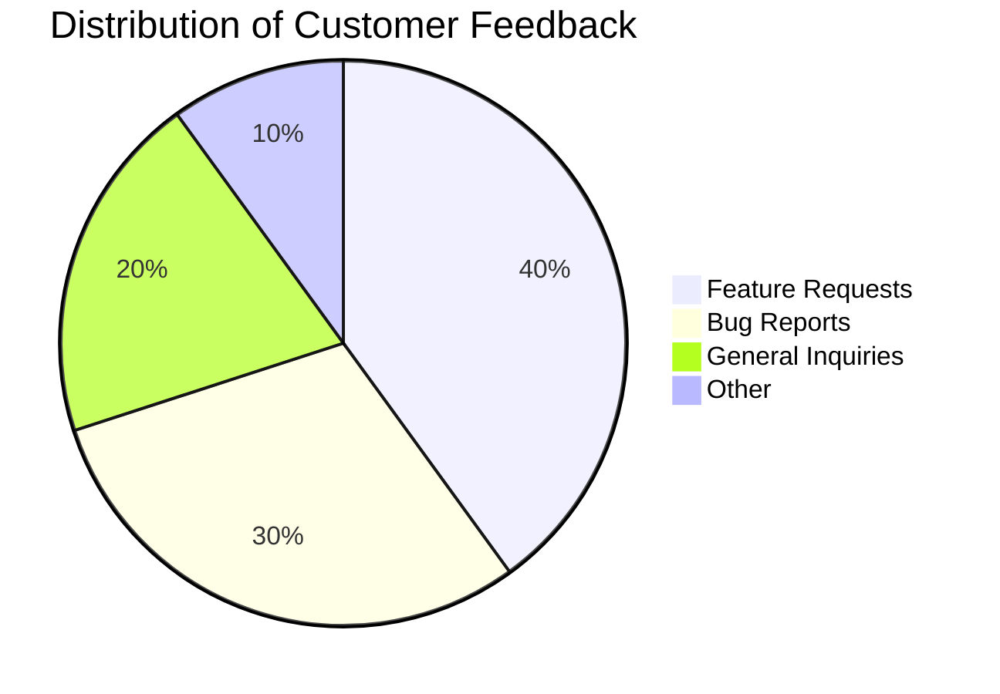

---
authors:
    - clair
categories:
    - audience engagement
date: 2023-10-24
---

# Maximizing Customer Satisfaction: AI-Driven Strategies to Optimize Customer Experience

Learn how businesses can optimize customer experiences, strengthen relationships with their community, and enhance brand visibility. Dive into the world of AI-powered community management now!

<!-- more -->

## Introduction

In today's digital landscape, building and nurturing a community is paramount for businesses and organizations. It is through community engagement that brands can foster connections, gather feedback, and enhance the overall customer experience. To optimize community engagement efforts, many businesses are turning to Artificial Intelligence (AI) solutions like Chainfuse AI.

Chainfuse AI revolutionizes community management by leveraging AI technology to automate processes, provide personalized recommendations, and streamline interactions with the audience. With its advanced capabilities, Chainfuse AI helps businesses enhance their brand presence, strengthen relationships with their community members, and optimize customer experiences.

In this article, we will explore the role of Chainfuse AI in community engagement. We will discuss how AI-driven communication tools can improve customer interactions, prioritize user concerns, collect valuable feedback at scale, and enhance brand visibility. By harnessing the power of Chainfuse AI, businesses can create a vibrant and engaged community that drives growth and success.

Join us as we dive into the world of AI-powered community engagement with Chainfuse AI.

### 1. Understanding the Role of AI in Community Engagement

Artificial Intelligence (AI) is fast becoming an indispensable ally in the realm of community engagement, ushering in a new era where organizations can interact with their audience in a more personalized and efficient manner.

Among these transformative technologies leading the charge is Chainfuse AI, with its innovative approach to community management.

Leveraging Chainfuse AI's capabilities, developers can create custom integrations with popular communication channels such as Slack, Microsoft Teams, and even email through the ChainFuse API. This seamless communication between ChainFuse AI and the desired communication channel allows users to receive AI-generated insights directly within their preferred platform, transforming the way they interact with the organization.

AI-driven communication tools like ChainFuse AI offer numerous benefits by automating repetitive tasks, analyzing data, and boosting overall efficiency. They spare community managers the time and effort spent on processes like content scheduling, member onboarding, and engagement tracking, while also providing personalized recommendations, answering common queries, and facilitating seamless interactions. This unique blend of automation and personalization enhances member experiences, leading to improved productivity and optimized community experiences.

The power of ChainFuse AI can be harnessed in various ways for community engagement. For starters, you should have a comprehensive understanding of its specific features and capabilities to effectively leverage its functionalities. Having a well-defined community engagement strategy in place is also essential.

By outlining your goals, target audience, and desired outcomes, you can tailor your use of ChainFuse AI to address the specific needs and preferences of your community members. Regular monitoring and analysis of your community engagement efforts using ChainFuse AI are equally important, allowing you to spot areas for improvement and make data-driven decisions to enhance your engagement strategies.

Many businesses across industries have found success using ChainFuse AI for audience interaction. Integrating ChainFuse AI into their websites or online platforms, they've managed to boost audience engagement and offer personalized experiences. This integration provides valuable insights and data about their audience, which, in turn, enables businesses to tailor their offerings and marketing strategies. The result? Improved customer satisfaction, more conversions, and business growth.

Customizing ChainFuse AI to match your brand identity and resonate with your target audience is a breeze. You can modify the color scheme, typography, layout, and overall visual style to align with your brand. Tailoring the content and messaging to your audience's needs and preferences is just as straightforward. Leverage user data and feedback to constantly optimize and personalize the AI algorithms, ensuring a tailored experience for your audience.

ChainFuse AI also shines in customer support. By capturing customer interactions and requests and analyzing them in real-time, you can provide personalized and efficient support. This proactive approach, powered by AI insights, identifies common customer issues and addresses them before they escalate, reducing the need for customer support intervention.

Lastly, ChainFuse AI can be tapped for real-time feedback collection. By integrating ChainFuse AI's capabilities into your system, you can capture real-time feedback from users and analyze it for valuable insights. This cutting-edge approach to feedback collection ensures that your community's voice is heard, fostering stronger connections and ensuring continuous improvement.

#### 1.1. The Power of AI-Driven Communication

Artificial Intelligence (AI) is revolutionizing the realm of community engagement, transforming how community managers interact with their audiences. AI technology is notably leveraged in automating tasks that would otherwise be time-consuming and monotonous, such as responding to user inquiries and gathering feedback. Chainfuse AI steps up to the plate in this regard, with its advanced capabilities that prioritize user issues and concerns. This ensures an optimized user experience, and in turn, provides businesses with the invaluable insights they need.

To illustrate, Chainfuse AI's ability to automate responses to user inquiries takes the efficiency and accuracy of information delivery to new heights. The AI capitalizes on the context details provided, thoroughly analyzing and interpreting user inquiries before generating a fitting response. In essence, the AI does the heavy lifting, allowing businesses to focus on timely and precise information dissemination.

There's also an exciting role that AI-driven communication plays in the collection of feedback. By integrating AI-powered chatbots into various communication channels, whether it be websites, messaging platforms, or mobile apps, user engagement is automated. Users can interact with these advanced chatbots and provide feedback, which the AI can process quickly in accordance with predefined rules or machine learning algorithms. This streamlines the feedback collection process, enhances the customer experience, and enables businesses to make data-driven decisions.

In the context of uncovering key insights, AI-driven communication is equally instrumental. The power of AI allows businesses to sift through extensive data and extract valuable information - an important asset in effective decision-making and business growth. AI-powered tools can scrutinize communication patterns, identify trends, and reveal hidden patterns that may remain undetected by humans. This leads to more effective communication strategies, improved customer experiences, and superior business outcomes overall.

The Chainfuse AI system also incorporates an algorithm that prioritizes user concerns. It gathers and evaluates user feedback to identify the most common and impactful issues raised by users. This information significantly improves user experience as it guides the focus of improvement efforts. By proactively addressing potential concerns based on user behavior and patterns, AI allows businesses to preemptively address issues before they escalate into bigger problems.

In the same breath, Chainfuse AI also offers a variety of features that can help businesses optimize their website and provide more interactive and personalized experiences for their customers. This includes real-time analytics, personalized recommendations, and targeted messaging. By analyzing user behavior and preferences, Chainfuse AI can provide personalized product suggestions, relevant content, and timely notifications that increase customer engagement and satisfaction.

Streamlining the feedback collection process is another avenue where AI-driven communication shines. AI can be used to automate and enhance the feedback collection process. By implementing AI-powered chatbots or virtual assistants, businesses can provide a seamless and interactive feedback experience for customers. These AI-driven communication tools can engage customers in real-time, elicit feedback, and furnish personalized responses based on customer input. The analysis of feedback data from various sources like social media, emails, and customer surveys can help identify patterns and trends in feedback. This aids businesses in addressing common issues and improving their products or services.

Finally, Chainfuse AI is a significant tool for community management, maximizing efficiency across various processes such as error handling, event listeners, and document loading. This results in faster and more accurate response times, reducing the need for manual intervention. By analyzing data and providing insights, Chainfuse AI assists in optimizing community management strategies and improving overall performance. With Chainfuse AI, community managers can effectively manage and enhance their communities, saving both time and resources.

#### 1.2. Universal Connectivity: Engaging with Audiences Across Multiple Platforms

With Chainfuse AI, the power of universal connectivity takes community engagement to the next level by streamlining communication across multiple platforms such as Discord, Telegram, WhatsApp, and SMS. This cross-channel approach not only broadens your reach, but it also ensures that your brand presence remains consistent and engaging anywhere your audience might be.

Integration of Chainfuse AI with Discord, for instance, taps into the potential of APIs and webhooks, creating a bot that interacts dynamically with the AI system. This bot can then perform a variety of actions based on user data, allowing member notifications and updates to be automated. This functionality transforms the Discord server into a proactive engagement tool.

Similarly, by configuring Chainfuse AI to interact with Telegram, you create an AI bot that users can chat with directly within the app. The bot, acting as an interface between the user and the AI system, responds to inquiries or commands, providing the user with the information or services they need.

SMS communication, too, can gain significant benefits from Chainfuse AI integration. By incorporating Chainfuse AI into your existing SMS framework, you can automate and fine-tune various aspects of SMS communication, such as message routing and customer segmentation. This results in improved efficiency, enhanced user experience, and increased overall effectiveness of your SMS strategy.

The multi-channel engagement facilitated by Chainfuse AI offers a gamut of rewards. It provides a more comprehensive and flexible approach to member engagement by enabling you to interact with your community across various channels and platforms. This means you're not limited to a single medium but can reach a broader audience, providing a seamless and consistent experience across platforms.

By offering personalized and targeted interactions, Chainfuse AI can bolster customer satisfaction and loyalty. Furthermore, it enables you to collect valuable insights and data from multiple sources, boosting your decision-making capabilities and fine-tuning your engagement strategies.

To optimize the use of Chainfuse AI across numerous communication channels, it's important to maintain consistent branding across all platforms, tailor messages to suit each channel, optimize content for each platform's specifications, create a seamless experience through cross-channel integration, and regularly monitor and analyze the performance of your channels.

The universal connectivity feature of Chainfuse AI has been instrumental in enhancing operations and efficiency in businesses across the board. By seamlessly linking different systems and applications, it streamlines data exchange processes, leading to improved data accuracy, faster decision-making, and increased productivity.

Setting up Chainfuse AI for multi-channel communication involves accessing the base URL and navigating to the "Onboard" page. Here, instructions guide you through configuring the AI system for multi-channel communication, ensuring a comprehensive setup that covers all necessary bases.

In a digital landscape where connectivity is key, Chainfuse AI provides a solution that ensures your brand is always accessible, engaging, and responsive, no matter what platform your audience may prefer.

### 2. Managing Negative Feedback with AI

In the realm of community management, negative feedback can often serve as a challenging hurdle. However, advancements in technology have brought forth tools like Chainfuse AI that can shift these impediments into opportunities for growth and improvement. These AI-powered tools can help in promptly and efficiently addressing the negative comments and feedback, creating an environment of positivity within the community.

With Chainfuse AI, community managers have the ability to harness the power of advanced natural language processing algorithms. These algorithms delve into customer sentiment analysis and can accurately identify and categorize negative feedback based on several criteria, such as product quality, customer service, or delivery issues. This granular understanding of feedback allows managers to strategically prioritize their actions and create effective solutions to address customer concerns, ultimately leading to improved customer satisfaction.

When it comes to addressing negative feedback with ChainFuse AI, it's essential to practice a few important strategies. Promptness in response is key to demonstrating the value and seriousness attached to the feedback. A professional and empathetic tone in responses can help avoid hostility, making it easier to acknowledge customer concerns and provide viable solutions or explanations. Addressing negative comments publicly assures other customers about your active engagement with the issue, but having an option to take the conversation offline for more private resolution can also be beneficial.

The beauty of Chainfuse AI lies in its capability to provide insights and suggestions on addressing customer concerns, based on the feedback analysis. By identifying patterns or trends in the feedback, it empowers businesses to make informed decisions for improving their products or services. In addition, Chainfuse AI can automate the process of responding to negative feedback, ensuring timely and consistent communication.

It's important to remember that addressing negative feedback also offers an opportunity for growth and improvement. Hands-on listening, acknowledging concerns, responding promptly, maintaining professionalism, offering solutions, and learning from feedback are all key to building trust and strengthening relationships within the community. As such, Chainfuse AI can be seen as a powerful tool for managing negative feedback, allowing for a proactive, efficient, and adaptive approach to maintaining a positive and professional relationship with customers.

Chainfuse AI also offers customization options to better address negative feedback and improve customer satisfaction. By carefully analyzing the feedback, training the AI model with examples of negative feedback and desired responses, updating response templates, testing and iterating the model, and continuously monitoring the AI's performance, one can optimize the tool to generate the most effective responses.

In this new era of community management, Chainfuse AI stands out as a platform that turns negative feedback into a catalyst for positive change, enabling businesses to proactively address complaints and improve their overall customer experience by integrating AI capabilities into their communication channels.

#### 2.1. Strategies for Handling Challenging Situations

Chainfuse AI brings a fresh perspective to dealing with challenging situations in community management, by offering tailored strategies to manage feedback effectively. The strength of Chainfuse AI lies in its adaptability, as it allows for customizations to address specific issues. For instance, the system can be customized to detect negative comments and provide practical solutions to address them. This is achieved by integrating event listeners into specific elements or maneuvering the DOM with JavaScript, resulting in a more user-friendly experience for those encountering feedback on the Chainfuse platform.

One of the standout benefits of Chainfuse AI is its proactive approach to community management. The system utilizes state-of-the-art AI technology to interpret data from a variety of sources, helping to identify and swiftly address any potential issues within the community. This data analysis also reveals valuable trends and opportunities, enabling the development of strategies to encourage positive interactions and boost overall community satisfaction.

The broad spectrum of Chainfuse AI functionalities also extends to addressing negative feedback. Using the base URL - https://chainfuse.com/ - the platform offers a range of tools to analyze and respond effectively to negative comments.

When it comes to enhancing customer satisfaction, personalization is the key. Chainfuse AI leverages user behavior and preference data gathered from its website to offer personalized recommendations and targeted assistance. This can include services such as intelligent chatbots, real-time support, and automated problem-solving. The result is an optimized user experience that improves customer satisfaction by delivering an efficient and personalized service.

Chainfuse AI also sets a high standard for best practices in handling negative feedback. The approach is calm and considered, focusing on understanding the customer's concerns and providing prompt and professional responses. Recognizing the value of feedback, Chainfuse AI uses it as a learning opportunity to continuously refine the product or service.

Creating a positive community environment is another area where Chainfuse AI excels. AI strategies are employed to identify and remove hidden variables that may be causing website errors, monitor user-generated content for adherence to community guidelines, and analyze user behavior to provide personalized recommendations. The result is an engaging online community that provides a positive experience for all users.

Lastly, Chainfuse AI offers an array of advanced features for proactive community management. These include automatic detection and removal of hidden variables, event listener integration, error handling, footer customization, wrapper script integration, translation support, and beacon monitoring. These features collectively contribute to a seamless user experience and effective community management.

#### 2.2. Maintaining a Positive Environment using AI Tools

Creating and maintaining a positive environment within a community is a cornerstone for customer satisfaction. In this endeavor, AI tools such as Chainfuse AI have become invaluable allies, particularly in managing negative feedback effectively, and fostering positive interactions within the community.

With Chainfuse AI, you can effectively manage negative feedback by first, analysing the feedback to identify the key issues or concerns raised by community members. Once these main issues are recognized, Chainfuse AI can be leveraged to generate automated responses that address these concerns in a timely and personalized manner.

Chainfuse AI also provides the ability to track and monitor customer sentiment and engagement. This monitoring allows for proactive measures to address any negative feedback that may arise, taking appropriate actions to resolve customer issues, thereby enhancing overall customer satisfaction.

Promoting positive interactions with Chainfuse AI can be achieved by establishing clear communication channels with the system. This might involve providing a user-friendly interface and ensuring the instructions are easily understood by community members. Providing feedback mechanisms is another way to encourage positive interactions, as this helps users understand how the AI is interpreting their input, and gives them an opportunity to provide suggestions for improvement.

To maintain the relevancy and accuracy of the AI system, regular updates and maintenance are crucial. Transparency is key to building trust among community members, so explaining how the AI system works can go a long way in encouraging positive interactions.

Chainfuse AI offers features that allow for the analysis and moderation of user-generated content. By implementing AI algorithms, the platform can identify and flag any content that violates community guidelines, such as hate speech, harassment, or inappropriate material. This proactive approach fosters a safe and inclusive environment for all community members.

In addition, Chainfuse AI can provide sentiment analysis, which allows community managers to gauge the overall mood and sentiment of the community, and take appropriate actions to address any concerns or issues that may arise.

To maintain customer satisfaction with Chainfuse AI, several steps can be taken. It is crucial to ensure that the AI technology is properly implemented and integrated into the customer service process. To do this effectively, customer service representatives need to be trained on how to use the AI tools, and they must receive ongoing support and feedback.

Regularly gathering customer feedback is also important and can be used to improve the AI technology and the overall customer experience. This process could involve conducting surveys, monitoring social media channels, and actively seeking out customer opinions and suggestions.

Open and transparent communication with customers about the use of AI technology is another key strategy. This includes explaining how the technology works and how it is being used to improve the customer experience. Addressing any concerns or misconceptions that customers may have is also important.

Finally, providing personalised and tailored experiences to customers can also help maintain satisfaction. Chainfuse AI can analyse customer preferences and behaviours, and use that information to deliver customized recommendations, offers, and support.

By following these strategies, businesses using Chainfuse AI can maintain customer satisfaction and enhance the overall customer experience. Negative feedback can be managed efficiently, positive interactions promoted, and a positive community environment sustained.

### 3. Utilizing Chainfuse AI for Effective Community Management

Chainfuse AI emerges as a potent catalyst in the sphere of community management, boasting a plethora of features that can be adeptly tailored to harmonize with both the brand essence and the preferences of the audience. This makes it an ideal panacea for controlling the dynamics of online communities effectively.

The power of Chainfuse AI lies in its abilities to elevate community management tasks. It automates integral parts of community management, from moderating comments to timely addressing user queries. This AI-driven tool analyzes user behavior, providing key insights to bolster community engagement. It has an in-built mechanism to identify and manage spam or inappropriate content, ensuring the community remains a healthy and secure digital environment. The use of Chainfuse AI allows businesses to optimize their resources while managing their online communities effectively.

To unlock the full potential of Chainfuse AI, it's critical to adhere to some best practices. Start by defining clear guidelines for community members to foster a respectful environment. Also, ensure regular interaction with the community, addressing their feedback, queries, and concerns promptly. This not only values their participation but also builds trust. Encourage active participation by hosting events, contests, discussions, and more, contributing to a sense of belonging and strengthening the community fabric. Vigilance for any inappropriate or harmful content is vital, and quick action to tackle such issues will maintain a positive community atmosphere.

A successful customization of Chainfuse AI requires a deep-seated understanding of the brand values and audience preferences. Through comprehensive market research and data analytics, businesses can gain valuable insights into their audience's behavior and expectations. These insights can guide the customization of AI algorithms and models, delivering personalized experiences resonating with the audience. Transparency and ethics should be the guiding principles in the development and deployment of AI technologies. Consistent monitoring and evaluation of AI technologies' performance and their impact on the brand and audience preferences are crucial for making necessary adjustments, ensuring continuous alignment.

Visit the official website of Chainfuse for a more in-depth understanding of the services and features it offers for community management. The website's blog section may also provide valuable case studies or articles showcasing successful community management with Chainfuse AI. While the specific brands using Chainfuse AI for community management aren't directly mentioned in the provided context, businesses across sectors can leverage this AI-powered solution to enhance their community management strategies.

To optimize online communities with Chainfuse AI, businesses can leverage its various tools and functionalities. Features like automated moderation, sentiment analysis, community analytics, personalized recommendations, and intelligent chatbots can significantly enhance performance and engagement. These AI-powered features can improve user satisfaction, streamline content management, encourage meaningful interactions, thereby creating a vibrant and active community environment. Although the given context information does not directly mention any specific strategies related to community management, the possibilities are expansive, and businesses can explore it based on their specific needs.

In conclusion, Chainfuse AI is a highly versatile and potent solution for community management, providing an array of customizable features that align with brand and audience preferences, making it an effective tool for managing online communities.

#### 3.1. Customization Options to Align with Brand and Audience Preferences

Chainfuse AI, a leader in the AI industry, presents a remarkable opportunity to harness the power of customization. This allows businesses to mold the AI's functionality according to their unique needs. The true strength of Chainfuse AI lies in its adaptability, which comes to life through the iterative and consistent fine-tuning of its algorithms and models. Its capabilities are trained on data specific to a business's unique needs, ensuring the AI system delivers results optimized for the user.

An example of this customization efficiency is evident in the powerful spam and inappropriate content filtering feature of Chainfuse AI. It utilizes sophisticated AI algorithms to scan website content, effortlessly identifying and flagging any undesirable content. This allows businesses to remove or block such content, thereby maintaining a secure and user-friendly online environment.

To ensure this environment is not only secure but engaging, Chainfuse AI capabilities go beyond mere content moderation. Initiatives such as personalized recommendations, intelligent chatbots, and predictive analytics take user experience to the next level. Drawing from user behavior and preferences, Chainfuse AI provides tailored content and valuable suggestions, enhancing user engagement and satisfaction.

Integration of Chainfuse AI with existing community management platforms is a breeze, thanks to its versatile API. From automated moderation and sentiment analysis to user behavior analysis, Chainfuse AI's functionalities can be harnessed to boost community management processes. To make the most of these AI capabilities, the AI settings and parameters can be customized to align with specific community needs.

The customization process requires an in-depth understanding of the Chainfuse website's base URL and domain structure. Careful consideration of the chunk_id and type of the specific URL targeted for customization will further refine the process. The use of appropriate event listeners and handlers ensures that customizations are carried out in the correct context. Moreover, any changes made must be in line with the website's overall design and functionality to prevent any disruption in user experience. Lastly, testing all customizations in a development or staging environment before deployment ensures a smooth transition.

Chainfuse AI's role in maintaining a safe digital space is invaluable. By scrutinizing data from various sources, such as the base URL, chunk_id, domain, and type, it detects potential threats and responds accordingly. This includes the detection and blocking of malicious URLs, safeguarding the community from potential harm.

To maximize community engagement, Chainfuse AI customization utilizes the platform's features and functionalities in conjunction with its AI capabilities to personalize user interactions. This approach ensures that content is tailored to particular community members, fostering a sense of belonging and increased involvement. In conclusion, with Chainfuse AI's customizable capabilities, businesses can enhance their community management efforts, ensuring a secure and engaging environment for their users.

##### 3.1.1 Identifying and Filtering Out Spam and Inappropriate Content

The power of AI technology in community management is well demonstrated by Chainfuse AI, which is designed to create a secure environment by identifying and filtering out spam and inappropriate content. Utilizing the capabilities of this advanced technology, Chainfuse AI promptly detects and deals with problematic content, thereby fostering a safe and engaged community environment.

Chainfuse AI employs a comprehensive AI algorithm to examine various forms of web content, spanning text, videos, and images. This approach allows it to tackle any potentially harmful or inappropriate material. The system instantaneously triggers an automated process to block or eliminate the identified content, reinforcing a secure browsing experience for users.

Harnessing the strength of AI, the system undertakes a constant examination of user interactions, assessing user behavior, and spotting any possible threats, including spam, phishing attempts, or malicious content. This continuous monitoring offers a secure and trustworthy community environment, instantly addressing any potential risks.

Furthermore, Chainfuse AI brings an additional layer of security by suggesting preventive measures to reinforce community safety. Suggestions could range from introducing robust authentication protocols to enhancing the process of content moderation.

To tap into the full potential of Chainfuse AI, one needs to integrate it with moderation tools. This can be achieved by leveraging the resources and APIs offered by Chainfuse, which include services specifically devised to detect and filter spam and inappropriate content. The amalgamation of these tools with Chainfuse AI significantly bolsters the moderation capabilities of your platform, providing a clean and secure user experience.

Nevertheless, the practical implementation of Chainfuse AI's spam and content filtering abilities can be further enhanced. By removing hidden variables in the IP class list, the accuracy of spam detection is improved. Adding event listeners can improve the performance and responsiveness of the spam and content filtering functionalities. Effective error handling and user-friendly footer design can enhance the overall user experience and minimize false positives in spam filtering. Utilizing Cloudflare Insights can provide additional data that can be used to optimize the spam and content filtering capabilities of Chainfuse AI.

Chainfuse AI plays a pivotal role in moderating online communities. It meticulously analyzes user-generated content, flagging any potentially harmful posts or violations of community guidelines, including offensive language, hate speech, and spam. By providing real-time monitoring and alerting moderators to any suspicious or concerning activity, Chainfuse AI ensures the upkeep of a safe, positive environment, making it an invaluable asset to any community manager.

##### 3.1.2 Ensuring Consistent Engagement Across Different Channels

Chainfuse AI brings a fresh approach to community engagement by integrating the power of AI with the convenience of universal connectivity. This innovative platform creates a seamless link between popular communication channels such as Discord, Telegram, WhatsApp, and SMS, allowing organizations to directly connect with their audience. By eliminating the barriers between platforms, Chainfuse AI ensures a steady flow of engagement across numerous channels, enhancing the interaction between businesses and their communities.

Imagine not having to worry about switching between apps or losing track of customer requests. Chainfuse AI acts as a unified hub, collecting user queries and feature requests from different platforms and prioritizing them based on user concerns. This results in an optimized customer experience, where every voice is heard, and every concern is addressed.

To go a step further, Chainfuse AI allows businesses to tailor the platform according to their needs. With the customization options, organizations can align the AI capabilities of Chainfuse with their brand image and audience preferences, creating a more personalized and engaging user experience.

The versatility of Chainfuse AI is evident in its wide range of applications across various industries. Political campaigns, crypto startups, e-commerce brands, educational institutions, travel agencies, non-profit organizations, influencers, creators, and local businesses can all leverage the powerful features of Chainfuse AI to enhance their community engagement and streamline operations.

For instance, let's look at the application of AI-driven communication tools in the educational sector. When Bayes Business School, a part of City University London, underwent a renaming project, it recognized the importance of understanding stakeholder sentiment and correcting misinformation. By using social media engagement and monitoring tools like Hootsuite and Talkwalker, the school was able to distribute content, track conversations, and monitor sentiment across various social media channels. Similarly, Chainfuse AI can be employed to gather feedback, address user queries, and refine products based on community input.

Chainfuse AI is not just a tool; it's a comprehensive solution for community managers and organizations looking to boost their community engagement. By leveraging AI-powered features and universal connectivity, businesses can effectively gather feedback, engage with users across numerous platforms, and build products that resonate with their community. The customization options further enhance the user experience, allowing organizations to create a personalized space for their users, thereby bolstering brand presence and customer satisfaction.

In the ever-evolving digital landscape, Chainfuse AI stands as a testament to the revolutionary power of AI in enhancing community engagement. Whether it's a crypto startup looking to gather investor feedback or an e-commerce brand seeking to optimize its customer experience, Chainfuse AI is proving to be an indispensable tool for effective community management.

### 4. Tailoring Community Engagement Efforts to Different Industries

Chainfuse AI has proven itself as an effective and innovative solution across a diverse range of sectors. This includes the dynamic and fast-paced world of crypto startups, where Chainfuse AI is making significant strides. It uses machine learning algorithms and data analysis to aid these startups in market analysis, price prediction, risk assessment, and portfolio management. Furthermore, it can automate trading strategies and optimize cryptocurrency transactions, which is a game-changer for crypto startups. This functionality of Chainfuse AI enables these businesses to make data-driven decisions and enhance overall market performance.

In the realm of e-commerce, Chainfuse AI is equally influential. By leveraging AI technology, Chainfuse AI provides solutions that are precisely cut out for the unique needs and challenges of e-commerce brands. The platform comes equipped with a plethora of features and services that help brands bolster their online visibility, enrich customer experience, and boost conversions. For instance, it can analyze customer behavior and preferences to personalize the shopping experience and suggest relevant products to customers. Additionally, it can optimize inventory management and supply chain operations by predicting demand and identifying market trends. Moreover, Chainfuse AI ensures secure transactions by detecting and preventing fraudulent activities.

For educational institutions, Chainfuse AI plays a crucial role in shaping the future of learning. It uses machine learning algorithms and data analytics to offer personalized recommendations and adaptive learning paths for students. This allows educators to tailor their teaching methods to cater to the specific needs of each student. Plus, Chainfuse AI can automate administrative tasks such as grading and feedback, giving teachers more time to focus on instruction and student support. This approach helps improve student outcomes and cultivate a more efficient learning environment.

While the application of Chainfuse AI in political campaigns is not explicitly mentioned in the provided context, the versatility and adaptability of this technology suggest its potential in this field. Similarly, the context does not directly state the use of Chainfuse AI in engaging with crypto startups. Nevertheless, given Chainfuse AI's proven track record in other sectors, its utility in these areas is a promising prospect.

In a nutshell, Chainfuse AI offers a broad spectrum of tailored solutions aimed at supercharging community engagement efforts in various industries. By effectively integrating machine learning and data analytics, Chainfuse AI is set to revolutionize these sectors with cutting-edge solutions.

#### 4.1 Use Cases: Political Campaigns, Crypto Startups, E-Commerce Brands

In the sphere of political campaigning, the utility of AI-driven tools like Chainfuse can extend beyond the traditional limitations. However, based on the available context, Chainfuse may not explicitly offer features like real-time voter engagement or instant feedback collection for political campaigns.

Moving on to the cryptocurrency industry, startups can immensely benefit from the data analysis capabilities of AI. Specifically, Chainfuse AI can significantly improve the process of identifying potential investors. This is achieved through the analysis of multiple factors including investment patterns, prior investments in crypto, and market trends, all which are executed using advanced algorithms and machine learning technologies. This results in a more streamlined and targeted approach to attracting potential investors.

However, there is no direct mention or evidence in the provided context of Chainfuse AI offering a platform for crypto startups to showcase their vision. The extent to which Chainfuse AI can aid in vision showcasing remains uncertain without further information.

Similarly, in the e-commerce sector, there is potential for AI to revolutionize customer service. Nevertheless, the provided context does not directly indicate that Chainfuse offers an AI-driven solution specifically tailored for e-commerce brands. The potential for AI applications in e-commerce could range from answering product queries, gathering customer reviews, and streamlining post-purchase support. For instance, AI-powered chatbots can provide instantaneous and accurate responses to customer inquiries, reducing the need for manual intervention. Furthermore, AI can be used to analyze customer data, identifying patterns and trends that would allow brands to preemptively solve common issues and enhance customer satisfaction.

In summary, while there is no explicit mention of certain features being offered by Chainfuse AI, such as real-time voter engagement for political campaigns or vision showcasing for crypto startups, there is potential for AI-driven solutions to be applied in these contexts. As the implementation of AI becomes more prevalent across various industries, the use-cases will likely expand, and solutions like those offered by Chainfuse will continue to innovate.

#### 4.2 Use Cases: Educational Institutions, Travel Agencies, Non-Profit Organizations

Educational institutions have the potential to leverage the power of Chainfuse AI to foster stronger connections with their learners, address queries promptly, and seamlessly gather feedback. Chainfuse AI provides a myriad of solutions tailored to the unique needs of the education sector, including AI-driven technologies which can enhance learning experiences, streamline administrative tasks, and deliver personalized support to both educators and students.

Through advanced analytics, automated assessment systems, intelligent tutoring systems, and other cutting-edge tools offered by Chainfuse AI, educational institutions can optimize their outcomes. The platform's AI solutions are designed to infuse cutting-edge technologies into the education sector, driving efficiency, effectiveness, and innovation.

To engage learners with Chainfuse AI, educators can follow simple steps: Navigate to Chainfuse's home page and look for a specific section dedicated to learner engagement. Here, educators can explore a range of AI features and functionalities, following any prompts provided to fully utilize the AI for learner engagement.

In addition to engaging learners, Chainfuse's AI technologies make it easy for educational institutions to collect feedback from various stakeholders. Automated, efficient feedback collection processes enabled by AI can provide institutions with valuable insights that can drive process improvements.

For travel agencies, Chainfuse AI can be a game-changing resource in crafting personalized journeys for travelers and gathering feedback for future trip planning. Although specific solutions offered for travel agencies aren't specified in the context, the broad capabilities of Chainfuse AI suggest that it could be used to analyze customer behavior and preferences, offering personalized recommendations and experiences.

By gathering data from multiple touchpoints, Chainfuse AI can tailor each customer's journey, optimizing engagement and ensuring satisfaction. Whether it's suggesting relevant services, guiding customers through the booking process, or offering real-time customer support, Chainfuse AI aims to enhance the customer journey and deliver remarkable experiences.

Feedback collection for future trips can also be facilitated by Chainfuse AI's platform. Features such as analytics and customer feedback management can help travel agencies gather and analyze customer feedback to identify areas for improvement and enrich future travel experiences.

Non-profit organizations, too, can turbocharge their missions by harnessing Chainfuse AI. While there isn't any direct mention of AI solutions for non-profit organizations, the platform's features suggest the potential for creating personalized interactions with supporters, delivering tailored content, and offering interactive features to boost user engagement.

However, there's no specific mention of Chainfuse AI being used for donation collection. To spread awareness effectively, non-profit organizations can make the most of Chainfuse AI's features to create engaging content, reach a wider audience, and track the success of their campaigns. With tools for creating targeted content, optimizing messaging, and delivering through various social media and communication channels, Chainfuse AI can enhance awareness efforts and create a significant impact on target audiences.

#### 4.3 Use Cases: Influencers and Local Businesses

In a world where community engagement is paramount, influencers are continually seeking innovative ways to weave stronger connections with their fan base and fuel their monetization efforts. Chainfuse AI serves as a powerful tool, providing a bespoke solution to these needs. The platform's AI capabilities facilitate the analysis of fan interactions, shedding light on their behaviors, preferences, and interests.

With these insights, influencers can craft personalized content that resonates with their audience, fostering deeper connections. Chainfuse AI's advanced technology also supports influencers in identifying specific fan segments, enabling a tailored approach to content creation and communication that enhances the sense of community and loyalty among followers.

In terms of monetization, the strategies that influencers can adopt with Chainfuse AI are plentiful and depend on their unique goals. They can leverage opportunities such as sponsored content partnerships, brand collaborations, and affiliate marketing. Other lucrative avenues include product endorsements and selling digital products or services. With the assistance of Chainfuse AI, influencers can optimize their online presence and generate revenue more effectively.

When it comes to content preferences, Chainfuse enables influencers to keep their fingers on the pulse of their audience. The platform's ability to analyze user behavior and engagement, coupled with machine learning algorithms, allow for accurate predictions on the types of content fans would most likely engage with and enjoy. The platform's real-time analytics and reports further enrich these insights, guiding influencers in their content strategy to meet audience needs and enhance their experience.

However, managing an influencer community with Chainfuse AI requires additional guidance and resources, which can be sought directly from Chainfuse AI's official documentation and support resources.

For local businesses too, Chainfuse AI holds the key to effective community engagement. The platform's tools, such as email protection, error handling, and translation services, can streamline communication with customers. The platform's insights and analytics can also bolster businesses' understanding of their community, helping them to tailor their offerings and marketing strategies effectively.

To further support local businesses, Chainfuse AI offers customer support features such as live chat, chatbots, and ticketing systems to address customer queries promptly. Self-service options like a knowledge base or FAQ section can also be integrated, reducing the need for direct support and enhancing customer satisfaction.

Promotion of events is another area where Chainfuse AI shines. Using the base URL of https://chainfuse.com/ and the domain chainfuse.com, local businesses can create customized campaigns that align with their specific needs and goals. Targeted promotion of events can also be optimized by focusing on specific pages or sections on the Chainfuse website that hold relevance to the local businesses and their target audience.

Finally, feedback collection, an essential component of service improvement, can be efficiently handled by Chainfuse AI. The local community can interact and provide feedback through various sections of the Chainfuse website. The feedback can then be analyzed using Chainfuse AI technology, providing businesses with insights that can be used to enhance their services.

In conclusion, while specific case studies of influencers and local businesses using Chainfuse AI are not directly provided, the potential benefits of leveraging Chainfuse AI's capabilities are evident. Whether it's strengthening fan connections for influencers or improving services for local businesses, Chainfuse AI offers a diverse range of solutions to effectively manage and engage with a community.

### 5. Optimizing Customer Experience with Chainfuse AI

The incorporation of Chainfuse AI into customer experience optimization efforts is a game-changer. By harnessing the power of AI, businesses are granted the opportunity to delve deeper into understanding user behaviors, preferences, and interactions, resulting in personalized recommendations and suggestions tailored to each customer. These personalized experiences can lead to improved user engagement, increased conversion rates, and an enhanced overall level of satisfaction. This is achieved while simultaneously automating processes, providing real-time support and streamlining customer interactions for an overall more efficient and effective customer experience.

Moreover, Chainfuse AI is a vital asset when it comes to collecting feature requests. The platform's user-friendly interface comes equipped with a variety of tools and features, such as customizable forms and surveys, designed to effortlessly gather and manage feature requests from users. In addition, the platform’s analytics and reporting capabilities allow businesses to track and analyze the collected feature requests, enabling them to prioritize and plan for future updates and enhancements.

For addressing user queries, businesses can rely on ChainFuse AI. It employs the context information provided to generate accurate and relevant responses. By scrutinizing the base_url, chunk_id, domain, type, and url, ChainFuse AI can comprehend the specific user query and provide the applicable information or assistance. Whether the queries are related to the website, specific URLs, or any other topic related to ChainFuse, the AI system delivers reliable answers rooted in the given context.

Prioritizing user concerns is another area where Chainfuse AI shines. The system uses an intelligent algorithm that analyzes user feedback and sentiment to identify the most common and significant concerns raised by users. This critical information is then utilized to prioritize addressing these concerns and make improvements to the user experience. Furthermore, the AI employs machine learning techniques to forecast potential issues based on user behavior and patterns. This allows for proactive measures to be taken to address these concerns before they escalate into major issues - resulting in enhanced user satisfaction and an overall better user experience.

Lastly, the adoption of AI-powered chatbots could be the pivotal point in enhancing customer service. Designed to handle basic customer inquiries and provide automated responses, these chatbots can even assist with more intricate issues by rerouting customers to the appropriate support channels. The integration of AI into customer service operations offers various benefits, including improved response times and 24/7 support. Additionally, AI can be used to scrutinize customer data and generate insights that can be instrumental in improving the overall customer experience.

In summary, Chainfuse AI serves as a powerful cog in the wheel of customer experience optimization, giving businesses the tools they need to provide a more personalized, efficient, and effective service.

#### 5.1 Collecting Feature Requests and Addressing User Queries

Harnessing the power of Chainfuse AI, enterprises can now effectively gather user feature requests and handle customer inquiries.

This advanced tool not only eliminates the mundane task of manual replies but also provides an opportunity for businesses to refine their services based on user feedback.

When it comes to gathering feature requests, Chainfuse AI wheels in numerous advantages. The platform's user-friendly interface equips businesses with the capability to accumulate and manage feature requests without hassle. The built-in functionalities, which include customizable forms and surveys, allow a detailed collection of information pertaining to the requested features. Plus, the analytics and reporting features that come with Chainfuse AI enable easy tracking and analysis of these requests, aiding in prioritizing and planning future upgrades and enhancements.

The benefits don't just end there. Chainfuse AI's AI-powered feedback collection system streamlines and automates user feedback, making the process efficient and precise. As a result, no valuable insights go unnoticed. The feedback thus obtained is analyzed and categorized, making it easier for product teams to prioritize and address the most sought-after features. It's no wonder that businesses across various sectors leverage Chainfuse AI to obtain valuable feedback, aiding in the creation of customer-centric solutions and product development.

Conversely, Chainfuse AI also comes in handy while managing user queries. The platform is built with advanced natural language processing algorithms, which aids in comprehending queries and providing precise responses. It's crucial to provide clear, concise, and easily understandable responses that directly address the user's queries. Regular updates to the knowledge base ensure that Chainfuse AI continues to provide the most current and relevant information.

For queries that demand detailed or specific information, Chainfuse AI can provide additional resources such as links to related articles, documentation, or tutorials. Such resources not only heighten the user's understanding but also offer comprehensive responses. Continuous improvements based on user feedback play a pivotal role in enhancing the system's performance.

Collecting feedback is one aspect, but how about using this feedback to improve products and services? Chainfuse AI also offers insights and recommendations to enhance product features and customer satisfaction. By analyzing user feedback, Chainfuse AI allows businesses to make data-driven decisions, optimizing their offerings.

While the AI-powered feedback guides the businesses to prioritize key areas of improvement, to act on the feedback promptly and involve cross-functional teams in the process, ensures a significant impact on the product and service quality. It's a continuous cycle of improvement and innovation, backed by the user feedback provided by Chainfuse AI.

In conclusion, whether it's about collecting feature requests, addressing user queries, or utilizing feedback for improvement, Chainfuse AI stands as a one-stop solution. It's not just about facilitating effective communication between users and product teams, but about creating more customer-centric solutions, enhancing product offerings, and ultimately, elevating the customer experience.

##### 5.1.1 Prioritizing User Concerns to Improve Customer Experience

Chainfuse AI is engineered with the capability to identify and prioritize customer issues. This efficient feature facilitates businesses to address critical concerns first, ensuring an optimal customer experience.

Harnessing the power of AI, Chainfuse enhances customer experience by prioritizing the user's concerns through an analysis of vital customer data and feedback. It identifies urgent concerns through this evaluation, laying a strong framework for prompt resolution. This AI-driven approach empowers businesses like Chainfuse to address customer inquiries more swiftly, thereby enhancing overall customer satisfaction.

Moreover, Chainfuse AI goes the extra mile in addressing immediate user concerns by dissecting user behavior and pinpointing prevalent issues or bottlenecks. By leveraging the wealth of data harvested from user interactions on the Chainfuse platform, the AI can pick up patterns and trends within user issues. This rich data repository then enables the development of strategic countermeasures to these concerns, elevating the overall user experience.

In a bid to further alleviate user concerns, the AI also provides bespoke recommendations and advice to users, based on their specific issues and predilections. This tailored approach helps in mitigating user concerns and augmenting their satisfaction with the Chainfuse platform.

To ensure the highest level of customer satisfaction with Chainfuse AI, it employs advanced algorithms and machine learning to analyze, categorize, and prioritize customer concerns by their magnitude and urgency. With the ability to recognize and prioritize customer issues in real-time, it ensures that the most critical matters are dealt with the utmost priority. This responsiveness to customer issues enables businesses to provide immediate and effective redresses, leading to elevated levels of customer satisfaction.

Moreover, the AI system proffers insights and recommendations to businesses on enhancing their products or services grounded on the customer's feedback and concerns. Leveraging Chainfuse AI's concern prioritization capabilities, businesses can preemptively address customer issues and amplify overall customer satisfaction.

To address user concerns with efficacy, Chainfuse AI can utilize varied strategies such as implementing an AI-powered chatbot on their website. This chatbot, programmed to understand and respond to user queries and concerns swiftly and accurately, employs natural language processing and machine learning algorithms. It provides relevant information and resolutions, effectively addressing user concerns.

Furthermore, Chainfuse AI can also use sentiment analysis to comprehend the emotions and sentiment behind user concerns. This understanding helps them prioritize and address the most critical concerns first, ensuring a superior user experience. By capitalizing on AI technologies, Chainfuse AI can effectively address user concerns and provide satisfactory solutions.

##### 5.1.2 Gathering Valuable Feedback for Service Improvement

Harnessing feedback is pivotal to enhancing products and services. Chainfuse AI equips businesses with the capacity to extract valuable insights from their community's responses, giving them the power to augment their offerings and boost customer satisfaction.

With Chainfuse AI, businesses have the opportunity to delve into user interactions and behavior on their website. This is made possible through the advanced tracking and analytics features offered by Chainfuse AI. By understanding how users explore your site, what actions they take, and the challenges they face, you can pinpoint areas that need improvement and steer your feedback collection strategy accordingly.

The power of Chainfuse AI doesn't stop at analytics. Its integration with various feedback collection tools facilitates the implementation of surveys or feedback forms on your website. This provides a direct channel for users to share their thoughts and experiences.

When it comes to feedback analysis, Chainfuse AI shines. Its in-built tools and features help process and analyze feedback data using cutting-edge AI algorithms. By harnessing these insights, businesses can make data-driven decisions backed by a deep understanding of their community's needs and preferences.

But what about feedback management? Once again, Chainfuse AI delivers. Developers can connect to the Chainfuse platform using the provided base_url to access the AI capabilities for managing feedback. This integration optimizes feedback management processes, enabling businesses to make informed, data-driven decisions.

Another aspect of Chainfuse AI's prowess is its ability to prioritize and address user concerns. This is achieved by creating a reliable communication channel with users, such as a dedicated support email, a live chat feature, or a community forum. Pair this with active listening and timely responses to user concerns, and you have a recipe for success. It's also essential to have a dedicated team or individual responsible for managing these user concerns, ensuring speedy and effective resolutions.

Chainfuse AI also plays a significant role in optimizing customer experiences through feedback. It works by analyzing customer data and offering insights that can be used to refine various aspects of the customer journey. By identifying patterns, trends, and customer preferences, businesses can tailor their offerings to match their customers' needs more effectively. This approach can lead to increased customer satisfaction, loyalty, and consequently, business growth.

Finally, the AI capabilities of Chainfuse AI enable businesses to uncover key insights from user feedback. By processing and analyzing large volumes of user feedback, businesses can extract meaningful information and identify patterns or trends. These insights enable businesses to improve their products and services based on user preferences and needs, while also driving innovation and enhancing customer satisfaction.

### 6. Enhancing Brand Presence and Strengthening Connections with Chainfuse AI

Chainfuse AI is an extraordinary tool that not only propels businesses to optimize their customer journey, but it also magnifies brand visibility and fortifies relationships with their audience. At the heart of these enhanced connections lies real-time engagement and instantaneous feedback that can be scaled, forming the cornerstone for the development of robust and flourishing communities.

With Chainfuse AI on your side, you unlock the ability to delve into customer behavior and preferences. This power allows businesses to tailor their interactions with customers, thereby creating a personalized experience that resonates with customer needs. The invaluable data amassed through customer interactions further enables AI to provide customized recommendations, breathing life into the customer experience. Supplementing these enhancements, the AI can streamline processes such as customer support and product recommendations, ensuring an effortless and efficient user journey, thereby fostering increased customer satisfaction and loyalty.

In the realm of brand management, Chainfuse AI offers a wide array of solutions including AI-fueled analytics, vigilant social media monitoring, and reputation management. These tools allow businesses to keep a pulse on brand mentions, sentiment analysis, and customer feedback. This information serves as a launchpad for data-oriented decisions that can amplify a brand's presence. Furthermore, Chainfuse's AI algorithms provide personalized recommendations and insights that can fine-tune brand communication and customer engagement. This suite of services offered by Chainfuse AI instills businesses with the power to bolster their digital presence and reputation.

The relationship between a business and its audience is a crucial one, and strengthening these connections is made easier with Chainfuse AI. By employing strategies such as personalizing interactions based on audience data and preferences, enhanced customer support services, and optimizing online presence, businesses can foster trust and loyalty with their audience. The AI technology also provides insights on how to improve user engagement and conversion rates, creating a seamless experience. Additionally, Chainfuse AI allows businesses to gather valuable insights about audience patterns and preferences, guiding their marketing and communication strategies, and ensuring they deliver targeted and relevant content.

Real-time engagement is a vital aspect of customer experience, and Chainfuse AI allows businesses to experiment with strategies such as personalized chatbots, dynamic content recommendations, and A/B testing. Real-time analytics can provide insights into user behavior, leading to enhanced engagement and improved customer satisfaction.

An integral part of understanding your customers is collecting feedback from them. Chainfuse AI provides a solution for collecting instant feedback at scale. The ability to gather feedback efficiently and effectively is a game-changer for businesses. With a user-friendly interface and seamless integration, Chainfuse AI simplifies the feedback collection process and provides businesses with valuable insights that can guide informed decision making. Whether it's for product development, customer satisfaction, or market research, Chainfuse AI offers a scalable solution for instant feedback collection.

Harnessing the power of Chainfuse AI results in a richly personalized customer experience. Employing best practices such as predictive analytics to anticipate customer needs, ensuring a cohesive omnichannel experience, and providing real-time support can elevate customer satisfaction and engagement. Continuous improvement is key, and analyzing the data collected by Chainfuse AI can identify areas that need refinement, leading to an optimized customer experience.

To wrap it all up, Chainfuse AI can help businesses strengthen their brand presence and reputation. By effectively utilizing the AI features of Chainfuse for targeted marketing campaigns, personalized customer experiences, engaging with key industry influencers, and optimizing brand messaging, brands can develop a strong and engaging identity. By using Chainfuse AI, businesses can fortify their connections with their audience and foster long-lasting relationships.

#### 6.1 Real-Time Engagement and Instant Feedback Collection at Scale

Engaging with your community in real time and collecting feedback promptly is like having a secret weapon in the world of community engagement. Chainfuse AI is that secret ally, providing you with the tools to interact with your audience right in the moment and gather their responses just as quickly. This technology not only strengthens the bonds with your community but also amplifies your brand's visibility.

Imagine running an online event or a webinar where you can rope in your audience actively. With real-time engagement, you can take your audience's pulse during the event, tailoring the content based on live feedback. This not only improves the overall quality of the interaction but also ensures your audience feels seen and heard, enhancing their overall satisfaction and retention.

Feedback is the lifeblood of continuous improvement and growth. A feedback form on your website, live chat support, use of social listening tools - all are effective methods of gathering instant feedback. The quicker the feedback comes in, the faster you can address any issues, making necessary adjustments and improvements to your service or product. This agility in decision-making leads to greater user satisfaction and boosts your business performance.

Building a strong community, however, isn't all high tech. It's about defining your community's purpose and values clearly, fostering inclusivity, and promoting active participation. Setting up guidelines and ensuring they are consistently followed creates a safe space. Encouraging respectful communication, offering valuable content, and fostering connections between community members can all be achieved with Chainfuse AI. Remember, building a robust community requires time, effort, and constant fine-tuning of strategies based on feedback.

Brand presence is crucial in today's digital era. Leveraging social media platforms to interact with your audience or collaborating with influencers who align with your brand are effective strategies to enhance your brand's visibility. Hosting events and webinars centered around your industry, conducting surveys, or even encouraging audience participation increases brand engagement.

Consider exploring resources and case studies on successful real-time engagement strategies on websites like Chainfuse. You can find a wealth of information on how real-time engagement can transform your business and increase its brand presence. Quick feedback collection tools are available that allow you to gather real-time responses during events, which can be used to gauge audience engagement and improve future presentations or events.

In the end, consistency is key. Regular updates, sharing relevant information, and responding to comments can strengthen your connection with your audience, keeping them in the loop about the latest developments in your community.

Remember, enhancing brand presence through audience engagement isn't a one-size-fits-all strategy. From social media marketing to content creation, influencer partnerships, or encouraging user-generated content - what works best will depend heavily on your audience. Your brand's unique audience engagement strategies should adapt to the specific needs and preferences of your target market. With tools like Chainfuse AI, you'll be well equipped to manage this engagement and collect instant feedback, putting you on the path to a thriving, robust community, and a strong brand presence.

##### 6.1.1 Identifying Potential Investors or Supporters for Various Campaigns

The innovative intelligence of Chainfuse AI is instrumental in pinpointing potential advocates and contributors for various campaigns, including but not limited to political operations, crypto startups, and nonprofit organizations aiming to expand their mission's impact.

This AI tool has the capacity to merge seamlessly with widely used communication platforms such as Discord, Telegram, WhatsApp, and SMS, which facilitates businesses in gathering vital feedback and addressing inquiries with finesse. As a result, the operations become smoother and more efficient, leading to optimized user experience.

A hallmark of Chainfuse AI is its universal connectivity feature. This makes it possible for businesses to reach their target audiences across multiple channels, ensuring no potential customers or supporters are missed. This is particularly beneficial for campaigns that require extensive reach and engagement, such as political drives and fundraisers for nonprofit organizations.

The Chainfuse AI platform is not limited to generic applications. It offers a rich array of customization options, enabling businesses to tweak the AI tool to align perfectly with their brand identity and audience preferences. This feature ensures a more personalized and consequently engaging user experience, which is a critical factor in driving user satisfaction and loyalty.

The versatility of Chainfuse AI shines through its applicability to a broad range of industries and use cases. From political campaigns and crypto startups to e-commerce brands and educational institutions, the platform caters to diverse needs. This flexibility of use makes it an invaluable asset for businesses, irrespective of their industry or scale of operations.

Supporting evidence of Chainfuse AI's effectiveness can be seen in the case of Sterling Strategies, a premier democratic campaigning and fundraising company. With the aid of AI analytics technology similar to that of Chainfuse AI, Sterling Strategies was able to identify patterns in data swiftly and accurately, target the right donors, and obtain precise contact information. This strategic move resulted in a remarkable 5x annual revenue growth and a staggering 22x return on investment compared to previous methods.

In conclusion, Chainfuse AI is more than just an AI tool. It's a game-changer for businesses looking to enhance their community engagement, optimize their operations, and improve their growth trajectory. Whether it's for identifying potential investors for crypto startups, facilitating real-time voter engagement in political campaigns, or streamlining customer support for e-commerce brands, Chainfuse AI proves to be an indispensable ally.

##### 6.1.2 Streamlining Operations through Efficient Query Response Systems

Chainfuse AI has the power to revolutionize businesses by enhancing the efficiency of query response systems. This is achieved through the strategic implementation of artificial intelligence and machine learning techniques that are designed to analyze and process incoming queries in a swift and precise manner.

This intelligent platform leverages natural language processing algorithms that can understand the core intention and context within user inquiries, thereby generating relevant and pinpoint-accurate responses. The crux of the system's effectiveness lies in its ability to constantly learn and refine its responses through continuous user interactions, refining its precision and effectiveness over time.

By strategically integrating Chainfuse AI with various communication channels, such as websites, social media platforms, and messaging apps, businesses can ensure a seamless and efficient resolution to user queries across multiple platforms. This, in turn, leads to enhanced customer satisfaction, improved response times, and streamlined support operations, all of which are crucial to promoting brand loyalty.

A key aspect of Chainfuse AI's ability to improve customer satisfaction lies in its capacity to analyze customer data and generate personalized solutions. By recognizing patterns and trends in customer behavior, preferences, and feedback, businesses can gain a deeper understanding of their customer base and align their services to suit these needs better. This data-driven approach can lead to enhanced customer experiences, increased customer loyalty, and ultimately, improved customer satisfaction.

Moreover, Chainfuse AI can automate certain customer service processes, such as chatbots or virtual assistants, to provide quick and efficient support to customers, further enhancing their satisfaction. By analyzing user behavior and preferences, Chainfuse AI can generate accurate and relevant answers to customer queries, improving customer satisfaction and loyalty.

In terms of operational efficiency, Chainfuse AI offers a variety of tools and capabilities that can be harnessed to optimize various processes within the business framework. By leveraging the power of AI, Chainfuse AI can analyze data, identify patterns, and make intelligent recommendations to improve operational efficiency. This extends to automating repetitive tasks, optimizing resource allocation, and providing real-time insights and analytics to aid in decision-making.

Adherence to best practices is vital when leveraging Chainfuse AI to address user queries. These include providing clear and concise answers, utilizing natural language processing, regularly updating the knowledge base, offering additional resources, and continuously improving based on user feedback.

Chainfuse AI's capabilities extend beyond enhancing query response efficiency. By analyzing and processing large amounts of data, Chainfuse AI can identify patterns and trends within the data, allowing for more accurate and efficient query responses. There are numerous case studies that attest to the effectiveness of Chainfuse AI in improving query response times and accuracy across various industries and use cases.

In conclusion, Chainfuse AI offers an innovative solution for businesses looking to augment their query response systems, enhance their operations and improve customer satisfaction, thereby bolstering brand loyalty.
#7 Conclusion: The Value of Chainfuse AI in Elevating Community Engagement Strategy
Chainfuse AI is a transformative tool that is revolutionizing the way communities engage, offering a wealth of possibilities for community managers and organizations. Its AI-driven capabilities, extensive connectivity across platforms, and customized refinement features allow businesses to optimize customer experiences, bolster their brand presence, and foster lasting communities.

Through its integration with platforms such as Discord, Chainfuse AI enables seamless real-time updates and alerts, ensuring that community managers stay current with the latest notifications. To integrate Chainfuse AI with Discord, you just need to create a webhook in your server settings, copy the webhook URL and paste it in the Chainfuse AI platform. With this integration, real-time updates from the AI are sent directly to the Discord channel of your choice.

Moreover, Chainfuse AI offers a powerful solution for customer feedback collection. By analyzing customer interactions on digital platforms, valuable insights can be garnered, leading to actionable feedback that can significantly improve customer experience and website performance.

For crypto startups, accessing the base URL of Chainfuse, https://chainfuse.com/, allows exploration of an array of AI-powered services and features designed specifically for this industry. Efficiency and effectiveness are enhanced by leveraging these AI solutions.

Chainfuse AI also optimizes customer support by automating and streamlining various support processes. Its advanced algorithms and natural language processing abilities analyze customer queries, provide relevant responses, and offer proactive suggestions, thereby reducing the workload on support agents and freeing up their time for more complex and critical customer issues.

In the realm of education, Chainfuse AI provides a platform for students to submit questions and concerns, with the ability to analyze the feedback data to identify trends and areas for improvement within the educational institution. For travel agencies, Chainfuse AI offers personalized itineraries and recommendations based on client preferences and needs.

Moreover, non-profit organizations can utilize Chainfuse AI to engage supporters and spread awareness. Leveraging AI, non-profits can enhance their fundraising efforts, increase donor participation, and make a strong online presence, thereby maximizing their impact and reach.

In sum, Chainfuse AI is a game-changer in community engagement strategy, enhancing customer experience, strengthening brand presence, and nurturing enduring communities.

### 7. Conclusion: The Value of Chainfuse AI in Elevating Community Engagement Strategy

In today's digital landscape, building and nurturing a community is paramount for businesses and organizations. The role of Chainfuse AI in community engagement is significant. This AI-driven tool revolutionizes the way businesses interact with their audience by providing personalized recommendations, automating repetitive tasks, and streamlining customer interactions.

Chainfuse AI enhances customer experiences by prioritizing user concerns, collecting valuable feedback at scale, and optimizing brand visibility. By leveraging the power of AI, businesses can create a vibrant and engaged community that drives growth and success.

The main points discussed in this article include understanding the role of AI in community engagement, utilizing AI-driven communication tools to enhance customer interactions, managing negative feedback with AI, tailoring community engagement efforts to different industries, optimizing customer experience with Chainfuse AI, enhancing brand presence and strengthening connections with Chainfuse AI.

The broader significance of this topic lies in the power of AI technology to transform community management practices. By harnessing the capabilities of Chainfuse AI, businesses can enhance customer experiences, gather valuable insights from user feedback, and strengthen their brand presence.

To experience the benefits of Chainfuse AI for your own brand or organization, it has never been easier to get started. Visit Chainfuse website to learn more about how you can optimize your community engagement efforts with the power of AI.

In conclusion, Chainfuse AI offers businesses an innovative solution for effective community engagement. By leveraging its advanced capabilities, businesses can create personalized experiences for their audience, gather valuable feedback at scale, optimize customer experiences, enhance brand visibility and strengthen connections with their communities.
