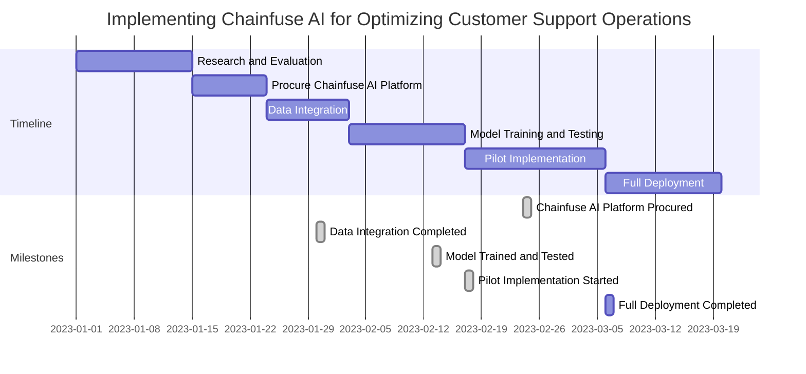

---
authors:
    - clair
categories:
    - audience engagement
date: 2023-10-24
---

# Maximizing User Experience: How AI-Driven Solutions Optimize Customer Satisfaction

Explore the impact of AI on community engagement strategies and see real-world case studies that showcase its effectiveness. Elevate your business's user experience with Chainfuse AI.

<!-- more -->

## Introduction

Artificial Intelligence (AI) has transformed the way businesses engage and connect with their customers, revolutionizing the user experience. In this transformation, AI-driven solutions like Chainfuse AI have played a pivotal role in crafting personalized and engaging experiences for community members. By leveraging AI technology, businesses can gain a deeper understanding of their audience, respond swiftly to their needs, and elevate the overall user experience.

This article explores the role of AI in enhancing user experience and addresses common challenges faced in community engagement. It highlights how Chainfuse AI streamlines the relationship between businesses and users, creating a sense of community and belonging. The article also focuses on the impact of AI on customer satisfaction by providing immediate and precise solutions to inquiries, reducing wait times, and improving service quality.

Furthermore, it delves into how AI-driven solutions improve community engagement by analyzing data from various sources to generate insights that lead to personalized strategies. It emphasizes the importance of maintaining a positive online environment through content filtering and addressing negative feedback effectively using AI-powered tools.

Lastly, the article discusses how businesses can balance communication channels with AI tools like Chainfuse AI to ensure seamless engagement across multiple platforms. It highlights customization options that allow businesses to tailor the AI to their specific brand needs, resulting in a more personalized user experience. Additionally, it showcases successful case studies from various industries that demonstrate how Chainfuse AI enhances community engagement strategies.

Overall, this article explores how businesses can leverage Chainfuse AI's capabilities to enhance community engagement, improve customer satisfaction, and deliver a superior user experience across different industries.

## 1. Understanding the Role of AI in Enhancing User Experience

The advent of Artificial Intelligence (AI) has been a game-changer, radically revolutionizing how businesses interact and connect with their customers.

The emergence of AI has paved the way for organizations to gain a deeper understanding of their audience, swiftly react to their needs, and in the end, to elevate the user experience. In this transformation, AI-driven solutions such as Chainfuse AI have played a pivotal role, equipping businesses with the necessary tools to craft more personalized and engaging experiences for their community members.

Consider Chainfuse AI, it has managed to streamline the relationship between businesses and users, particularly in the realm of community engagement. It's not just about providing information anymore, but also about creating a sense of community, a sense of belonging. That's where Chainfuse AI shines, delivering a seamless experience that bridges the gap between organizations and their audience.

Take, for instance, the integration of Chainfuse AI with Discord, a popular platform for community interaction. The process is simple and straightforward: start by creating a webhook in Discord, paste the webhook URL into Chainfuse AI's platform, and voila! You're all set up. You can now receive real-time updates and alerts from Chainfuse AI directly in your Discord channel, ensuring a constant stream of engagement with your community.

Moreover, Chainfuse AI allows customization according to your brand's requirements. By following specific instructions, you can adjust the AI to meet the precise needs of your brand, optimizing your use of the platform. This level of customization ensures that Chainfuse AI's functionalities align with your business objectives and branding strategy.

Chainfuse AI also extends its reach to e-commerce businesses. By optimizing customer support operations with AI technology, businesses can dramatically improve response times, resulting in a more efficient and personalized customer experience.

This is achieved by analyzing customer data and providing personalized recommendations, thereby facilitating better communication with customers.

Furthermore, Chainfuse AI's application extends beyond traditional businesses with its utilization for real-time voter engagement. By employing advanced algorithms and machine learning techniques, Chainfuse AI provides personalized recommendations and messages to voters that address their key issues and concerns. The platforms used for this engagement can range from social media and messaging apps to email campaigns.

In essence, AI-driven solutions like Chainfuse AI have not only streamlined the way businesses engage with their customers but have also redefined the boundaries of user experience, resulting in a more engaged and satisfied community.

### 1.1. The Impact of AI on Customer Satisfaction

AI-powered solutions are fundamentally reshaping customer interactions, resulting in an impressive elevation of satisfaction levels. At the heart of this transformation is the application of advanced technologies like Chainfuse AI which unlocks the ability for businesses to provide immediate and precise solutions to inquiries raised by customers, thereby reducing their wait times and boosting the overall quality of service.

Chainfuse AI is much more than a simple automation tool. Its sophisticated algorithms and machine learning capabilities allow it to sift through masses of customer data and interactions, identifying patterns and trends with precision. The result of this analysis enables businesses to create a personalized customer service approach and offer solutions fine-tuned to the specific needs of customer inquiries.

In the realm of customer service, Chainfuse AI shines brightly by providing businesses with a platform to automate responses to frequently asked questions. The application of AI in this context is twofold - on one hand, it allows for accurate and prompt responses to be provided, significantly enhancing the customer experience. On the other hand, it mitigates the manual effort traditionally involved in handling customer queries, thereby improving operational efficiency.

Moreover, the power of AI is particularly evident in the way it handles multiple customer queries simultaneously. By utilizing advanced algorithms and machine learning techniques, businesses can provide automated responses that are not only accurate but also personalized and relevant. This reduces response times and ensures customers are not left waiting for answers, playing a pivotal role in enhancing customer satisfaction.

However, achieving this level of customer satisfaction is not merely about reducing wait times. Behind the scenes, Chainfuse AI works tirelessly to improve website performance. By analyzing user behavior and website metrics, its AI algorithms optimize server response times, efficiently cache data, and prioritize content delivery. While it's not directly mentioned in the context, such AI-driven optimizations can significantly enhance the user experience and minimize wait times for website visitors.

When it comes to improving service quality, AI is a game-changer. Chainfuse AI can implement virtual assistants or chatbots to provide quick and accurate responses to customer inquiries, analyze customer data to identify patterns and trends for personalized service, and automate repetitive tasks. This not only enhances the quality of service but also frees up time for service agents to focus on more challenging issues.

Chainfuse AI's solution is adaptive, continuously learning from user interactions to ensure responses are current and meet users' needs. It uses a combination of technologies, such as API integrations, machine learning, and natural language processing, accumulating information from various sources like websites and blogs to generate specific responses to user queries.

In conclusion, AI-driven solutions like Chainfuse AI are revolutionizing customer service, from improving response accuracy to enhancing satisfaction levels, and enabling businesses to deliver a superior customer experience.

### 1.2. How AI-Driven Solutions Improve Community Engagement

AI-powered solutions, such as Chainfuse AI, are innovative tools that turn the tide in the field of community engagement. Real-time data analysis on user interactions and feedback can generate valuable insights, paving the way for improvements in both products and services.

Delving into the specific needs and goals of a community is the first step in harnessing AI for community engagement. AI shines by analyzing data to glean insights about community member preferences and behaviors. These nuggets of information can then fuel the development of personalized and targeted engagement strategies.

AI can automate certain tasks, like sending bespoke messages or recommendations to community members. This is based on their interests and prior interactions. AI-powered chatbots can provide instant support and address common inquiries, freeing up human capacity for more complex issues.

A critical role of AI is in monitoring and analyzing social media conversations and sentiment towards the community. This provides invaluable feedback that can streamline engagement strategies and address any concerns or issues promptly. These insights can lead to continuous improvements in community engagement.

To create personalized experiences with AI-driven solutions, it's essential to gather and analyze data from varied sources like customer interactions, preferences, and behaviors. AI algorithms can then learn to understand individual needs and preferences. AI technologies like natural language processing and machine learning can help in understanding customer sentiments and preferences in real-time, paving the way for more accurate and personalized recommendations.

Moreover, AI-driven solutions enable real-time customization across different touchpoints like websites, mobile apps, and customer service channels. This ensures customers receive relevant and personalized experiences at every interaction. A continuous monitoring and analysis of customer data and feedback refines and improves AI-driven solutions over time. This iterative process ensures that personalized experiences delivered through AI continually align with evolving customer expectations.

In the case of Chainfuse AI, they use user feedback to enhance their product offerings. Feedback from users is encouraged through various channels, including surveys, customer support interactions, and social media. This feedback is then analyzed to identify areas of improvement and prioritize feature development. By actively listening to their users and incorporating their suggestions, Chainfuse AI ensures that their products and services meet the evolving needs and demands of their customers. This iterative process allows them to continually enhance their offerings and deliver a superior user experience.

Successful case studies of community engagement using AI-driven solutions have demonstrated the potential of these technologies. AI algorithms analyze and interpret data from sources like social media, community forums, and surveys to gain insights into community needs and preferences. By leveraging AI-driven solutions, organizations can tailor their communication and engagement strategies, resulting in higher levels of participation and satisfaction among community members.

A measure of the impact of AI-driven solutions on community engagement can be seen by analyzing metrics like user engagement, user satisfaction, and behavior patterns. User interactions with the AI-driven solution, the frequency of interactions, and the duration of engagements can gauge the level of community engagement. Feedback from the community members regarding their experience with the AI-driven solution provides insights into its impact on engagement.

In conclusion, the use of AI-driven solutions such as Chainfuse AI in community engagement is a game-changer. It provides personalized experiences, automates tasks, and gathers valuable insights for continuous improvement. By integrating AI into community engagement strategies, businesses can create more engaging and personalized experiences leading to increased loyalty and satisfaction.

## 2. Addressing Negative Feedback: The Power of AI

Facing negative feedback is a common occurrence in any community. However, the way a business addresses this feedback can drastically alter their image and connection with their community members. This is where solutions like Chainfuse AI step in, equipping businesses with the necessary tools to efficiently address negative feedback and transform it into a possibility for enhancement.

Addressing negative feedback appropriately is a multi-step process. The first crucial step is to thoroughly analyze the feedback to understand the specific customer concerns or issues. The key is to respond promptly and professionally, acknowledging the feedback and assuring the customer that their issues are being looked into. Remaining calm and empathetic throughout the interaction is vital, helping to dissipate any tension and cultivate a positive relationship with the customer. The final step is to take proactive measures to resolve the issue, which could involve offering a solution, providing a refund, or taking corrective action to improve the product or service.

Applying Chainfuse AI effectively to manage negative feedback can showcase a commitment to customer satisfaction and loyalty. It's essential to actively listen to the feedback and understand the customer's concerns. The issues should be addressed promptly, providing a satisfactory resolution while maintaining a professional and empathetic tone. This approach not only helps to defuse the situation but shows that the company values its customers. Feedback, even negative, should be viewed constructively, using it as an opportunity to improve. By analyzing the negative feedback, common issues can be identified, and appropriate measures can be taken to address them.

Maintaining open lines of communication and transparency with customers throughout the process can help rebuild trust and transform a negative experience into a positive one. Chainfuse AI specializes in analyzing customer feedback and sentiment, identifying areas of improvement, and providing actionable insights. This enables businesses to address customer concerns and enhance their products or services, leading to improved customer satisfaction and positive outcomes.

Several businesses have been successful in managing negative feedback with the help of ChainFuse AI. The AI technology provided by ChainFuse has allowed businesses to handle negative feedback effectively and turn it into a positive experience for customers. ChainFuse AI analyzes customer feedback, identifies the underlying issues, and provides actionable insights for businesses to address these concerns. This proactive approach to resolving customer issues, improving their products or services, and enhancing overall customer satisfaction becomes a possibility with ChainFuse AI, turning negative feedback into an opportunity for growth.

Implementing Chainfuse AI can also assist in automating customer support processes, allowing for faster response times and more personalized interactions. Monitoring various online platforms, analyzing sentiment, responding promptly, personalizing responses, learning from feedback, and implementing changes, all contribute to effectively addressing and resolving negative feedback, thereby improving customer satisfaction and loyalty.

In conclusion, Chainfuse AI is an effective tool businesses can utilize to transform negative feedback into positive outcomes, enhancing customer satisfaction and the overall customer experience.

### 2.1. Strategies for Managing Negative Comments Using AI

Leveraging the power of AI in managing community feedback, Chainfuse AI has revolutionized how businesses handle negative comments. Its advanced algorithms sift through comments, prioritizing them based on their sentiment. This way, the most critical concerns rise to the top, allowing businesses to tackle these first.

By using Chainfuse's error handling functionality, businesses can efficiently analyze error details, identifying negative feedback hidden within. Equipped with this knowledge, they can prioritize and effectively address these comments, ensuring no concern is left unattended.

In understanding the sentiment behind each comment, Chainfuse AI employs its AI capabilities and services. By integrating necessary AI modules and algorithms, businesses can gain insights into the overall sentiment expressed by users. This is particularly useful on platforms, like social media or other online communities, where user comments play a substantial role in engagement and feedback.

When it comes to addressing critical issues, Chainfuse AI takes a systematic approach. A comprehensive review of the AI system's performance, including its reliability, accuracy, and ability to handle complex tasks, is conducted. Once the issues are identified, the system is refined, whether it involves enhancing the training data, refining the underlying algorithms, or optimizing the computational resources. This process ensures the AI system is continuously improved and aligns with the evolving needs of the organization.

Chainfuse AI excels at the management of negative comments by categorizing them based on sentiment and content. The platform identifies negative comments and suggests appropriate responses or actions, helping businesses maintain a positive online reputation and effectively engage with their customers.

Through analyzing data from various sources, Chainfuse AI can help identify key feedback points and prioritize them based on their relevance and impact. This allows businesses to address the most important feedback first, giving them a chance to make more informed decisions to improve their product or service.

But Chainfuse AI doesn't stop at resolving issues. It takes it a step further by showing community members that their feedback is valued. The AI analyzes and interprets the feedback, providing insights that help users understand the significance of their input. It fosters a stronger sense of engagement and collaboration within the community, leading to better decision-making and improved user experience on the platform.

All these, coupled with its ability to reduce the time and effort required to resolve issues, establishes Chainfuse AI as a formidable tool in enhancing user experience, one feedback at a time.

### 2.2. The Importance of Maintaining a Positive Online Environment

Creating an inclusive and positive online environment is more than just a goal for community managers; it is a necessity. A hospitable atmosphere encourages members to freely share their ideas, engage more deeply with the brand, and fosters a sense of community spirit. Chainfuse AI lends itself to this endeavour by filtering out inappropriate and negative content, thus ensuring that every community member experiences a safe and welcoming digital environment.

However, maintaining an online community that's vibrant and positive extends beyond mere content filtering. It involves a multifaceted approach that intertwines technological solutions with clear communication, policies, and guidelines.

Security is one such key aspect. Chainfuse AI facilitates a secure environment, implementing measures such as data encryption and the use of secure protocols. A safe and secure environment engenders trust, a crucial factor in fostering positive community interactions.

Simultaneously, clear community guidelines and effective moderation systems play a pivotal role. Such guidelines set boundaries for acceptable behaviour while moderation systems ensure adherence. Chainfuse AI, with its advanced algorithms and machine learning capabilities, can bolster these efforts by identifying and handling inappropriate conduct, thereby promoting respectful and constructive interactions.

Aside from security and regulation, fostering a truly positive environment goes hand in hand with respect, inclusion, and open communication. Encouraging respectful interaction helps build an environment where individuals listen actively, empathize, and remain open-minded. Celebrating diversity and actively seeking different perspectives not only promotes inclusion but also enriches the community experience.

The implementation of Chainfuse AI technology in your community management routine can also offer unique benefits. Its ability to analyze and monitor online content enables businesses to identify potential issues, such as hate speech, harassment, or misinformation, and provides actionable insights to tackle these issues. This approach ensures an inclusive online space where users feel safe and valued, thereby enhancing the overall user experience.

Finally, fostering consistent engagement is crucial. This could involve hosting events, running contests, or even facilitating collaborative projects that prompt community members to actively engage and connect with the brand. Regular communication via newsletters or social media can help build a sense of belonging and keep members informed about the brand's updates and initiatives.

In essence, maintaining an inclusive and respectful online environment has far-reaching benefits. It fosters a sense of inclusivity, promotes constructive interactions, builds trust, and reduces conflicts. Chainfuse AI, with its advanced filtering and security features, can be integral to achieving these outcomes, helping you create an online community where everyone feels safe, respected, and valued.

## 3. Balancing Communication Channels with AI Tools

Operating within the digital sphere today, organizations are called upon to interact with their audiences through a variety of communication channels. Keeping abreast of these channels can pose its own set of challenges. This is where advanced AI tools, such as Chainfuse AI, come into play, offering businesses a unified conduit through which they can engage with their community members in a consistent and seamless manner.

Leveraging the Chainfuse AI platform enables businesses to balance multiple communication channels effectively. This centralized platform enables the monitoring and management of all communication channels from one consolidated platform, ensuring streamlined processes and efficient communication.

A cornerstone of Chainfuse AI's functionality is the establishment of clear communication protocols. This involves the defining of preferred channels, setting response times, and developing escalation procedures, all aimed at facilitating timely and effective communication.

The Chainfuse AI platform underscores the importance of regular updates, keeping the lines of communication open and ensuring regular updates are provided. This includes updates on progress, changes in project status, and other relevant information, all of which contributes to a transparent operating environment.

Chainfuse AI uses automation tools to streamline communication processes and reduce manual effort. This includes automated notifications, reminders, and response templates, all intended to ensure efficiency and consistency in communication.

Collaboration and feedback lay at the heart of Chainfuse AI's approach to community engagement. By regularly seeking input from team members, clients, and other stakeholders, the platform is able to continuously refine its communication strategies and promptly address any issues or concerns.

While the context did not provide specific examples of businesses using Chainfuse AI for multi-channel engagement, it did provide a detailed overview of how the platform can be used to manage communication across various channels. For instance, businesses can implement Chainfuse's AI capabilities to automate different processes on platforms like Telegram, such as chatbot interactions, data analysis, and personalized messaging, ultimately leading to a more efficient and seamless engagement experience for users.

Similarly, on WhatsApp, Chainfuse AI can be used to create personalized messages, schedule and automate messages, and facilitate interactive conversations. This approach not only keeps audiences engaged and informed but also makes them feel heard and valued.

The Chainfuse AI platform also offers solutions for SMS communication, providing features like email protection, error details, translation, and onboard services, all of which can enhance the efficiency of SMS communication.

In conclusion, Chainfuse AI offers a robust solution for managing multi-channel engagement, prioritizing user concerns, and delivering a consistent and seamless user experience. With its advanced AI technology and user-centric approach, Chainfuse AI helps businesses to not only enhance their customer engagement strategies but also to improve their overall customer experience.

### 3.1. Integrating Multiple Platforms for Seamless Engagement

Chainfuse AI's unique feature of universal connectivity is a game-changer for businesses. It bridges the gap between various communication platforms, such as Discord, Telegram, WhatsApp, and SMS, ensuring a harmonious and uninterrupted customer engagement experience.

To harness the potential of this cross-platform connectivity, integrating Chainfuse AI with your preferred platforms is essential. In the case of Discord, for example, you can easily set up notifications via the server settings and the creation of a webhook. This webhook URL can then be incorporated into the Chainfuse AI platform, enabling you to receive real-time alerts and updates directly on Discord.

For Telegram users, engaging with Chainfuse AI is as simple as searching for the Chainfuse AI bot in the app. Once located, users can begin a conversation with the bot, which will respond with the required information or services.

While no specific details are available for WhatsApp and SMS integrations, the power of Chainfuse AI lies in its capability to leverage multiple platforms to expand your audience reach. Each platform has a unique user base, and by reaching out on multiple platforms, you can engage a larger demographic and potentially attract more users or customers.

Moreover, the use of multiple platforms can bolster reliability through redundancy. If one platform experiences technical glitches or downtime, Chainfuse AI can still maintain communication through other platforms, ensuring consistent user interaction.

The flexibility of various platforms, with their distinct features and capabilities, also allows Chainfuse AI to deliver a more personalized experience to users. Judicious use of each platform's strengths can result in more targeted and relevant messages for different segments of your audience.

The integration of multiple platforms with Chainfuse AI not only broadens reach but also enhances brand visibility. By marking your presence on diverse platforms, you can increase brand awareness, making it easier for users to find and engage with your services.

In summary, Chainfuse AI's universal connectivity across multiple platforms opens up a world of possibilities, from expanding reach and increasing reliability to personalizing user experiences and enhancing brand visibility. So go ahead, embrace the power of Chainfuse AI, and transform your community engagement experience.

### 3.2 Leveraging the Power of AI for Consistent Community Interaction

Harnessing the capabilities of artificial intelligence can revolutionize the way businesses operate, particularly when it comes to community interaction. Central to this transformation is Chainfuse AI, an instrumental tool in delivering both consistent and high-quality engagement experiences.

A key feature of Chainfuse AI is its proficiency in automating responses to routine inquiries. This function not only streamlines operations but also caters to community members' need for prompt and precise responses. The result? A community where members feel acknowledged, valued, and more deeply engaged.

Behind the scenes, Chainfuse AI employs advanced algorithms and machine learning techniques. Taking context information such as the base URL and chunk ID, the system analyses the specific requirements and characteristics of the query. From there, it retrieves and scrutinizes relevant data from its continuously updated database. By interpreting this data, Chainfuse AI generates timely and accurate responses to user queries, providing an efficient and seamless experience to users.

For instance, consider the scenario of a community manager harnessing the power of AI chatbots for customer support. Freed from the burden of fielding common questions, human resources can be redirected to more strategic tasks. Additionally, the use of AI algorithms to assess community feedback and sentiment guides organizations in identifying community engagement patterns and trends, thereby enabling data-driven decision-making.

AI-driven community engagement initiatives can be personalized to reflect individual preferences and behavior. For instance, content recommendations can be fine-tuned based on the data gathered by AI. This personalized approach, not just to engagement, but also to efficiency and responsiveness, is what sets AI apart when it comes to enhancing community interactions.

However, to ensure the effectiveness of AI-driven initiatives, specific best practices need to be adhered to. The AI system should be trained on a diverse dataset that mirrors the community it will engage with. Bias or skewed responses can be avoided in this way. Regular updates and fine-tuning of the AI model, based on user feedback and evolving community dynamics, are crucial to maintain the relevance and accuracy of the AI's responses. Moreover, it's necessary to have a moderation mechanism in place to oversee the AI system, to make certain that it doesn't produce inappropriate or harmful content. This approach ensures a safe and respectful community environment.

Chainfuse AI seamlessly integrates with relevant API endpoints, making the process of automating responses even more straightforward. However, it's vital to foster trust within the community to ensure AI technology is fully adopted. Keeping community members informed about AI projects and developments, involving them in the decision-making process, addressing their ethical concerns, and showing them tangible benefits of AI technology are all necessary steps to building a supportive and engaged community.

In conclusion, Chainfuse AI is a powerful tool that can dramatically enhance community engagement by improving efficiency, personalization, and responsiveness. By embracing AI-driven strategies and adhering to best practices, organizations can truly leverage the power of AI for consistent community interaction.

## 4. Dealing with Spam and Inappropriate Content Using AI

Spam and unwelcome content can be a significant disruption in the community, potentially discouraging members from engaging. AI-powered solutions like Chainfuse AI offer a potent remedy to this problem, ensuring a secure and engaging environment for community members.

Chainfuse AI employs techniques such as natural language processing, machine learning, and pattern recognition to proficiently detect and classify spam content. These abilities can be accessed by integrating Chainfuse AI into your system or application, which can significantly enhance the overall quality and security of your platform by filtering out spam.

To optimize the utilization of Chainfuse AI for community content moderation, specific strategies should be adopted. Firstly, aligning the AI's settings and parameters with your specific moderation needs is crucial. This includes setting up filters for sensitive language and defining acceptable content guidelines. Routine monitoring and review of the AI's performance can lead to better accuracy of moderation decisions and overall improved performance over time.

For the AI system to be accepted and respected within the community, clear and transparent moderation policies should be communicated. Additionally, while AI can handle large volumes of content, the introduction of human moderation allows for nuanced decisions that might be challenging for AI algorithms alone. This blend of AI and human moderation strikes an exceptional balance between efficiency and accuracy in content moderation.

The integration of Chainfuse AI with community platforms allows for automated moderation of user-generated content, ensuring only appropriate material is displayed. This maintains a safe and positive online environment for users, enhancing their overall online experience. With Chainfuse AI, offensive content and potential threats can be identified and mitigated proactively, helping to maintain a positive and secure online community.

Chainfuse AI also offers the incredible advantage of real-time flagging and removal of inappropriate content. This automated instant action assures a safe and wholesome ambiance for community members, catering to platforms where manual monitoring may be challenging.

For successful implementation of Chainfuse AI, following specific instructions provided by Chainfuse will ensure the AI system is properly configured for effective community moderation. The guidelines may encompass setting up the AI system, defining moderation rules, and integrating the AI system with your community platform.

Ultimately, utilizing Chainfuse AI can significantly enhance the community experience. The AI technology can learn and adapt to new spam patterns over time, further improving its spam filtering abilities. A collaborative effort involving user education about spam-free environment importance and spam reporting mechanisms can foster a clean, engaging environment for community interactions.

Therefore, by utilizing Chainfuse AI, organizations can effectively manage spam and inappropriate content, ensuring a positive and engaging online experience for their users.

### 4.1 Customization Options to Tailor the AI to Specific Brand Needs

Harnessing the power of Chainfuse AI, businesses can enhance their community engagement by deploying tailored AI solutions that cater perfectly to their unique brand requirements. The AI system provided by Chainfuse can be meticulously customized, allowing for fine-tuned alignments with your brand objectives, as well as optimizing AI-driven outcomes for a more precise and relevant result.

To achieve this, brands need first to understand the structure and functionality of the Chainfuse website they are working with. A deep understanding of the base_url and domain is crucial. The chunk_id and type of the specific URL targeted for customization is another key consideration. This helps identify the exact section or feature of the website that needs modification.

Implementing suitable event listeners and handlers, such as document.addEventListener() and document.onreadystatechange(), ensures the customizations are applied precisely when and where they are needed. These functions allow your code to execute when the document is loaded fully or reaches a specific state.

In the tailoring process, it's important to maintain consistency with the existing design and functionality of the website to ensure a seamless user experience. Any AI modifications must not negatively impact user experience or performance. Consequently, businesses should test their modifications thoroughly in a development or staging environment before deploying on a live site. This precautionary step ensures the customizations work as expected and do not present unintended issues.

Customizing Chainfuse AI is not limited to improving its algorithms and models. By using the base_url, you can customize how the AI analyzes content on your website and determines its relevance for sharing purposes. The chunk_id and domain information can be used to refine these processes further, ensuring the shared content aligns perfectly with the specific website and its target audience.

However, the context provided does not include specific details about using Chainfuse AI for spam and content filtering. For more detailed information about the customization capabilities of Chainfuse AI, it is recommended to refer to the official Chainfuse documentation or contact their customer support.

In summary, Chainfuse AI provides a powerful platform that can be tailored to meet specific brand needs. By understanding and leveraging the system's customization capabilities, businesses can enhance their community engagement by ensuring that the content shared is relevant and appropriate.

### 4.2 Creating a Safe and Engaging Environment Through Content Filtering

Creating a safe and enjoyable online community is fundamentally hinged on vigilant content management, an endeavor in which Chainfuse AI plays a pivotal role. This platform equips administrators with sophisticated content filtering mechanisms, enabling the swift identification and elimination of content that's unfit for the community. This proactive measure bolsters the integrity of the community, ensuring a pleasant experience for all participants.

Now, how do we harness the power of Chainfuse AI in this regard? First, visit Chainfuse's portal at https://chainfuse.com/. Navigate to the content filtering functionality and proceed to configure it based on your community's unique needs. The platform provides intuitive instructions to guide you through the customization of your content filtering rules. Remember to save your changes and confirm that the feature is enabled.

In the effort to maximize the efficiency of content filtering, Chainfuse AI recommends a few best practices. The platform's AI system can deftly filter content based on a wide array of parameters, hence the importance of establishing clear and precise rules for content filtering. Regularly updating these rules in response to user feedback and evolving needs is also crucial. Furthermore, analytics and insights provided by Chainfuse AI can be instrumental in refining your filtering process and enhancing its efficiency over time.

Chainfuse AI, beyond just content filtering, offers a spectrum of services aimed at content detection and management. The platform employs advanced algorithms and machine learning techniques to analyze content and detect any inappropriate or harmful elements. This real-time moderation ensures the protection of users from objectionable or offensive content. For monitoring and tracking purposes, Chainfuse AI generates comprehensive logs and reports on the system's effectiveness.

Spam and harassment are, unfortunately, common obstacles in online communities. Chainfuse AI offers a robust solution to these challenges, using advanced algorithms and machine learning techniques to detect and filter out spam and harassing content. By analyzing the content of messages, comments, and posts in real-time, Chainfuse AI can flag or block content violating community guidelines, thereby fostering a safer, more inclusive community environment.

Automated content moderation is a vital feature of Chainfuse AI. By leveraging Chainfuse's AI technology, you can analyze and moderate user-generated content in real-time. The platform offers extensive resources and documentation on its website, helping you jumpstart the process of automated content moderation integration into your platform. Plus, the Chainfuse blog is a valuable source of articles and guides related to this topic.

Lastly, the benefits of Chainfuse AI extend beyond the technical realm. Its advanced algorithms and machine learning capabilities ensure the automated detection and filtering of harmful content, maintaining a safe, positive user experience. By analyzing and understanding content in context, Chainfuse's AI enables accurate and efficient filtering, contributing greatly to the high standard of content quality, protection of users from harmful material, and fostering of a more engaging and inclusive community space.

## 5. Industry-Specific Challenges and Solutions in Community Engagement

Challenges in fostering community engagement can vary widely across different industries. Recognizing this, Chainfuse AI offers solutions that are tailored to address the distinct hurdles encountered within diverse sectors, enabling businesses to optimize their approaches to community engagement.

For instance, Chainfuse AI allows you to leverage the blog section on their website for disseminating valuable content, updates, and significant announcements. This not only keeps the community informed but also stimulates a sense of belonging and active participation.

Additionally, in the digital age where social media platforms such as Twitter, Facebook, and LinkedIn are thriving, Chainfuse AI helps establish a robust online presence. By regularly posting updates, responding to comments and messages, and organizing interactive sessions like Q&A sessions or live webinars, you can encourage active community involvement and foster connections.

Chainfuse AI also amplifies two-way communication by listening actively to community feedback, suggestions, and issues. Prompt and transparent responses to their queries and concerns convey that their voices are valued and appreciated, thereby increasing their engagement.

To make your community experience more engaging, Chainfuse AI suggests the implementation of gamification elements. Features like leaderboards, badges, or rewards can incentivize and motivate community members to participate actively, creating a sense of healthy competition and boosting community engagement.

Furthermore, Chainfuse AI advises on the organization of events and contests revolving around the platform itself. Virtual events, competitions, or hackathons can attract new community members and offer opportunities for existing members to showcase their skills and interact with others who share similar interests.

Chainfuse AI also underscores the importance of providing educational resources. Tutorials, guides, and webinars can help community members understand and utilize the platform effectively, empowering them to leverage the platform and enhance their engagement.

Lastly, Chainfuse AI emphasizes the understanding of your target audience, the building of strong relationships, sharing valuable content, encouraging active participation, fostering a positive and inclusive environment, and utilizing technology. Each industry and community have their own unique dynamics and preferences, so adapting and customizing your engagement strategies is crucial.

However, it is worth noting that there isn't specific mention or indication of case studies of successful community engagement using Chainfuse AI based on the provided context. For more detailed and explicit information on Chainfuse's specific services or solutions, it is best to refer to their official website or directly reach out to their support team.

Remember, optimizing community engagement is a continual process. Regularly analyze and adapt your strategies based on the feedback and needs of your community to ensure continuous growth and involvement.

### 5.1 Tailored Guidance for Different Industries and Use Cases

Chainfuse AI's capabilities extend to provide personalized solutions that propel industries in achieving their community engagement goals. The platform carries a portfolio of different industry solutions designed to cater to unique needs.

For crypto startups, Chainfuse serves as a cornerstone, offering specialized advice to help them navigate their journey successfully. The platform's AI-driven guidance enables these startups to make informed decisions that align with their objectives.

In the realm of education, Chainfuse stands as a beacon of support. The platform delivers a personalized experience for educational institutions, aiding in the optimization of processes, adoption of innovative technology solutions, and enhancement of the learning experience. With AI at its core, Chainfuse provides these institutions with the critical advice they need to realize their goals.

Travel agencies stand to benefit from Chainfuse AI's prowess in data analysis. By recognizing patterns and trends in the industry, Chainfuse AI can deliver strategies that are tailor-made for travel agencies. These encompass a range of areas including marketing, customer engagement, pricing strategies, and more. The AI's ability to provide real-time insights based on current market conditions and trends enables these agencies to stay competitive and make informed decisions.

The utility of Chainfuse AI does not end here. It extends to a myriad of other industries including retail, healthcare, and more. The platform's AI solutions enhance community interactions, helping businesses understand their communities better and deliver personalized experiences. These solutions strive to foster stronger relationships, gather insightful data, and drive positive outcomes for businesses and their communities.

With the use case versatility of Chainfuse AI, its features can be harnessed to elevate community engagement. From personalized recommendations to real-time analytics and interactive chatbots, the platform empowers you to engage with your community more effectively. The AI's ability to analyze user behavior and preferences allows it to suggest relevant content, events, and discussions to keep your community members engaged. The addition of interactive chatbots that provide instant support and assistance enhances the overall community experience, leading to stronger engagement.

### 5.2 Case Studies: Successful Community Engagement Strategies Across Various Industries

Across the spectrum of industries, a myriad of businesses are tapping into the power of Chainfuse AI to substantially boost their community engagement. By zeroing in on these real-world applications, we can glean vital insights into how Chainfuse AI can be wielded to tackle unique challenges and fine-tune community engagement strategies.

The Chainfuse AI platform is a mainstay in various companies looking to revamp their community interaction strategies. The key to unlocking the potential of Chainfuse AI lies in leveraging the resources and features available on the platform. By visiting https://chainfuse.com/, users gain access to a wealth of tools designed to facilitate community engagement. The domain and chunk_id associated with Chainfuse AI provide detailed insights into the specific components and functionalities that can enhance community interaction.

To optimize the use of Chainfuse AI for community engagement, several strategies could be employed:

-   Using the blog section on the Chainfuse website to disseminate meaningful content, updates, and announcements, fostering a sense of community and promoting active involvement.
-   Establishing a robust presence on social media platforms like Facebook, Twitter, and LinkedIn for consistent interaction with the community.
-   Encouraging two-way communication by actively listening to feedback, suggestions, and concerns from the community, and promptly addressing them.
-   Integrating gamification elements, such as rewards, badges, and leaderboards, to incentivize active participation and stir up healthy competition.
-   Organizing virtual events, competitions, or hackathons focusing on Chainfuse AI to attract new members and provide a platform for existing members to showcase their skills and interact with peers.
-   Providing educational resources, such as tutorials, guides, and webinars, to equip community members with the knowledge to effectively utilize Chainfuse AI.

Remember, optimizing community engagement is an ongoing process. It's essential to continually analyze and adjust your strategies based on the feedback and needs of the community to ensure sustained growth and involvement.

While AI-driven community engagement with Chainfuse AI is broadly used, the specifics may differ based on the distinct needs and objectives of the organization or community. Best practices for using Chainfuse AI may include ensuring proper integration of the AI system with the community engagement platform, providing clear guidelines and instructions to the AI system, regular checks and evaluations of the AI system's performance, and maintaining transparency and accountability in the use of the AI system. By adapting and refining these practices based on feedback and lessons learned from previous engagements, the effectiveness of the AI system in community engagement can continuously improve.

AI-driven community engagement with Chainfuse AI has manifested in various real-world applications. For instance, Chainfuse AI's algorithms analyze user behavior and preferences on its website to personalize content and recommendations, enhancing user engagement. Another application is seen in the deployment of AI-powered chatbots on the Chainfuse platform, providing instant and personalized customer support, answering queries, and guiding users through community features. These AI-driven interventions help create a more interactive and engaging community experience.

While the context information does not explicitly mention any case studies on leveraging Chainfuse AI for community engagement, the potential for their existence cannot be ruled out. After all, it's plausible that businesses have successfully used Chainfuse AI for such purposes. Consequently, showcasing these real-life examples can offer potential users and community members a better understanding of the value and benefits of the AI solution. Apart from illustrating specific use cases and demonstrating the problem-solving capabilities of Chainfuse AI, these case studies can also provide evidence of its effectiveness in driving community engagement. By featuring testimonials and feedback from community members who have experienced the positive impact of Chainfuse AI, these case studies can build trust and credibility, thereby fostering a sense of belonging among community members.

## 6 Harnessing the Capabilities of Chainfuse AI for Enhanced Community Engagement

Chainfuse AI, a technology platform focused on community engagement, presents a unique blend of distinctive traits and functionalities that will revolutionize your approach to nurturing your community. It is designed in such a way that it creates personalized and engaging experiences for your community members, leading to an increase in satisfaction and cementing a sense of loyalty.

The strength of Chainfuse AI lies in its multiple applications. An effective way to enhance community engagement includes the use of AI-powered chatbots or virtual assistants. Their ability to interact with community members, addressing their inquiries quickly and with a personal touch, proves invaluable. Further, the platform allows for optimization of social media and online forums, providing a space for community members to connect, share ideas, and ask questions.

The power of Chainfuse AI doesn't stop at creating connections. It provides regular updates and offers opportunities for webinars and online events. By actively seeking feedback from the community, it enhances the feeling of inclusion and value among the members, which is crucial to building loyalty.

When it comes to implementing Chainfuse AI, a few key considerations come into play. Ensuring proper integration of AI into your website or platform is the first step. Chainfuse provides a detailed guide on implementation to help you get started. Post-integration, monitoring and analyzing the performance of the AI in engaging your community becomes important. Chainfuse AI's analytics tools provide insights and data to make this task easier. Lastly, regular communication with your community members provides feedback on their experience with the AI. This feedback is instrumental in making improvements and customizing the AI's functionality to meet the specific needs and preferences of your community members.

Personalizing community experiences with Chainfuse AI can be achieved by leveraging the platform's features. Additionally, Chainfuse AI can be used to collect feedback and insights from your community. The data gathered can be analyzed to gain a better understanding of your community's needs and preferences, leading to informed decision-making and improvements in products or services.

Integration of Chainfuse AI with popular communication channels, such as email, chat platforms, social media platforms, can be achieved using the base_url and domain information provided. Leveraging the Chainfuse API and the appropriate endpoints and methods makes this process seamless. By establishing connections with these popular communication channels, you can automate and streamline your community engagement efforts, taking full advantage of Chainfuse AI's capabilities, and communicating with your community members on their preferred platforms.

In essence, Chainfuse AI provides you with a multitude of ways to enhance the engagement and interaction with your community, making your community management more effective and efficient.

### 6.1 Features and Unique Value Propositions of Chainfuse AI

One of the remarkable attributes of Chainfuse AI that sets it apart is its adaptability across a variety of industries. It doesn't merely confine itself to a single sector but bridges gaps across multiple sectors. The domains that can harness the power of Chainfuse AI encompass healthcare, finance, retail, and manufacturing, to name a few. This versatile tool has the capability to become an integral part of businesses, driving innovation and fostering growth.

Chainfuse AI is known for its automation of redundant tasks, its ability to analyze massive volumes of data to extract crucial insights, and the enhancement of customer experiences through personalized recommendations. It holds the potential to optimize supply chain operations, detect inconsistencies or fraudulent activities, and streamline decision-making processes, making it a robust tool for businesses.

Focusing on the individual requirements of every user, Chainfuse AI introduces tailored refinements that can enhance the overall user experience on their platform. This means that users can optimize their interactions and workflow based on their specific needs and preferences, thereby enhancing productivity. The AI technology incorporated in Chainfuse AI provides personalized recommendations and suggestions by observing and analyzing user behavior, which leads to an efficient and effective workflow.

Moreover, Chainfuse AI's personalized refinement options permit users to focus on the most relevant data and filter out any information that may not align with their objectives. This degree of customization not only refines the accuracy of the AI system's recommendations but also promotes a more engaging way to interact with the AI system.

In terms of connectivity, Chainfuse AI provides universal connectivity across several components of a website, which includes the content delivery network (CDN) and the checkout page, among others. This is made possible through base URLs and different chunk IDs for varied functionalities. Universal connectivity is a crucial feature as it allows seamless integration and communication across different systems, platforms, and devices. This aids AI algorithms in accessing and analyzing a comprehensive range of data sets, enhancing the overall efficiency of AI-driven solutions. Moreover, real-time data sharing and collaboration are made possible, allowing for continuous learning and improvement of AI models.

In short, Chainfuse AI, with its universal connectivity, personalized user experience, and wide applications across industries, offers a unique value proposition that extends well beyond conventional AI solutions.

#### 6.1.1 Universal Connectivity Across Multiple Channels

Chainfuse AI is designed with a focus on universal connectivity, a feature that empowers businesses to connect and communicate with their audience through a variety of popular channels including Discord, Telegram, WhatsApp, and SMS. This multi-channel approach is ideal for companies striving to ensure a steady, reliable, and consistent engagement experience with their community, reaching them wherever they may be.

To harness the power of Chainfuse AI on Discord, for example, you can start by creating a webhook. After navigating to your server settings, you'll find an "Integrations" tab. Click on "Create Webhook", give it a name and choose the channel where you wish to receive AI notifications. Copy the generated webhook URL and paste it into the corresponding field in the Chainfuse AI platform. Once this setup has been completed, you'll receive real-time updates and alerts from the AI directly in your chosen Discord channel.

A similar process is followed when you wish to utilize Chainfuse AI on Telegram. You begin by opening the Telegram app and searching for the Chainfuse AI bot. After opening a chat window with the bot, you can initiate a conversation by sending a message or command. The bot will then provide you with the necessary information or services you require.

While there are detailed guides available for Discord and Telegram integration, it's important to note that using Chainfuse AI across multiple channels generates several benefits. It allows for a unified customer experience across different platforms, enabling personalized and targeted interactions with customers. Additionally, leveraging Chainfuse AI across numerous channels allows businesses to gather valuable data and insights, thereby enhancing their marketing strategies and improving overall customer satisfaction.

Let's delve deeper into these benefits using Discord as an example. The platform is widely used for community engagement and communication, hence, effective use can help in building a robust and active community. By creating a welcoming environment, regularly communicating with your audience, encouraging active participation and fostering a sense of community, you can lay a strong foundation for a vibrant and engaged audience on Discord centered around Chainfuse AI.

Engaging effectively on Telegram also requires a responsive approach, sharing valuable content, multimedia, personalized messages, and efforts to encourage participation. With these practices in place, your Telegram channel can provide a dynamic and engaging environment for your audience.

For platforms like WhatsApp and SMS, although specific integration guides aren't provided in the solution context, the potential of Chainfuse's platform can still be maximized to reach a larger audience and improve the effectiveness of your messaging. The AI can automate and optimize your WhatsApp marketing campaigns, and similarly, the AI-powered SMS features can enhance communication, personalize interactions, and streamline the overall customer experience.

In conclusion, Chainfuse AI's universal connectivity across multiple channels ensures that businesses can provide a seamless and consistent engagement experience, irrespective of the platform their audience prefers.

#### 6.1.2 Tailored Refinement Options for Personalized User Experience

Chainfuse AI stands out by providing a unique opportunity for businesses to fine-tune the AI in harmony with their brand's specifics and the peculiarities of their audience. This adaptability of the AI leads to a heightened and more personalized user experience, thus amplifying their contentment and interaction.

Delving into the customization process, it begins with grasping a clear understanding of the target audience. Identifying the specific characteristics, tendencies, and behaviors of the audience lays the groundwork for the AI's alignment. By gathering valuable data such as user activity, feedback, and demographic details, businesses can gain significant insights about their audience preferences and behaviors.

Next comes segmentation, where the audience is divided based on shared traits or preferences. This enables a more focused customization of AI models. The collected data combined with audience segmentation aids in the personalization process. This might include content that is customized, product suggestions that are individualized, or user experiences that are tailored.

Continuous learning is a key aspect of the AI personalization process. By implementing mechanisms that learn continually from user interactions and feedback, the AI models are equipped to adapt and enhance with time, providing better alignment with audience preferences. Regular testing and optimization of AI algorithms are crucial to ensure they yield the desired results. This might involve A/B testing, analyzing performance metrics, and making the necessary adjustments.

Customizing Chainfuse AI for user engagement has immense potential benefits. By tailoring the AI to meet the specific needs of the users, it can deliver a personalized and targeted experience which leads to increased user satisfaction and engagement. The AI can provide relevant suggestions, recommendations, and support based on the user's preferences and behavior. In addition, customizing Chainfuse AI can also aid businesses in gathering valuable insights about their users, empowering them to make data-driven decisions and enrich the overall user experience.

Refining ChainFuse AI for personalized experiences requires a step-by-step approach. Once the target audience is discerned, relevant data is gathered from various sources and analyzed using advanced analytics tools. Based on the insights gleaned, define the types of personalized experiences that you aspire to confer to your customers. The AI models are then trained using machine learning techniques based on the collected data.

This involves creating algorithms that can analyze and understand the unique preferences and behaviors of each individual customer. Constant testing and optimization of the AI models guarantee their precision and effectiveness. It is crucial to keep a tab on the performance of the personalized experiences and make adjustments as needed. Additionally, the refined ChainFuse AI is integrated into the website or application to deliver personalized experiences in real-time.

The impact of the refined ChainFuse AI can be measured by tracking its effect on customer engagement, conversion rates, and overall business performance. Metrics and analytics help measure the effectiveness of the personalized experiences and identify potential areas for improvement. By following this step-by-step guide, you can refine ChainFuse AI to deliver personalized experiences that cater to the unique needs and preferences of your customers. With Chainfuse AI, the possibilities of customization are vast, leading to greater user satisfaction and engagement.

#### 6.1.3 Wide Range of Applications Across Different Industries

Chainfuse AI offers a versatile suite of solutions that serve a diverse range of sectors and scenarios. For instance, the tool can be instrumental for crypto startups, offering advanced analytics and insights to aid data-driven decision making. With Chainfuse, startups can gain insights into their website's performance, user behavior, and market trends, enabling them to refine their marketing efforts, optimize user experience, and even identify potential security vulnerabilities to protect their digital assets.

E-commerce brands can harness Chainfuse AI to enhance customer support. By integrating Chainfuse into their customer support workflows, these brands can improve response times, provide personalized assistance, and automate support solutions, all of which culminate in heightened customer satisfaction and brand loyalty.

Notably, Chainfuse AI also serves an innovative function in the realm of education. It uses AI-powered tools to foster interaction and inclusivity in learning environments, boosting active participation and collaboration among students, teachers, and administrators.

Non-profit organizations also stand to benefit from Chainfuse AI. Seamless user experience and robust security are both achievable through Chainfuse's services. This includes a content delivery network (CDN) and email protection, both of which are critical in maintaining donor trust.

Influencers can leverage Chainfuse AI to strengthen fan connections. The technology's ability to analyze and understand fan behavior based on their interactions allows influencers to engage more effectively and cater to specific interests. This ultimately leads to a more personalized fan experience and growth of the fanbase.

Local businesses, too, can take advantage of Chainfuse AI's community engagement solutions. With this tool, businesses can connect with customers, collect feedback, and enhance the overall customer experience, contributing to a stronger brand presence and customer loyalty.

Across various sectors, Chainfuse AI has a proven record of success in improving processes and resolving specific problems. From optimizing website performance and boosting cybersecurity to streamlining customer service using AI-powered chatbots, Chainfuse has demonstrated its potential in driving positive outcomes.

When implementing Chainfuse AI, it's crucial to understand and consider the specific requirements and challenges of each industry. Collaboration among stakeholders, thorough testing, and ongoing monitoring are vital steps to ensure a successful integration and maximize the benefits of Chainfuse AI.

## Conclusion

Artificial Intelligence (AI) has revolutionized community engagement by providing businesses with powerful tools to enhance the user experience and drive customer satisfaction. Chainfuse AI, in particular, offers a range of AI-driven solutions that can be customized to meet the specific needs of different industries and brands. By leveraging the capabilities of Chainfuse AI, businesses can streamline communication channels, personalize user experiences, address negative feedback effectively, and create a positive online environment.

The impact of AI on customer satisfaction is significant. Chainfuse AI enables businesses to provide immediate and precise solutions to inquiries, reducing wait times and improving service quality. By analyzing data from various sources, Chainfuse AI generates insights that lead to personalized strategies and enhances community engagement. The platform also helps businesses balance communication channels across multiple platforms, ensuring seamless engagement.

The broader significance of this article's topic lies in the transformative power of AI in enhancing community engagement. Businesses that leverage AI-driven solutions like Chainfuse AI can deliver a superior user experience, improve customer satisfaction, and build strong and engaged communities.

To harness the capabilities of Chainfuse AI for your brand, it has never been easier to get started. Visit (Chainfuse)[https://chainfuse.com/onboard] now to create a personalized AI solution for your business.
