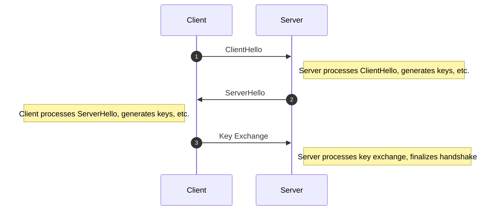

ChatGPT generated TLS 3 way handshake diagram using mermaid

```mermaid
sequenceDiagram
autonumber
    participant Client
    participant Server

    Client->>Server: ClientHello
    note right of Server: Server processes ClientHello, generates keys, etc.
    Server->>Client: ServerHello
    note left of Client: Client processes ServerHello, generates keys, etc.
    Client->>Server: Key Exchange
    note right of Server: Server processes key exchange, finalizes handshake
```