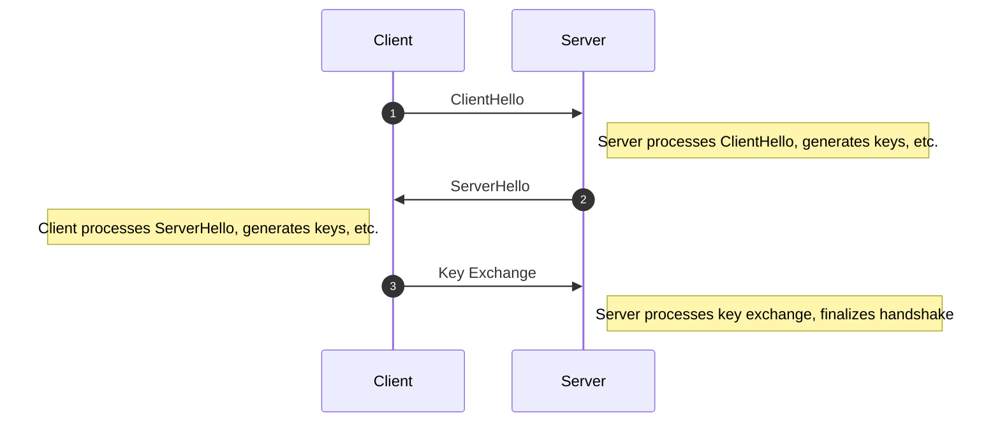

---
authors:
    - demosjarco
categories:
    - ai
    - tech deep dive
date:
    created: 2023-10-26
---

I used ChatGPT to generate the TLS 3 way handshake diagram process used in https using mermaid

<!-- more -->

