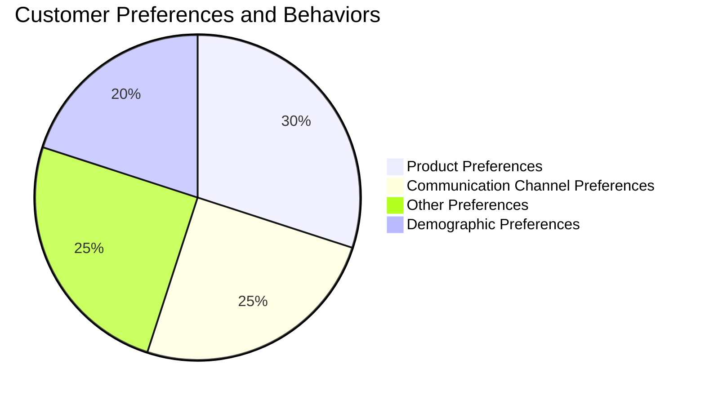

---
authors:
    - clair
categories:
    - audience engagement
date: 2023-10-24
---

# Optimizing Customer Experience: AI-Powered Strategies for Enhanced Satisfaction

Find out how AI-powered features like personalized communication and real-time analytics can drive customer satisfaction and loyalty. Explore the transformative potential of AI with Chainfuse AI.

<!-- more -->

## Introduction

In today's digital world, businesses must find ways to optimize customer experiences to stay competitive and foster growth. This means providing personalized, seamless interactions that meet customer expectations and address their unique needs. To achieve this, businesses are turning to artificial intelligence (AI) and the powerful capabilities it offers.

In this article, we will explore how AI can transform community engagement strategies across various industries. From gaming and retail to healthcare and education, each industry has its own set of challenges and requirements when it comes to engaging with their communities. With the help of AI, businesses can tailor their engagement strategies to better meet these specific needs.

By leveraging AI-powered features like personalized communication, real-time analytics, and universal connectivity, businesses can create more meaningful interactions that drive customer satisfaction and loyalty. We will also delve into the key features of Chainfuse AI, a platform that empowers businesses to enhance their customer engagement efforts through AI-driven solutions.

Join us as we uncover the transformative potential of AI in elevating community engagement strategies for different industries. Let's explore how businesses can leverage the power of AI to build stronger connections with their customers and drive success in today's digital landscape.

## 1. Understanding the Importance of Customer Experience Optimization

In the digital world we live in today, optimizing the customer experience isn't a frill but an absolute must-have. It revolves around the idea of making every interaction a customer has with your brand both easy and enjoyable. This strategy not only improves customer satisfaction, but also breeds loyalty and fuels business growth.

To nail customer experience optimization, businesses should consider a variety of strategies. Personalizing content and recommendations based on customer preferences and behaviour is one way to do it. In the same vein, enhancing website and application performance can result in smoother customer experiences. Gathering and analysifying feedback from customers can also help businesses make data-driven decisions on how to improve their products and services. Furthermore, providing communication and support across multiple channels can contribute significantly to customer satisfaction.

In this era of ever-evolving technology and online platforms, customers have a plethora of options and high expectations. Keeping customers happy and satisfied is no longer a choice but an imperative.

A positive customer experience is essential for businesses to retain their existing customers and attract new ones, as well as set themselves apart from the competition. Offering a seamless and personalized digital experience can lead to increased customer loyalty, an influx of positive word-of-mouth recommendations, and ultimately, higher profits.

Customer experience is an integral part of any brand's interaction with its customers. Factors that ensure seamless interactions include a user-friendly website or application, effective customer support systems, and the use of data analytics to understand customer preferences and behaviours. Social media platforms and other communication channels can also boost customer engagement and enable smooth interactions.

Delivering a positive customer experience comes with a slew of benefits. It aids in building customer loyalty and retention. When customers have a positive interaction with a company, they are more likely to be repeat customers and recommend the company to others. This can lead to increased sales and revenue. A company that offers excellent customer experience stands out from the competition. Plus, satisfied customers are likely to share their experiences with others, either through online reviews or personal recommendations. This can help attract new customers and expand the customer base.

Improving customer satisfaction and loyalty requires offering a seamless and user-friendly website experience. This can be achieved through an effective website design, clear communication of product and service offerings, and prompt and helpful customer support.

Offering loyalty programs and incentives can encourage repeat business and bolster customer loyalty. Regularly seeking customer feedback and promptly addressing any concerns can also lead to higher customer satisfaction and loyalty.

Businesses can drive growth by enhancing the overall customer journey and satisfaction. This can be achieved by offering personalized and seamless interactions at various touchpoints. By understanding customer needs and preferences, businesses can tailor their products and services to match those expectations. Investing in customer service and support can help create positive experiences and build long-term relationships with customers. Continuous customer feedback and improvements can drive growth by delivering exceptional customer experiences.

Businesses should follow these best practices to optimize customer experience: personalization, user-friendly design, quick loading times, clear and concise communication, responsive customer support, continuous improvement, mobile optimization, consistent branding, streamlined checkout process, and omnichannel experience. By adhering to these practices, businesses can enhance customer experience, leading to increased customer satisfaction and loyalty.

There are ways to measure and track customer satisfaction. One common approach is to conduct surveys and collect feedback. Analyzing the responses will provide insights into customer satisfaction levels and areas for improvement. Businesses can also track customer satisfaction metrics such as Net Promoter Score (NPS), Customer Satisfaction Score (CSAT), and Customer Effort Score (CES). These metrics provide quantitative measures of customer satisfaction and can help businesses understand how they are performing compared to industry benchmarks.

A variety of tools and technologies can enhance customer experience. These include Customer Relationship Management (CRM) software, customer feedback platforms, live chat software, and data analytics tools. By harnessing these tools and technologies, businesses can improve the overall customer experience.

### 1.1. Defining Customer Experience Optimization in the Digital Age

The digital era calls for businesses to enhance their customer experience optimization. This involves making the most of technology to elevate every customer interaction throughout their journey. The crux of this approach is to truly understand the customers' requirements, their preferences, and their behavior. Armed with this knowledge, businesses can deliver personalized experiences that not only meet but exceed customer expectations. This approach becomes increasingly significant in today's world, where customers demand personalized, seamless experiences across all platforms.

One of the most effective strategies for customer experience optimization in the digital age revolves around improving website performance, refining the user interface, and personalizing content. By ensuring that their websites load quickly and efficiently, businesses can offer their customers a smooth browsing experience. Enhancing the user experience involves creating intuitive navigation, clear and easily understandable content, and user-friendly interfaces. Personalization forms an integral part of customer experience optimization. Tailoring website content and recommendations based on individual preferences and behaviors can significantly enhance the digital customer experience. These strategies are fundamental in driving customer satisfaction and loyalty.

Technology can be used effectively to enhance customer touchpoints. Businesses can implement features like live chat on their websites, use chatbots for instant customer support, and utilize customer relationship management (CRM) systems to track and manage customer interactions. Data analytics and artificial intelligence can be used to personalize customer experiences, and offerings can be tailored to individual preferences and needs. All these steps result in creating more meaningful and engaging customer interactions, thereby improving customer satisfaction and loyalty.

Understanding the needs and preferences of customers is of paramount importance for a business' success. Businesses can align their products, services, and marketing strategies to meet their customers' expectations by analyzing their behavior and preferences.

This can be accomplished through market research, customer surveys, data analysis, and monitoring customer feedback. With insights into customer needs and preferences, businesses can make informed decisions and develop strategies that resonate with their target audience, thereby leading to customer satisfaction and loyalty.

Delivering personalized experiences involves understanding the needs and preferences of individual users. Organizations can tailor their products, services, and communications to meet the specific needs and interests of each customer by analyzing user data and behavior.

Techniques such as segmentation, targeting, and personalization algorithms can be utilized for this purpose. By implementing a data-driven approach and leveraging technology, organizations can create unique and personalized experiences that resonate with their customers, ultimately leading to increased engagement and customer satisfaction.

Businesses that consistently surpass customer expectations can build strong relationships, foster customer loyalty, and differentiate themselves from competitors. This involves providing exceptional products or services, exceptional customer service, and going above and beyond to meet customer needs. Factors like delivering products on time, offering personalized experiences, resolving issues promptly, and continuously improving the customer experience play a crucial role in exceeding customer expectations.

Ensuring a seamless experience across all channels is another key aspect of customer experience optimization. This involves optimizing the website for different devices and screen sizes, ensuring consistency in the user interface and design across all channels, and integrating customer data across channels to personalize the experience. Additionally, a robust customer support system can help address any issues or concerns that customers may have, thereby enhancing the overall experience.

Several best practices can enhance the customer journey. These include ensuring a seamless and user-friendly website experience, achieved by optimizing page load times, improving website navigation, and ensuring all links and buttons function correctly. Personalization plays a key role in enhancing the customer journey, and businesses can tailor website content and offers to individual customer preferences and needs. Excellent customer support throughout the journey, including offering multiple channels for customer communication such as live chat, email, and phone support, and ensuring prompt and helpful responses to customer inquiries and issues, can enhance the customer journey and create a positive experience for customers.

In summary, businesses can significantly enhance their customer experience by leveraging technology, understanding customer needs and preferences, delivering personalized experiences, exceeding customer expectations, and ensuring a seamless experience across all channels. By following these strategies, businesses can optimize their customer experience, leading to increased customer satisfaction, loyalty, and improved business performance.

#### 1.1.1 The Role of AI in Customer Experience Optimization

Artificial Intelligence (AI) is a powerful tool that businesses can wield to revolutionize their customer experience optimization strategies. It holds the potential to mine and analyze customer data, identify behavior patterns, and unearth valuable insights that can significantly enhance customer satisfaction and loyalty.

A critical aspect of AI is its capability to automate processes. By harnessing the power of AI, businesses can offload mundane tasks such as responding to routine customer queries, offering personalized recommendations, or handling transactions. This automation not only conserves resources but also frees up customer service representatives to tackle intricate issues that necessitate human intervention. Imagine having AI-powered chatbots that can engage customers in natural language conversations, providing instantaneous responses and support.

Beyond automation, AI's potential to predict customer behavior is a game-changer. By leveraging diverse data sources and machine learning algorithms, AI can assess customer interactions, purchasing history, and demographic data, among other relevant information. The outcome is a set of patterns that facilitate predictions about future customer behavior. These predictive analytics help organizations to refine their marketing campaigns, optimize pricing strategies, improve customer retention, and overall, enhance the customer experience.

In the digital age, personalization is paramount. For this, the Chainfuse platform can be a valuable asset. Through its advanced AI algorithms and tools, Chainfuse enables businesses to analyze user data, segment audiences, and provide personalized content, recommendations, and offers. The result is an improved customer experience strategy that bolsters engagement, satisfaction, and business outcomes.

AI isn't just a reactive tool; it's proactive as well. This proactive nature is evident in its ability to resolve issues before they magnify into significant problems. For instance, AI algorithms can process customer data, flag potential issues, and alert businesses to tackle them proactively. This preemptive approach can result in increased customer satisfaction and a reduced need for reactive support.

Uncovering customer insights with AI is another key aspect. By employing techniques like natural language processing and various machine learning algorithms, AI can analyze customer data from surveys, social media, and customer support inquiries to discern patterns and trends. These insights can illuminate customer preferences, behaviors, attitudes, and provide invaluable information to refine products, services, and marketing campaigns.

When AI is deployed for personalized customer solutions, a granular understanding of customer needs and requirements is crucial. AI can scrutinize customer data - their browsing behavior, preferences, and more - to deliver bespoke recommendations and suggestions. Furthermore, it can enhance customer service by providing real-time assistance and support through chatbots or virtual assistants. The result? An elevated customer experience that fosters customer satisfaction and loyalty.

AI's benefits in customer experience optimization are manifold. Its ability to process massive amounts of customer data and identify underlying patterns can provide businesses with a wealth of insights into customer habits, preferences, and needs. This can guide businesses to tailor their products and services to meet these needs. AI's prowess in automating and personalizing customer interactions can result in a more efficient and customized experience. Moreover, its predictive capabilities can enable businesses to anticipate and address customer concerns proactively, paving the way for proactive recommendations.

Optimizing the use of AI in customer interactions involves a set of best practices. Ensuring that the AI system is well-trained and has access to accurate data is paramount. It's also crucial to find the right balance between automation and human interaction. Customers must always have the option to connect with a human agent when needed. Transparency is also important - customers must know when they're interacting with an AI system and have the freedom to opt out if they prefer. Continuous monitoring and evaluation of the AI system are essential to identify potential issues or limitations and make necessary improvements. Following these best practices ensures that businesses can leverage AI to provide a seamless and satisfactory customer experience.

## 2. Leveraging AI for Effective Communication

AI revolutionizes the way businesses communicate with their customers, bringing personalization and efficiency to the forefront. By tapping into the power of AI, businesses have the capacity to respond in a tailored manner to commonly raised queries and deliver personalized product recommendations based on a user's historical interactions.

AI-based customer communication has been integrated across diverse sectors, including e-commerce, banking, healthcare, and customer service. One prevalent example is the use of AI-powered chatbots that provide personalized recommendations, answer routine questions, and engage with consumers, adding a touch of personalization to the customer experience. For instance, voice-activated AI assistants like Siri and Alexa use natural language processing to streamline customer interactions with businesses.

In the realm of automated responses, it's essential to ensure that responses are timely, relevant, and precise. AI algorithms analyze the context and intent behind a user's queries to provide personalized, accurate responses. Avoiding complex or technical jargon is also crucial to maintain clarity and enhance the customer experience. And, if needed, providing an option to seamlessly escalate the conversation to a human agent can significantly elevate the customer experience.

AI's prowess can also be harnessed for personalized product recommendations. For example, AI algorithms on Chainfuse AI analyze user behavior and preferences to generate individualized recommendations, which can be displayed across various pages on the website. AI considers factors like browsing history, purchase history, and demographics and leverages this data to make accurate recommendations, thereby enhancing user experience and increasing the likelihood of conversion.

AI-powered chatbots and virtual assistants play a pivotal role in enhancing customer experience. These intelligent systems provide instant support, answer frequently asked questions, and guide customers through various processes. The incorporation of natural language processing and machine learning algorithms enables these AI solutions to understand and respond to customer queries in a conversational manner, improving customer satisfaction and reducing response times. Moreover, these tools can analyze customer interactions, identify patterns, and arm businesses with valuable insights for further improvement.

AI solutions for customer communication offer a slew of benefits including improved customer satisfaction, personalized experiences, and increased operational efficiency. By analyzing customer data and behavior, AI provides insights and recommendations, automates customer interactions through chatbots or virtual assistants, and facilitates targeted marketing campaigns.

Using AI to automate customer queries can significantly streamline the process and boost customer satisfaction. By employing natural language processing and machine learning algorithms, AI tools can interpret customer queries in real-time, providing accurate and relevant responses. This automation negates the need for human intervention in many cases and allows businesses to handle a large volume of customer queries concurrently. Moreover, AI systems can learn from past interactions and continuously refine their responses, ensuring that customers receive the most current and pertinent information.

AI has multiple benefits in customer communication. It can enhance response times by providing immediate, accurate responses to inquiries. It also personalizes interactions and offers tailored recommendations. Moreover, by automating repetitive tasks, it frees up human agents for more complex and value-added activities. Overall, AI in customer communication leads to increased efficiency, improved customer satisfaction, and cost savings for businesses. Therefore, AI is not just an added advantage, but a necessity for businesses aiming to optimize their customer experience.

### 2.1. Integrating AI with Popular Communication Channels

The integration of AI into popular communication channels serves to enhance the dialogue between businesses and their customers. This fusion allows for engagement points to be established across a variety of platforms, be it social media, messaging applications, or even SMS, providing a cohesive experience across all interactions.

The brilliance of AI comes into play with the inclusion of AI-based chatbots. These programmable conversational agents are designed to understand and respond in real-time to queries put forth by users. Whether it's through a website, messaging app, social media platform, or any other communication channel, these chatbots streamline customer interactions, offer immediate support, and overall, amplify the user experience.

The integration of AI with social media is not a straightforward operation and utilizes various technologies and techniques. For instance, natural language processing (NLP) algorithms can be employed to parse through and comprehend the content that is shared on social media platforms. This can aid in sentiment analysis, trend identification, and even prediction of user behavior. Besides, AI-enhanced chatbots can interact with users on social media platforms, delivering customer support, answering queries, and even making personalized recommendations based on user preferences. Furthermore, AI can be used to tailor the social media experience for users. Through the analysis of user data and behavior, AI algorithms can push targeted content, advertisements, and recommendations to individual users, enhancing their overall social media experience.

AI integration with messaging apps poses several benefits. For starters, it permits personalized and automated customer interactions, augmenting customer service, and satisfaction. AI-enhanced chatbots can provide instant responses, address frequently asked questions, and manage simple tasks, freeing up human customer support agents to focus on complex issues. AI can analyze conversations and user data to offer valuable insights and make proactive suggestions, improving the overall user experience. The integration also enables businesses to scale their customer support operations efficiently, as chatbots can handle multiple conversations simultaneously.

In integrating AI with SMS, it is crucial to adhere to certain best practices to ensure a smooth and effective integration. A deep understanding of the target audience and their preferences when it comes to SMS communication is necessary. This understanding would help tailor the AI-powered SMS experience to meet their specific needs and expectations. Implementing natural language processing (NLP) capabilities in your AI system helps in understanding and interpreting the text messages received from users. This will enable the system to provide accurate and relevant responses, improving the overall user experience. Additionally, AI algorithms can personalize SMS interactions based on user preferences, past interactions, and behavior.

Data privacy and security are of utmost importance when dealing with AI-powered SMS systems since they handle sensitive user information. It is necessary to prioritize data privacy and security by implementing robust encryption methods and following industry best practices for data protection. Lastly, AI systems learn and improve over time. Regularly analyzing user interactions, feedback, and performance metrics helps identify areas for improvement. Incorporating user feedback and iterating on the AI models enhances the SMS experience.

Optimizing customer experience with AI integration involves the strategic application of AI-powered technologies like chatbots and virtual assistants. These technologies offer personalized and efficient customer service, automate repetitive tasks, and offer real-time assistance. With AI's ability to anticipate customer needs and offer proactive recommendations by analyzing customer data and behavior, businesses can personalize marketing campaigns, tailor product recommendations, and optimize pricing strategies.

Implementing AI for personalized communication on social media greatly amplifies user engagement and customer satisfaction. With AI algorithms and natural language processing, social media platforms can analyze user preferences, interests, and behaviors, delivering personalized content and recommendations. AI-powered chatbots can also interact conversationally with users, providing instant responses and addressing customer queries and concerns. This saves time, resources, and creates a more personalized and interactive experience for users on social media platforms. AI can also assist in auto-generating personalized messages, comments, and replies based on user interactions and context, further enhancing the overall communication experience on social media.

When using AI to streamline customer engagement on messaging apps, customer satisfaction and efficiency receive a significant boost. By leveraging AI technologies such as natural language processing and machine learning, businesses can automate responses to customer inquiries, provide personalized recommendations, and even offer proactive assistance. This reduces the workload for human agents and ensures consistent and timely responses to customer queries. Furthermore, AI-powered chatbots can be integrated with CRM systems to provide a seamless customer experience across different channels.

In conclusion, the integration of AI in customer engagement on messaging apps can enhance customer interactions and drive business growth.

#### 2.1.1 Case Study: Discord, Telegram, WhatsApp, and SMS Integration using AI

Chainfuse AI is a remarkable tool that has the potential to revolutionize customer engagement across various platforms. By establishing a connection with frequently employed communication mediums such as Discord, Telegram, WhatsApp, and SMS, businesses can respond to their customers in a swift and efficient manner.

Let's explore how Chainfuse AI enhances the customer experience across these platforms:

On Discord, the Chainfuse AI bot can be seamlessly integrated into your server and calibrated to provide real-time support to your customers. Its AI capabilities allow it to answer common queries, provide personalized assistance, and even give recommendations. Encouraging customers to interact with the bot and continuously monitoring its performance can lead to its optimization, resulting in improved customer engagement.

When it comes to Telegram, the Chainfuse website offers a plethora of features that can be used to interact with customers. The AI technology can enhance customer experience by providing personalized recommendations and assistance. By integrating Chainfuse AI with Telegram, businesses can create interactive chatbots or automated messaging systems that can communicate with customers in real-time, effectively boosting customer satisfaction and engagement on the platform.

Regarding WhatsApp and SMS, the features and capabilities of the Chainfuse platform can be leveraged to engage customers. Although the specific integration details are not explicitly provided, it can be inferred that the use of Chainfuse AI can potentially redefine how businesses communicate with their customers, providing a more personalized and efficient service.

Furthermore, on platforms like Discord, Chainfuse AI can be utilized to collect and manage feedback from the community. It provides a streamlined process for feedback collection, analysis, and action taking based on the insights received. This feature significantly enhances the feedback collection process, making it more impactful and efficient.

In the absence of specific details about feedback collection on Telegram, it is worth noting that AI-powered tools like Chainfuse can generally enhance the feedback collection process, making it more organized and insightful. Nonetheless, the potential of Chainfuse AI in revolutionizing customer engagement across these platforms is immense and worth exploring further.

## 3. Managing Negative Feedback through AI Strategies

Facing criticism is a natural part of any business journey. It's not the presence of negative feedback that determines your customer experience, but rather the way you handle it. By harnessing the power of artificial intelligence, businesses can streamline the process of managing negative feedback, identifying prevalent issues through analysis of comments and reviews, and automating appropriate responses to frequent grievances.

Let's take a deeper look at how to deftly manage negative feedback. A suitable starting point involves actively listening to customer concerns and empathizing with them. This prioritizes customer satisfaction by demonstrating that their feedback is acknowledged and their issues are taken seriously. Providing an immediate and appropriate solution is also crucial. Remember, criticism is an opportunity to grow and enhance your services or products, and maintaining open and consistent communication with customers is key.

Now, this is where AI enters the picture. AI solutions are highly beneficial in managing negative feedback. By processing vast amounts of data, AI algorithms can pinpoint patterns and trends in customer feedback, leading to a clear understanding of the root causes of criticism and aiding in the development of dedicated strategies to address them. Furthermore, AI-powered sentiment analysis can automatically sort feedback into categories of positive, negative, or neutral, allowing businesses to focus on and respond to negative feedback efficiently.

To automate responses, various AI techniques and tools can be employed. Sentiment analysis, powered by AI, can automatically identify negative feedback from customers. Using natural language processing (NLP) algorithms, relevant responses can be generated based on the sentiment and content of the feedback. By incorporating machine learning, the AI system can continuously refine its response generation, leading to improved automated responses over time. This results in quick resolution of customer concerns and enhances overall customer satisfaction.

Sentiment analysis and text mining can also be used to analyze comments and reviews, offering valuable insights into customer opinions, preferences, and pain points. Monitoring online platforms and social media channels allows you to promptly address any issues or concerns, providing a wealth of information about customer sentiment.

Effective management of negative feedback requires a careful and proactive approach. Here are some best practices:

-   Listen and empathize: Show that you value their input and are committed to addressing their concerns.
-   Respond promptly: Timely response to negative feedback is crucial.
-   Take ownership: Accept responsibility for any mistakes or shortcomings leading to negative feedback.
-   Apologize sincerely: A genuine apology can go a long way in defusing a negative situation.
-   Offer solutions: Provide the customer with practical solutions to address their concerns.
-   Learn from feedback: Use negative feedback as an opportunity to learn and grow.
-   Follow up: After resolving the issue, follow up to ensure satisfaction and show that their feedback was taken seriously.

AI can also identify common issues in customer feedback. By analyzing customer feedback using techniques such as NLP and sentiment analysis, businesses can understand common issues customers are facing, prioritize these issues, and address them swiftly, improving overall satisfaction.

Businesses can utilize advanced AI technologies such as machine learning and natural language processing to enhance customer experience management. These technologies can analyze customer data, automate customer interactions, personalize customer experiences, and streamline customer service processes.

AI-powered feedback analysis can play a crucial role in improving customer satisfaction. This analysis can help businesses identify areas for improvement, make data-driven decisions to enhance their products or services, and identify patterns in customer feedback to proactively address potential issues.

AI tools are available that can automate responses to customer complaints. They can analyze the sentiment of the complaint, identify the main issues, and suggest relevant solutions or actions. This can help businesses save time and resources.

Using AI to transform negative feedback into positive customer experiences involves using sentiment analysis. This analysis can help businesses identify areas where customers are dissatisfied, allowing them to take proactive measures to resolve these concerns and improve the overall customer experience. By using AI in this way, businesses can turn negative feedback into positive experiences by actively addressing customer concerns and providing exceptional service.

### 3.1 Techniques to Address Negative Comments and Feedback from Customers

Utilizing advanced AI-powered strategies can empower businesses to tackle negative comments and feedback effectively. Key among them is sentiment analysis, a feature that leverages artificial intelligence to evaluate the emotions expressed in the comments and reviews. This powerful tool helps businesses grasp the tone of their customer interactions, transforming rough data into comprehensible insights.

There's more. The capability of Chainfuse AI to generate automated responses is another tool in our arsenal. This AI-powered solution can swiftly respond to common complaints or queries, crunching down the time it takes to address customer concerns. The unique feature about these responses? They're not just automated; they're tailored to the query at hand. Chainfuse AI evaluates the query's context, leveraging all the data at its disposal, from the base_url to the domain and the url, to generate a response specific to the user's issue.

What's the result of all of this? A negative customer experience is quickly transformed into a positive interaction. And it's not just about averting a crisis - it's about learning from it. Chainfuse AI's ability to analyze and understand customer feedback, including the negative, provides businesses with actionable insights. This enables you to address customer concerns, refine your offerings, and ultimately bolster the overall customer experience.

Chainfuse AI ensures that every piece of feedback is seen as an opportunity for improvement. Adopting best practices such as active listening, timely acknowledgment of issues, and working proactively towards resolution all play a part in crafting a superior customer experience. And with Chainfuse AI, you have the technology to make it happen.

#### 3.1.1 Implementing an AI-Powered System for Feedback Management

Harnessing the power of AI for feedback management can revolutionize the way we understand and respond to customer experiences. Let's take Chainfuse AI as an example. It utilizes AI to scrutinize customer feedback in real-time. This allows businesses instant access to customer sentiments, enabling them to pinpoint and address issues swiftly.

AI algorithms form the crux of this system. These complex mathematical models are trained meticulously to spot patterns, gauge sentiment, and extract pivotal insights from customer feedback. In doing so, they pave the way for businesses to make data-driven decisions that are in sync with their customers' needs and expectations.

This is not all. With AI, feedback management can be automated, saving precious time and resources. The system can also run real-time analyses and generate insights that would typically take human analysts hours, if not days, to produce. Businesses can then use these insights to refine their offerings, streamline processes, and react proactively to customer concerns.

But where does Chainfuse AI fit into all this? Known for its real-time feedback analysis capabilities, Chainfuse AI can be integrated into your existing systems. Say, for example, you wish to automate responses. Using the appropriate endpoints and APIs, you can leverage Chainfuse AI to do just that.

In essence, Chainfuse AI serves as an invaluable tool to enhance customer experiences. By efficiently collecting, analysing, and acting on customer feedback in real-time, it aids businesses in tailoring their offerings to better meet customer expectations.

Moreover, AI-powered feedback management can also categorize and prioritize feedback. That means businesses can quickly identify and address key areas of concern. Add to that sentiment analysis, and you have a system that not only understands what customers are saying but also how they're feeling - a crucial aspect when framing responses.

When implemented correctly, Chainfuse AI can streamline customer support, improve response times, and most importantly, increase overall customer satisfaction. In a nutshell, AI-powered feedback management is a game-changer that can redefine your approach to customer feedback, making it more efficient, and customer-centric.

## 4. Balancing Multiple Communication Platforms using AI

In our digitally connected world, businesses must effectively engage with customers across a myriad of platforms. Balancing multiple communication channels adds complexity to this task, potentially hampering the consistency of customer experience. Here, Artificial Intelligence (AI) offers a valuable solution to this challenge.

AI holds the potential to deftly integrate with various communication channels, thereby enabling businesses to balance their communication efforts and ensure a consistent experience across all platforms. The method of integrating AI with communication channels involves leveraging various solutions that the market offers today. These solutions empower businesses to embed AI technologies such as natural language processing and machine learning into their communication channels, including chatbots, voice assistants, and email.

The integration of AI into these communication channels revolutionizes the customer interaction landscape. It lends a high level of automation to customer interactions, offers personalized responses, and streamlines communication processes. The ultimate result is an improved customer experience, reduced response times, and increased operational efficiency.

Several AI platforms and tools in the market offer pre-built integrations with popular communication channels. Businesses can take advantage of these integrations to easily deploy AI-powered chatbots across websites, messaging apps, and social media platforms. Embracing AI's capabilities in real-time analysis of customer interactions and sentiment gives businesses valuable insights, enabling them to refine their communication strategies.

AI's role in managing multiple communication channels extends beyond mere integration. Leveraging AI technology, businesses can automate and streamline their communication processes across different channels such as email, chatbots, and social media. This automation drastically enhances customer interactions. AI-powered chatbots can provide instant and personalized responses to customer queries, improving customer satisfaction and engagement. Plus, routine tasks can be automated, freeing up human resources for more complex tasks.

AI offers an excellent solution for maintaining seamless omnichannel communication. By integrating and synchronizing communication channels, AI ensures a consistent and seamless experience for customers across multiple platforms. Furthermore, AI's ability to analyze large volumes of customer data across different channels provides valuable insights into customer behavior, preferences, and sentiment. With this information at their fingertips, businesses can tailor their communication strategies and improve overall customer experience.

The integration of AI in managing communication channels also affords businesses scalability. AI can handle a large volume of communication requests simultaneously, empowering businesses to scale their operations without compromising quality or speed.

In conclusion, integrating AI with communication channels offers numerous benefits, including enhanced customer service, improved productivity, and better decision-making based on data-driven insights. As more businesses adopt AI in their communication strategies, the future of AI in customer engagement across platforms looks promising.

### 4.1 Streamlining Operations through Universal Connectivity

Harnessing AI's universal connectivity across diverse communication platforms provides a myriad of advantages for streamlining operations and fortifying customer engagement. By weaving this technology into various communication networks, it becomes possible to manage interactions with customers more efficiently, whether it's through SMS updates, social media responses, or engagements on messaging applications.

For instance, consider Discord. By utilizing its API, you can create a bot infused with AI capabilities to engage with users in real-time. This AI-powered bot can be programmed to understand user queries, provide pertinent information, and even offer personalized recommendations. The integration of Natural Language Processing (NLP) algorithms further enhances the bot's comprehension and interpretation of user messages, delivering a more personalized and effective customer experience on the platform.

On the Telegram front, AI is instrumental in creating a smooth and efficient customer experience. Aspects such as personalizing the customer experience based on their past behavior, preferences, and demographics, or providing instant, accurate responses using AI-powered chatbots are paramount. Leveraging NLP for conversational interactions with the chatbots and offering proactive assistance based on inferred customer needs are other examples. Continuous learning and improvement based on customer interactions and feedback round off the ways of enhancing engagement on the platform.

WhatsApp, another popular communication channel, is no stranger to the benefits of AI integration. Tools and platforms that offer chatbot capabilities can be utilized for automating customer communication. These chatbots, coupled with AI algorithms, can learn from past interactions and subsequently improve their responses, thereby streamlining the customer support process and providing relevant, timely information to customers.

When it comes to SMS messaging, AI shines by automating aspects of customer service and offering quicker responses to inquiries via text message. AI algorithms can scrutinize the content of the messages to generate apt replies based on predefined rules or machine learning models. This application of AI not only boosts response times and customer satisfaction but also enables businesses to handle a larger volume of inquiries without the need for additional human resources.

Using AI for real-time engagement on messaging apps is another approach. With the help of the appropriate API or SDK provided by the app platform, businesses can integrate AI capabilities into their messaging app. By automating responses and offering personalized recommendations, businesses can engage effectively with customers in real-time.

AI can also be applied to generate instant updates via SMS, utilizing NLP and machine learning algorithms. These systems can analyze incoming data to extract relevant information and generate automated SMS updates. This application is particularly useful where real-time updates are crucial, such as emergency alerts, stock market updates, or delivery notifications.

Finally, when it comes to social media platforms, AI-powered chatbots come to the rescue by providing instant responses to customer inquiries, ensuring timely and efficient communication. Plus, AI can analyze customer data to generate personalized recommendations, enhancing the overall customer experience. As a result, businesses can scale their customer communication efforts and provide round-the-clock support.

Beyond the improved efficiency and engagement, applying AI across multiple channels allows businesses to glean insights into customer preferences, automate tasks, and handle a large volume of interactions simultaneously. By integrating AI for consistent customer engagement, businesses can not only enhance the customer experience but also increase efficiency, and ultimately, drive business growth.

#### 4.1.1 Exploring the Benefits of Seamless Engagement across Channels

Delivering a unified customer experience across all communication platforms is a game-changer. When customers interact with a business, irrespective of the platform used, receiving a consistent experience is key. This not only improves customer engagement but also bolsters overall satisfaction. One tool that can make this a reality is Chainfuse AI, which offers the potential for universal connectivity, allowing businesses to engage with their customers on multiple fronts.

Let's take the example of Discord, a popular platform used by many. Chainfuse AI can be integrated smoothly with Discord by creating a webhook within Discord's server settings, which can then be linked with Chainfuse AI's platform. This setup ensures that all notifications from the AI are sent directly to a specified Discord channel, providing real-time updates and alerts.

However, it's critical to note that the integration of Chainfuse AI with other popular platforms such as Telegram and WhatsApp may not be directly available, based on available information. It is advisable to refer to the official documentation or contact Chainfuse AI's support team for further details on these integrations.

One intriguing possibility is integrating Chainfuse AI with SMS functionality, using the provided base_url and chunk_id to access necessary resources and APIs. This integration can aid businesses in reaching out to customers who prefer or are more accessible via text, increasing the chances of engagement.

Chainfuse AI's versatility goes beyond just communication. It has features that enable businesses to gather meaningful feedback from their customers. For instance, by leveraging its email integration, businesses can set up automated email campaigns or surveys to gather valuable customer feedback. Chainfuse AI also offers a checkout feature, allowing businesses to collect feedback during the purchase process. This, combined with its advanced analytics capabilities, enables businesses to identify patterns and trends and better understand their customer's concerns and needs.

Prioritizing user concerns is another area where Chainfuse AI shines. Through its analysis of user feedback, it can discern the most common and impactful concerns that users face. Machine learning techniques also allow it to anticipate potential concerns based on user behavior, enabling proactive measures to be taken. As a result, user satisfaction and overall experience are greatly enhanced.

Brand preferences also come into play when using Chainfuse AI. The platform allows businesses to tweak the code or configuration files to align the AI system with specific brand requirements, be it adjusting visual elements to match the brand's aesthetic or customizing AI's behavior to suit the brand's needs.

Although the use of Chainfuse AI in more specialized contexts such as political campaigns or for crypto startups is not explicitly mentioned, its versatility can be harnessed in various ways, depending on specific requirements and objectives. For example, e-commerce brands can integrate Chainfuse AI into their customer support system to improve response times, provide personalized assistance, and automate support solutions, leading to heightened customer satisfaction and loyalty.

In conclusion, Chainfuse AI is a dynamic tool that can revolutionize the way businesses interact and engage with their customers. By providing universal connectivity and an array of versatile features, it can significantly enhance the customer experience, making it a valuable addition to any business's toolkit.

## 5. Mitigating Spam and Inappropriate Content with AI

Unwanted content and spam can significantly diminish user experience on any platform. However, harnessing the power of artificial intelligence can help businesses effectively address these challenges by accurately identifying and filtering out such content, thereby enhancing customer experience and fostering a secure online environment.

The power of AI can be deployed to sift through and filter spam content using various techniques such as natural language processing, machine learning, and pattern recognition. These techniques can analyze content, identify underlying patterns indicative of spam, and then separate it from legitimate content. By training the AI model on a vast dataset of known spam content, it learns to differentiate between spam and important content. As new content is submitted, the AI can automatically classify it as spam or not, which assists in filtering out unwanted and potentially harmful content.

When it comes to leveraging AI to single out inappropriate content, several best practices can be employed. Firstly, it is fundamental to have a diverse and comprehensive training dataset that encompasses a wide range of inappropriate content examples. This helps the AI model recognize and accurately identify different types of inappropriate content. Secondly, regularly updating and fine-tuning the AI model enables it to adapt to the evolving patterns of inappropriate content, which can be achieved by incorporating user feedback and continually retraining the model with new data.

Implementing a multi-layered approach that combines AI with human moderation can also prove effective. While AI can automate the initial screening process, human moderators can provide the final judgment, handling complex cases that require contextual understanding. Transparency and accountability are also crucial. Clear communication of how AI is used to detect inappropriate content to users and provision of channels for reporting false positives or appealing decisions are vital. Regular audits and evaluations can help maintain the accuracy and fairness of the AI system.

AI algorithms for content filtering can be used to analyze and categorize large amounts of data in order to identify and filter out inappropriate or irrelevant content. Examples of AI algorithms for content filtering include Natural Language Processing (NLP) algorithms, Machine Learning algorithms, Deep Learning algorithms, and Collaborative filtering algorithms.

Chainfuse AI, for instance, identifies and filters out unwanted content by analyzing various factors such as the content of the webpage, user behavior, and the reputation of the source. It utilizes advanced algorithms and machine learning techniques to detect patterns and anomalies that might indicate unwanted or malicious content. By continuously learning and adapting, Chainfuse AI can effectively distinguish between legitimate and unwanted content, ensuring a safe and reliable browsing experience for users.

Businesses across different sectors have increasingly been employing AI to mitigate spam and inappropriate content. AI technology can analyze and filter vast volumes of data to identify and block spam messages, detect and remove inappropriate content, and enhance overall content moderation processes. This allows businesses to maintain a safe and secure environment for their users and protect their brand reputation. AI algorithms learn from patterns and user feedback, continuously improving their accuracy in identifying and mitigating spam and inappropriate content.

AI-powered solutions that help create a safer online environment use advanced algorithms and machine learning techniques to detect and prevent cyber threats like malware, phishing attacks, and data breaches. They can analyze large amounts of data in real-time to identify potential risks or anomalies. By leveraging these AI technologies, businesses can provide proactive protection, keeping organizations and individuals safe online.

Chainfuse AI can be integrated with existing content moderation systems to enhance them with AI technology, improving the efficiency and accuracy of the moderation process. This integration can be achieved by connecting to the Chainfuse website and accessing the appropriate endpoints. Furthermore, AI-based content filtering with Chainfuse AI can be set up by referring to the documentation provided by Chainfuse. This documentation provides step-by-step instructions on how to configure and implement this feature.

In conclusion, AI techniques can significantly improve customer experiences by filtering out unwanted content. These techniques include natural language processing algorithms and machine learning models which can analyze the content of customer interactions to identify any unwanted or inappropriate language. By using these AI techniques, businesses can proactively filter out unwanted content and provide a more positive customer experience. Chainfuse AI, in particular, helps businesses identify and address spam and inappropriate content by utilizing advanced algorithms and machine learning techniques. The system is trained to detect patterns and characteristics of spam and inappropriate content, enabling businesses to identify and take action against such content rapidly. This contributes to maintaining the integrity of their platforms and protecting their users from harmful or unwanted content.

### 5.1 Customizing AI to Identify and Filter Out Unwanted Content

Artificial Intelligence (AI) has ushered in revolutionary strategies for online content management. It can be tailored to recognize and filter out undesirable content, creating a safer online environment and enhancing user experience. This process involves applying AI techniques like Natural Language Processing (NLP) and machine learning algorithms to identify patterns or keywords linked to spam or unsuitable content.

On the technical side of things, AI customization employs the document object with its array of methods and properties. When specific events occur, such as DOMContentLoaded or readystatechange, event listeners like addEventListener are triggered, executing custom functions to filter the undesirable content. Additionally, CSS selectors along with DOM manipulation methods are utilized to pinpoint and eliminate inappropriate elements from the webpage.

To train AI in pattern recognition for spam content, a combination of NLP and machine learning techniques proves highly efficient. NLP methods preprocess and analyze text data, while machine learning algorithms are trained on labelled spam and non-spam data to identify patterns and make predictions.

When it comes to recognizing inappropriate content, AI systems make use of keywords linked to the content under scrutiny. The AI system examines the text and context of the content, flagging potential unsuitable content based on predefined keywords and patterns. It can also be taught to recognize specific language or phrases commonly associated with offensive content.

AI-powered algorithms also come into play for the automatic removal of unsuitable content. They scrutinize the content, identify patterns or features of unwanted material, such as spam or advertisements, and filter it out. Integrating AI into your content management system or website automates this process and can handle large volumes of content where manual moderation might not be feasible.

Coupled with human review, AI can provide an efficient and accurate process for flagging and reviewing unsuitable content. An AI system that analyzes content and spots any potentially inappropriate or harmful elements is beneficial. Once flagged, the content can be reviewed by human moderators who can determine if it violates any guidelines or policies.

A network-level content filtering solution is another effective method for enhancing customer experience by filtering out unwanted content. By blocking access to specific URLs or domains known to contain unwanted or inappropriate content, unwanted content is prevented from reaching the customer's device, thereby improving the overall browsing experience. Advanced content filtering solutions can also use machine learning algorithms to dynamically analyze and categorize web content for more precise filtering based on customer preferences.

Training AI to recognize patterns in unwanted content, such as spam or malicious scripts, requires adherence to best practices. Ensuring high-quality training data, accurate labeling and annotation, regular model evaluation, iterative refinement, robust testing, and a feedback loop are crucial components of a successful AI model. Following these guidelines enhances the accuracy and effectiveness of the AI model, ensuring effective recognition of patterns in unwanted content, and enhancing the performance of your content moderation system.

In conclusion, various AI techniques such as machine learning algorithms, natural language processing techniques, and image and video recognition algorithms can be integrated into content moderation systems to automatically identify and remove spam and inappropriate content. This helps maintain a safe and respectful online environment, ultimately enhancing the overall user experience. AI customization is a game-changer for online content moderation, offering a more efficient, accurate, and streamlined process.

#### 5.1.1 Ensuring a Safe Online Environment for Customers

Ensuring the digital space of a business is safe and user-friendly is vital for customer satisfaction. AI technologies, such as Chainfuse AI, can be harnessed to minimize the propagation of spam and inappropriate content, making the online experience for customers safer and more pleasurable.

The beauty of Chainfuse AI lies in its adaptability. Businesses can shape Chainfuse AI's content filtering capabilities to align with their specific needs. This ensures that undesirable content is effectively sifted out. The customization process is simple and straightforward, involving a few steps. Firstly, navigate to the Chainfuse website. Once there, identify the chunk ID related to content filtering. Add this chunk ID to the base URL to access the relevant content filtering feature and then follow the guidelines provided to exploit Chainfuse AI's content filtering capabilities effectively.

Moreover, Chainfuse AI offers users granular control over the content filtering process by allowing them to define and tweak its parameters. This ensures that the AI system accurately weeds out unwanted or inappropriate content based on the users' requirements, enhancing their overall experience with Chainfuse AI.

Creating a safe online environment is not just about filtering out inappropriate content. It's also about embracing best practices for security and privacy. This includes using secure and encrypted connections for all communications with the Chainfuse AI platform, implementing robust authentication measures like strong password policies and multi-factor authentication, and keeping the platform and all associated software up-to-date with the latest security patches and updates. Furthermore, businesses should monitor and analyze network traffic to detect any suspicious activity, train employees on cybersecurity best practices, and regularly back up data stored on the Chainfuse AI platform.

The Chainfuse AI platform also provides a solution for spam detection and prevention. Utilizing the provided URLs, users can access different sections of the website and gather more information about implementing Chainfuse AI for spam detection and prevention.

Chainfuse AI is not just a tool but an ally in maintaining a safe online environment for your business. By effectively setting up content filtering with Chainfuse AI, you're not only protecting your digital space but also providing your customers with a secure and enjoyable experience.

## 6. Tailoring Community Engagement Strategies for Different Industries

The dynamic nature of different industries creates unique requirements for community engagement strategies. Artificial Intelligence (AI) serves as an advanced tool to help businesses fine-tune their community engagement approaches according to industry-specific demands. The process involves a deep dive into the distinctive needs and challenges each industry faces, and the application of AI in creating tailor-made, relevant experiences.

AI-powered strategies for community engagement offer immense value to a plethora of industries. By incorporating AI technology, enterprises can amplify their engagement efforts, fostering significant interactions with their desired audience. AI's inherent ability to analyze voluminous data enables it to identify patterns, preferences, and trends, equipping businesses to customize their engagement strategies towards specific industries.

Consider the healthcare industry, where AI-crafted personalized communication campaigns stand out by addressing unique patient needs and concerns. By running algorithms on patient data, such as medical history and demographic information, AI can construct targeted messages and recommendations.

In the retail sector, AI-powered chatbots provide personalized assistance to customers. These virtual assistants help customers find the products they need and respond to their queries in real-time. Chatbots can also analyze customer interactions to unearth trends and preferences, allowing businesses to refine their product offerings and customer service.

When it comes to the education sector, AI plays a pivotal role in creating virtual learning communities. These digital gatherings allow students to participate in collaborative projects and discussions. By analyzing student performance data, AI can deliver personalized recommendations and interventions, enhancing the learning experience.

These examples underscore how AI-powered community engagement strategies can be customized to meet the unique needs of different industries. This adaptability allows businesses to forge stronger connections with their target audience and drive positive outcomes.

AI's capabilities extend to data analysis and machine learning algorithms to tailor community engagement for specific industries. These analyses of behavior, preferences, and needs of target audiences within specific industries help identify patterns and trends that inform personalized engagement strategies.

By recommending relevant content or services to community members, automating customer support processes, and providing personalized experiences based on individual preferences, AI helps industries optimize their community engagement efforts and deliver more targeted and valuable experiences to their audiences.

AI technology proves to be a valuable tool in understanding and addressing industry-specific community needs. AI algorithms analyze extensive data, such as online interactions, social media posts, and user feedback, to gain insights into the needs and preferences of a particular community. This knowledge allows businesses and organizations to tailor their products, services, and outreach efforts to better meet community needs.

Moreover, AI assists in automating processes and tasks, freeing up human resources to focus on more complex and strategic initiatives. Therefore, AI has the potential to offer valuable insights and support in addressing industry-specific community needs.

In conclusion, personalized community engagement solutions with AI cater to diverse industries, aiming to enhance community involvement and interaction through AI-driven features and functionalities. These solutions provide tailored experiences, analyze user behavior, and offer targeted recommendations to individuals in various industries. This ultimately helps organizations effectively engage with their diverse user base and deliver personalized experiences.

### 6.1 Understanding Unique Needs and Challenges Across Industries

Different industries have unique requirements, and understanding these nuances is key when cultivating community engagement strategies. Take a gaming community for instance, where real-time interaction matters a lot. Contrast that with a retail community, where personalized product suggestions hold more value. With the power of Artificial Intelligence (AI), businesses can not only gain a deeper insight into their communities' needs but can also tailor engagement strategies to match them.

In the gaming industry, for example, an effective technique is to set up interactive forums or chat spaces where members can engage in real-time. This fosters a space for immediate feedback, strategy exchange, and conversation. Incorporating live streaming features is another way to enhance real-time engagement, allowing gamers to interact with content creators directly. Leaderboards and competitive events can also foster an engaging atmosphere, promoting competition and interaction amongst gamers.

AI technologies can be integrated into gaming platforms to enhance the user experience and provide personalized engagement features. These could include AI-powered chatbots, recommendation engines, and real-time analytics to optimize gameplay and foster community interaction.

On the other hand, in the retail industry, AI can be harnessed to gather data on user behavior and preferences through website interactions, purchase history, and customer surveys. The data can then be analyzed using machine learning algorithms to identify patterns and trends. Personalized recommendations are generated for each individual user based on their unique preferences, thus enhancing the shopping experience.

The beauty of AI is its ability to continuously learn and improve its recommendations over time, making the suggestions more accurate and relevant. Moreover, these recommendations can be displayed on the website or through targeted email campaigns to engage and retain customers.

Various industries can hugely benefit from AI-powered engagement strategies. For instance, in healthcare, AI can enhance patient engagement by providing virtual assistants or chatbots that can answer health-related questions, schedule appointments, and provide medication reminders. In the banking sector, AI can offer personalized financial advice, detect fraud, and provide round-the-clock customer support. The travel industry can leverage AI to offer personalized travel recommendations, manage bookings, and provide real-time customer support. For e-commerce platforms, AI can enhance customer engagement by offering personalized product recommendations, chat support, and personalized shopping experiences.

A key best practice when leveraging AI in community engagement is transparency. Organizations should clearly articulate how AI is being used and ensure that user data is protected and used responsibly. It's equally critical to regularly evaluate and monitor the performance of AI systems to identify any biases or issues that may arise.

Through careful planning, implementation, and monitoring, organizations can effectively harness the power of AI to drive meaningful and impactful community engagement initiatives. By understanding their audiences better and tailoring their programs accordingly, organizations can foster more meaningful interactions, boost participation, and, ultimately, strengthen their communities.

#### 6.1.1 Examples of Successful Community Engagement in Various Sectors

The power of AI to boost community engagement spans across numerous sectors, amplifying user interaction and providing a unique user experience. One industry that has shown remarkable progress is the gaming industry. AI has not only proved to be a game-changer but also a game-enhancer. By employing AI-powered real-time updates, game developers can establish dynamic and responsive game environments. Imagine entering a game where non-playable characters (NPCs) smartly react to your actions, where real-time game events and challenges are driven by player performance, and where game recommendations are attuned to player preferences and behavior. This makes the gaming experience far more immersive and engaging, a tailor-fit for each player.

To further engage players, AI can create intelligent NPCs that enhance the realistic and immersive nature of games. Moreover, the concept of adaptive gameplay, where the game adjusts its difficulty and challenges based on the player's skill level, has been made possible by AI. Additionally, AI-powered chatbots are available to provide real-time assistance and support to players, offering an enriched gaming experience. We can even harness AI to detect and prevent toxic behavior in gaming communities, ensuring a positive and inclusive environment for all gamers.

Switching gears to the retail sector, AI has made significant strides in providing personalized product recommendations. Retailers can now analyze customer data like browsing history, purchase behavior, and preferences using AI algorithms, which then generate tailored recommendations to cater to each individual's unique interests and needs. This has drastically improved the shopping experience for customers, increased customer satisfaction, and led to a substantial boost in sales. Furthermore, the AI continues to learn and adapt to customer preferences, ensuring that the recommendations remain relevant and updated.

AI-driven community engagement is not limited to the gaming and retail sectors and has made its mark on various other industries. For instance, the healthcare industry employs AI-powered chatbots to provide personalized support and information to patients. In the education sector, AI technology is used to create personalized learning paths for students and provide real-time feedback. And in the entertainment industry, AI analyzes user preferences to suggest relevant content, thereby improving user engagement.

However, while implementing AI for enhanced community engagement, it's crucial to heed some best practices. Ensuring that the AI algorithms are unbiased and do not discriminate against any particular group is paramount. Transparency is key to building trust within a community; thus, clear communication about how AI is being used and its impact on community engagement is vital. Continuously monitoring and evaluating the AI system helps identify potential issues and make necessary improvements, contributing to a better and more engaging user experience.

In conclusion, the opportunities for AI-powered community engagement are vast and impressive. Whether it's gaming, retail, healthcare, education, or entertainment, AI is transforming the way we interact and engage with different communities. It's revolutionizing industries, and the future of community engagement lies in harnessing the power of AI.

## 7. Elevating Community Engagement Strategies with Chainfuse AI

Harnessing the potential of artificial intelligence, Chainfuse AI is a transformative tool that can elevate community engagement strategies. By integrating AI-driven features, it enables businesses to create personalized, seamless engagement across all channels.

Preparing for integration with a platform like Discord is quite straightforward with Chainfuse AI. First, you navigate to the server settings on Discord. From here, head to the 'Integrations' tab and create a webhook. You can then name the webhook and select the channel where AI notifications will be sent. Copy the generated webhook URL and proceed to the Chainfuse AI platform where you can paste the URL into the relevant field in the settings. Once this process is completed, Chainfuse AI will send real-time updates to the specified Discord channel. Thus, providing a seamless integration experience.

When it comes to utilizing Chainfuse AI for community engagement, several best practices come into play. First, proper integration of the AI system with the community engagement platform should be ensured, making the necessary configurations and permissions. Clear guidelines and instructions should be provided to the AI system, ensuring that it understands community engagement objectives, which will help it deliver accurate responses. Regular monitoring and evaluation of the AI system's performance is essential to identify potential issues or areas that can be improved upon. Moreover, being transparent in the use of the AI system and communicating its role in the process can foster trust within the community.

Chainfuse AI is a cutting-edge technology platform offering community engagement solutions. It caters to businesses desiring to enhance their community engagement strategies. To customize Chainfuse AI, you would need to navigate to the appropriate section on the Chainfuse website that allows for customization.

In a comparative light, Chainfuse's AI-driven community engagement tool stands out due to its advanced capabilities that significantly enhance engagement. For instance, AI algorithms can analyze data to provide personalized recommendations for community engagement, helping businesses tailor their strategies effectively. While other tools may offer AI features, the unique capabilities of Chainfuse's AI tool make it an attractive choice for businesses.

In terms of impact, Chainfuse AI's effectiveness can be measured through various metrics, including the number of active users, frequency of user interactions, and sentiment of user feedback. Tracking these metrics over time can provide an assessment of the effectiveness of Chainfuse AI. Additionally, conducting surveys and gathering feedback from community members can lend insights into their perception of the AI system and how it impacts their engagement levels.

In conclusion, Chainfuse AI empowers businesses to take their community engagement to a new level. Its AI features, seamless integration capabilities, and customization options make it an invaluable tool.

### 7.1 Utilizing Chainfuse AI's Key Features for Enhanced Customer Engagement

Optimizing customer engagement is no small feat, but with Chainfuse AI, businesses are empowered to take this to the next level. The magic lies in its unique features - AI-powered communication and universal connectivity, both of which are integral to honing customer satisfaction and loyalty.

Let's dive a little deeper.

AI-powered communication isn't just about automation, it's about personalization. By harnessing the power of artificial intelligence, Chainfuse AI is capable of analyzing customer data and using natural language processing techniques. This means, it can provide tailored responses and recommendations to customers, addressing their inquiries and needs in real-time. Imagine a digital environment where customer interactions are swift, personalized, and incredibly efficient. Well, that's what Chainfuse AI brings to the table.

Moreover, this AI-driven communication system is designed for integration into various channels such as websites, mobile apps, and social media platforms, promising seamless and efficient engagement with customers. This equates to a customer experience that is consistent, personalized, and available 24/7, regardless of the platform.

Now, let's talk about universal connectivity. Information is crucial in any business operation, and having it flow smoothly across various components of a system is a game-changer. Chainfuse AI's universal connectivity feature enables seamless communication and integration across different platforms and systems, reinforcing its overall performance and effectiveness. With this feature, Chainfuse AI can easily access and leverage external resources like APIs and third-party services, expanding its capabilities and supporting advanced functionalities.

But there's more!

Chainfuse AI is not just about enhancing customer interactions, it's also about understanding your customers. It has the ability to analyze customer data, preferences, and behaviors to create personalized experiences. This could come in the form of personalized recommendations, targeted marketing campaigns, and tailored customer support. Imagine the possibilities when every interaction your customer has with your business feels tailor-made for them. That's the kind of engagement Chainfuse AI can deliver.

Lastly, customer loyalty is not an afterthought with Chainfuse AI. By analyzing customer data and behavior, the system can identify patterns and make personalized recommendations. You can provide targeted offers, promotions, and rewards that are highly relevant to your customers. Plus, the automation of customer communication and engagement ensures timely and personalized interactions that enhance the overall customer experience, fostering long-term loyalty.

In conclusion, Chainfuse AI doesn't just offer features, it offers a strategy - a strategy to elevate customer engagement, drive satisfaction, and cultivate loyalty. It's not just about optimizing customer engagement, it's about revolutionizing it.

#### 7.1.1 Harnessing the Power of Universal Connectivity and Tailored Refinement Options

##### Elevating Community Engagement Strategies with Chainfuse AI

To enhance your community engagement strategies, two critical features of Chainfuse AI come into play: Universal Connectivity and Tailored Refinement Options.

Universal Connectivity is an innovative feature that endorses interaction with customers across various communication channels, ensuring a uniform and seamless experience. This is achieved by integrating advanced features enabling streamlined communication channels, process automation, and insights into consumer behavior, preferences, and necessities. Leveraging this feature can help you customize your offerings to meet customer expectations, thereby enhancing engagement, customer satisfaction, and loyalty.

However, the capability of Chainfuse AI extends beyond universal connectivity. It offers Tailored Refinement Options, allowing businesses to adapt the AI to their unique requirements. This ensures the delivery of the most relevant, personalized experiences to customers, further optimizing their experience.

But how do you customize Chainfuse AI for tailored refinement? Here's a handy guide:

1. **Understanding your specific needs:** Before diving into Chainfuse AI's tailored refinement options, outline your goals and objectives. This will assist you in selecting the most pertinent options and customizing them to suit your needs.
2. **Analyzing available data:** As Chainfuse AI relies on data to provide tailored refinements, it's crucial to scrutinize the available data and identify any recurring patterns or trends that can inform your refinement strategy.
3. **Starting with small iterations:** Begin with small iterations when putting to use Chainfuse AI's tailored refinement options. This allows you to test and evaluate the effectiveness of each refinement before implementing it on a wider scale.
4. **Monitoring and evaluating results:** Consistently monitor and evaluate the results of the refined options provided by Chainfuse AI. This will help you pinpoint any areas for improvement and make necessary adjustments to optimize the outcomes.
5. **Staying up-to-date with latest advancements:** Chainfuse AI is continuously evolving, introducing new features and improvements regularly. Stay informed with the latest advancements to ensure you are leveraging the most recent and effective options available.

By following these best practices, you can effectively use Chainfuse AI's tailored refinement options to enhance your outcomes and achieve your goals. Chainfuse also provides a detailed guide to assist you in integrating Chainfuse AI with popular communication channels, such as email, chatbots, and other messaging platforms. Following this guide will enhance your communication capabilities and provide a superior user experience for your customers.

Several case studies have documented the positive effects of Chainfuse AI's universal connectivity across different sectors, highlighting its ability to streamline processes, reduce costs, and improve overall productivity. These studies underline real-world examples of how Chainfuse AI's universal connectivity has revolutionized businesses and granted them a competitive edge in their respective markets.

By harnessing the power of these innovative features, businesses can significantly uplift their community engagement strategies, delivering an optimized customer experience. Chainfuse AI, with its universal connectivity and tailored refinement options, provides a comprehensive solution to enhance your communication strategies, making your community engagement efforts more effective and efficient.

## Conclusion

In today's digital world, businesses must find ways to optimize customer experiences to stay competitive and foster growth. This means providing personalized, seamless interactions that meet customer expectations and address their unique needs. By leveraging AI-powered features like personalized communication, real-time analytics, and universal connectivity, businesses can create more meaningful interactions that drive customer satisfaction and loyalty.

The article explores the transformative potential of AI in elevating community engagement strategies for different industries. It highlights the importance of understanding the unique needs and challenges of each industry and tailoring engagement strategies accordingly. From gaming and retail to healthcare and education, AI can be utilized to enhance customer experiences through personalized recommendations, real-time support, and targeted marketing campaigns.

Chainfuse AI is presented as an advanced tool that enables businesses to take their community engagement to the next level. With its AI-powered communication and universal connectivity features, Chainfuse AI empowers businesses to provide personalized experiences across various platforms. The integration of Chainfuse AI with popular communication channels like Discord, Telegram, WhatsApp, and SMS allows for seamless engagement with customers.

The broader significance of this topic lies in the potential for businesses to leverage the power of AI in enhancing customer engagement efforts. By understanding the unique needs of their target audience and utilizing AI-driven solutions like Chainfuse AI, businesses can create stronger connections with their customers and drive success in today's digital landscape.

It has never been easier to create an AI for your brand, start free now (here)[https://chainfuse.com/onboard].
